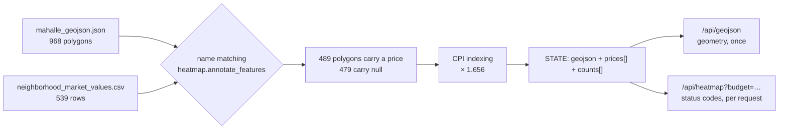
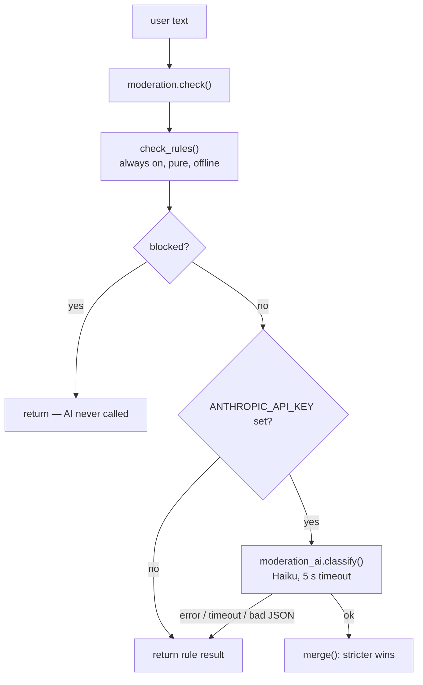
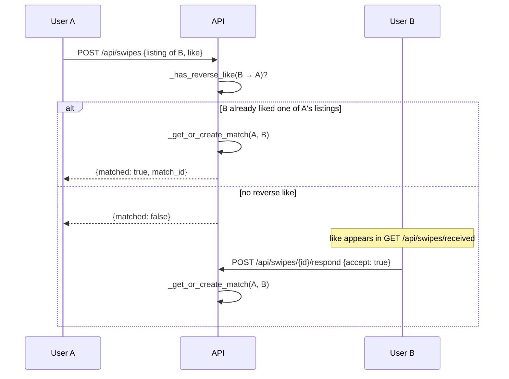

# Algorithms — Everything Except the Model

`evdes.tr` contains one machine-learning model and four hand-written algorithms.
This document explains the four hand-written ones:

1. **The budget heatmap** — colouring 968 neighbourhood polygons against a
   user's monthly budget.
2. **Alternative-neighbourhood suggestion** — "you can't afford Beşiktaş, but
   these places are a few stops away and you can".
3. **Content moderation** — a rule layer that has to survive Turkish.
4. **Match logic** — mutual likes, the likes queue, and de-duplication.

The fair-rent model (quantile LightGBM) is a separate topic; see
[`MODEL.md`](MODEL.md). Security topics — authentication, admin powers, message
encryption, who is allowed to call what — are deliberately out of scope; see
[`SECURITY.md`](SECURITY.md). For how the process boots and where these
algorithms sit in the request path, see [`ARCHITECTURE.md`](ARCHITECTURE.md).

Every claim below carries a `file:line` reference. Numbers labelled **measured**
were reproduced by running this repository's own code against the committed
dataset. Where a number could not be reproduced, this document says so instead
of repeating it. Section 6 lists what these algorithms do *not* do, including
two places where a docstring currently promises more than the code delivers.

---

## 1. The budget heatmap

### 1.1 The problem

The user types one number — a monthly budget — and expects a map of Istanbul
where they can see, at a glance, which neighbourhoods are within reach.

To do that we need two datasets to agree with each other:

| Dataset | What it is | Size |
|---|---|---|
| `data/raw/mahalle_geojson.json` | Neighbourhood boundary polygons, exported from a Nominatim/OSM dump | 968 features, 4.1 MB on disk (measured) |
| `data/processed/neighborhood_market_values.csv` | Median rent per neighbourhood, aggregated from the listings dataset by `backend/scripts/build_market_values.py:23-74` | 539 rows (measured) |

Neither dataset has an ID that the other one understands. The only join key is a
**Turkish place name written by two different sources with two different
conventions**. The CSV says `Kazlıçeşme Mah.`; the GeoJSON says
`Kazlıçeşme Mahallesi`. That is the whole problem.



The join runs **once per process**, during startup
(`backend/app/main.py:82`), not per request. Neighbourhood prices do not depend
on anybody's budget, so there is nothing budget-shaped to recompute. This is
stated as a design note at the top of `backend/app/heatmap.py:1-7`.

### 1.2 Turkish-aware name matching

All normalisation lives in `backend/app/normalize.py`, and it exists because
Python's default string casing is *wrong* for Turkish.

**The İ/ı problem.** Turkish has four `i` letters: dotted `i`/`İ` and dotless
`ı`/`I`. `"KADIKÖY".lower()` in Python yields `kadiköy` — with a dotted `i` —
while the correct Turkish lowering yields `kadıköy`. Two spellings of the same
neighbourhood then hash differently and never join.

The fix is not to implement Turkish casing rules. It is to **destroy the
distinction on both sides**: `_TR_FOLD` at `backend/app/normalize.py:12-22`
maps `ı`, `I`, `İ` and `i` all to plain `i`, and likewise folds `ç→c`, `ğ→g`,
`ö→o`, `ş→s`, `ü→u` and the circumflex vowels. Because both the CSV and the
GeoJSON go through the identical transformation, the comparison is consistent
even though the folded form is not correct Turkish. `fold()` at
`normalize.py:34-39` also lowercases and collapses runs of whitespace.

**The suffix problem.** Turkish place names carry an administrative suffix that
each source abbreviates differently. `_SUFFIX_RE` at `normalize.py:25` strips a
trailing `mahallesi`, `mahalle`, `mah` or `mh`, with or without a full stop, in
the *folded* form. `norm_neighborhood()` (`normalize.py:42-44`) is fold +
suffix-strip and produces the canonical join key.

**The word-boundary problem.** The two sources sometimes disagree about where
the spaces go: `Emniyet Evleri` vs `Emniyetevler`, `İzzet Paşa` vs `İzzetpaşa`.
`squash()` (`normalize.py:52-58`) removes spaces entirely to produce a more
tolerant key. This key is only used as a fallback, because dropping spaces
increases the chance of two genuinely different names colliding.

**Field discovery.** Nominatim does not put the neighbourhood name in a fixed
key. Depending on the record it can be `suburb`, `neighbourhood`, `city` or
`village`; the district can be `town`, `city_district`, `archipelago` or
`county`. `extract_place()` (`normalize.py:72-85`) tries each list in order,
most specific first (`normalize.py:30-31`), and returns `""` for the district
when none of the candidate keys exist.

**Display names.** Matching uses the mangled form, but the label on the map must
keep its Turkish characters. `display_name()` (`normalize.py:61-69`) strips the
same suffix with a case-insensitive regex while leaving `ç/ğ/ı/ö/ş/ü` intact,
and `annotate_features` writes *that* into the feature properties
(`backend/app/heatmap.py:90-91`).

### 1.3 The cascade, and why the match rate is 50.5%

`build_price_index()` (`heatmap.py:34-64`) builds three dictionaries from the
CSV in a single pass:

| Index | Key | Purpose |
|---|---|---|
| `exact` | `(folded district, folded neighbourhood)` | the normal case (`heatmap.py:54`) |
| `squashed` | `(folded district, space-free neighbourhood)` | tolerates word-splitting differences (`heatmap.py:55`) |
| `by_name` | neighbourhood only | last resort when the polygon has no district (`heatmap.py:59`) |

`by_name` is the dangerous one: Istanbul has many neighbourhood names that
repeat across districts, and picking the wrong one silently paints a polygon
with somebody else's rent. The index therefore tracks ambiguity: if the same
folded name appears under two districts **with different price entries**, the
name is recorded as ambiguous (`heatmap.py:57-58`) and then deleted from the
index entirely (`heatmap.py:61-62`). An ambiguous name produces *no data*
rather than a guess.

`annotate_features()` (`heatmap.py:67-103`) walks the polygons and tries the
three indexes in order (`heatmap.py:79-84`). Note the guard on the third step:
`by_name` is only consulted `if entry is None and not district` — i.e. only
when the polygon genuinely has no district to disambiguate with. A polygon that
*has* a district and failed both district-keyed lookups is left unmatched
rather than being resolved by name alone.

Running this against the committed data (measured):

```
total features: 968
  matched via exact     : 325
  matched via squashed  :  10
  matched via by_name   : 154
  unmatched             : 479
→ 489 / 968 = 50.5 %
```

which is exactly what the server prints at startup
(`backend/app/main.py:102-103`).

**Why only half.** It is tempting to read 50.5% as "the matcher fails half the
time". It does not. The CSV has 539 rows and 539 distinct `(district,
neighbourhood)` keys (measured) — so **539 is the hard ceiling**, and 489/539 =
90.7% of the available price rows found a polygon. The remaining 429 polygons
have no price data in the source dataset at all; there is nothing to match them
to. The listings dataset simply does not cover 44% of Istanbul's
neighbourhoods, and `build_market_values.py:20` drops any neighbourhood with
fewer than three surviving listings before the CSV is even written.

The 154 `by_name` matches are also worth understanding: 372 of the 968 polygons
carry no district field at all (measured), which is why the district-less
fallback is not a rare edge case but a third of the map.

### 1.4 Classification: four states and one ratio

Once every polygon has a price (or `None`), classification is trivial —
`classify()` at `heatmap.py:106-118`:

| Status | Condition | Colour |
|---|---|---|
| `nodata` | `avg_price is None` | `#95a5a6` grey |
| `safe` | `avg_price <= budget` | `#2ecc71` green |
| `borderline` | `avg_price <= budget * 1.20` | `#f1c40f` yellow |
| `expensive` | otherwise | `#e74c3c` red |

`BORDERLINE_RATIO = 1.20` is defined at `heatmap.py:18`, and the colour/label
table at `heatmap.py:26-31` is served verbatim from `/api/legend`
(`backend/app/main.py:239-242`) so the client does not have to re-declare it.

The yellow band exists because a hard green/red cut lies about the precision of
the underlying number. The neighbourhood price is a **median of asking rents**,
not a quote; a flat 3% over budget is not meaningfully different from a flat 3%
under it. 20% is a judgement call, not a derived quantity — it is roughly "one
flatmate's worth of negotiating room" — and it is the one number in this file
that has no empirical justification behind it.

Note that `classify()` takes a `listing_count` parameter it never reads
(`heatmap.py:106-111`); the caller never passes it either (`heatmap.py:133`).
Confidence is handled separately, in the next section.

### 1.5 Low-confidence marking, and the Kazlıçeşme story

`MIN_LISTINGS = 8` at `heatmap.py:24`. A neighbourhood whose median comes from
fewer than eight listings is flagged `low_confidence` in the response
(`heatmap.py:134-137`). **It is still coloured.** That decision is the
interesting part.

The motivating case is in the source comment at `heatmap.py:20-23` and
reproduces exactly:

```
Zeytinburnu / Kazlıçeşme Mah.  →  6 listings, median 137.500 ₺   (measured)
```

Kazlıçeşme is not a 137.500 ₺ neighbourhood. It is a district in the middle of
a large waterfront redevelopment, and the six listings that survived the
cleaning filters in `build_market_values.py:35-39` happen to be luxury units in
new towers. Six samples cannot tell "this area is expensive" apart from "six
expensive flats happened to be listed here". After CPI indexing (§1.6) the map
shows this polygon at **227.700 ₺** (measured), which is nonsense as a
representative rent.

Three options were available:

1. **Paint it anyway, say nothing.** The user reads 227.700 ₺ as fact and
   crosses a viable neighbourhood off their list.
2. **Treat it as `nodata`.** Honest, but 193 of the 489 priced polygons
   (measured) fall below the threshold — blanking them would grey out 40% of
   the coloured map and make the whole feature feel broken.
3. **Colour it, and mark it.** Ship the number, but visually tell the user not
   to lean on it.

The code takes option 3. The response carries a parallel boolean array
(`heatmap.py:134-137`) and a count in the summary (`heatmap.py:146`), and the
client renders those polygons at `fillOpacity: 0.3` instead of `0.65` with a
dashed `3 3` border (`frontend/src/pages/Explore.tsx:69-76`), plus a popup
warning naming the actual listing count
(`frontend/src/pages/Explore.tsx:190-191`).

The general principle worth taking away: *the threshold does not change the
estimate, it changes how loudly the estimate is stated.* The same principle
drives the fair-price band in [`MODEL.md`](MODEL.md).

### 1.6 CPI indexing, applied in exactly one place

The listings dataset is priced in **February 2025** lira
(`backend/app/indexing.py:55`). Everything the user sees must be in today's
lira. `rent_index()` (`indexing.py:75-94`) returns the multiplier — currently
`1.656` for the 2026-06 anchor (`indexing.py:62-63`), overridable at runtime
via `RENT_INDEX_FACTOR` (`indexing.py:81-86`). How that number was derived from
TÜİK bulletins, including the part that is an estimate rather than a published
figure, is documented at length in `indexing.py:1-50`.

`index_market_prices()` (`heatmap.py:150-169`) multiplies every polygon's
`avg_price` in place and returns how many it touched (489, measured).

The reason it exists as a separate function called from exactly one line
(`backend/app/main.py:91`) is a bug that shipped. Indexing was originally
applied only in the fair-price endpoints. The consequence, spelled out in
`heatmap.py:152-157` and `main.py:85-90`: the advisor quoted a Kadıköy room
share in 2026 lira while the map coloured the same neighbourhood using 2025
prices. Two features on the same screen disagreed by 66%, and the map was the
optimistic one — it told users their budget stretched further than it does.

Applying the factor to the loaded GeoJSON **before** `STATE` is populated means
`/api/geojson` and `/api/heatmap` are physically incapable of disagreeing:
`STATE["prices"]` is sliced out of the already-indexed features
(`main.py:93-100`). There is no second code path to keep in sync.

`index_market_prices` short-circuits when the factor is exactly `1.0`
(`heatmap.py:161-162`), so an un-indexed deployment does not pay a pointless
pass over 968 features.

### 1.7 Response-size design: geometry once, statuses per request

The naive design re-sends coloured GeoJSON on every budget change. Measured
against a local instance serving the committed data, `GET /api/geojson` is
**3,473,852 bytes raw / 920,001 bytes gzipped** (the same measurement quoted in
[`ARCHITECTURE.md`](ARCHITECTURE.md) §2). On a slider that fires as the
user drags, that is unusable.

The split:

- `/api/geojson` (`main.py:214-226`) returns geometry, names, prices and listing
  counts. It is budget-independent, so it is served with
  `Cache-Control: public, max-age=3600` and downloaded once.
- `/api/heatmap?budget=…` (`main.py:229-236`) returns **no geometry at all** —
  just `statuses`, `low_confidence` and `summary`, as arrays *positionally
  aligned with the feature order* (`heatmap.py:142-147`). The client zips them
  against the geometry it already holds
  (`frontend/src/pages/Explore.tsx:85-87`).

Measured at `budget = 25000`: **15,796 bytes raw, 731 bytes gzipped.**
`GZipMiddleware` is installed at `main.py:161` with a 1 KB floor, so in
production this response travels as under a kilobyte. Gzipped-to-gzipped that
is a ~1260× reduction versus re-sending the map, and it is achieved by the
array index doing the work an object key would otherwise do.

The alignment is implicit and unlabelled, which is the cost of the design: the
`id` written into each feature at `heatmap.py:88` *is* its array position, and
nothing at runtime checks that the client's cached geometry came from the same
process generation as the status array it is being zipped against.

---

## 2. Alternative-neighbourhood suggestion

> This feature is **switched off in the UI**. The endpoint, the graph and the
> data pipeline all work; the flag at `frontend/src/pages/Explore.tsx:20` is
> `false`. Section 2.6 explains why, with the measured output that motivated it.

### 2.1 The problem: straight-line distance lies in Istanbul

A student wants Beşiktaş and cannot afford it. The useful answer is "here are
places you can afford from which Beşiktaş is a short commute".

The obvious implementation — rank neighbourhoods by kilometres from the target —
fails badly here, and the module docstring names the reason at
`backend/app/transit.py:7-10`: **the Bosphorus**. Two points on opposite shores
can be 1–2 km apart as the crow flies and 45 minutes apart in practice, because
crossing requires a bridge, a tunnel or a ferry. Meanwhile two points 12 km
apart on the same metro line are 15 minutes apart.

Euclidean distance is not merely imprecise here; it is *anti-correlated* with
what the user cares about along exactly the seam that splits the city in half.
So the metric is not distance. It is **position in the rail network**.

### 2.2 The rail graph

`backend/scripts/fetch_transit.py` downloads the network from the Overpass API
(OpenStreetMap, ODbL, no API key). It queries route relations of type
`subway|light_rail|train|tram|funicular` within an Istanbul bounding box
(`fetch_transit.py:37`), filtered by a `network` regex
(`fetch_transit.py:48`) so that intercity high-speed lines do not leak in.

One detail in that query is load-bearing and documented at
`fetch_transit.py:41-46`: OSM route relations take `public_transport=stop_position`
nodes as members, **not** `railway=station` nodes. Querying stations separately
and then trying to associate them with lines by proximity would produce a
guess. Instead the stations are derived *from the relations' own members*
(`node(r.routes)` at `fetch_transit.py:54`), so the station↔line association is
correct by construction rather than by inference. Three Overpass mirrors are
tried in rotation with backoff (`fetch_transit.py:28-33`), because the free
endpoints frequently return "busy".

The committed `data/raw/transit_stations.json` contains **261 stations and 42
line objects covering 18 distinct line refs** (measured) — 42 rather than 18
because OSM models each direction of travel as its own relation.

`TransitNetwork._build_adjacency()` (`transit.py:105-120`) turns that into an
adjacency map of shape `{station: {neighbour: {line_ref, …}}}`. Two decisions
here:

- Edges come **only from consecutive pairs in a line's station sequence**
  (`transit.py:117`). Membership in the same line is not enough; Kadıköy and
  Tavşantepe are both on M4 but are not adjacent.
- The **line ref is stored on the edge**, not just the fact of adjacency
  (`transit.py:118-119`). Section 2.3 explains why that is the only way to
  price a transfer correctly.

Measured: all 261 stations have at least one edge, so there are no orphan nodes.

### 2.3 Edge weights: 1 per stop, 5 per transfer

```python
# backend/app/transit.py:150
step = 1 + (TRANSFER_COST if via_line and ref != via_line else 0)
```

`TRANSFER_COST = 5` (`transit.py:31`), `MAX_HOPS = 12` (`transit.py:27`).

The units are **stops**, not minutes. The claim being encoded is: *changing
lines costs about as much as riding five extra stops.* That is a rider's
intuition rather than a measurement — a transfer means walking a connecting
passage and then waiting an unknown fraction of a headway, and both are worse
than staying seated. Nobody timed Istanbul's interchanges to produce the 5.

What matters is that the ordering it produces is defensible: a candidate three
stops away behind two changes scores 3 + 10 = 13, while one five stops away
with no change scores 5. The second wins, and a rider would agree.

**These two constants interact, and the interaction is not documented in the
code.** The cheapest possible route with *t* transfers costs at least
`(t+1) + 5t`. Evaluated: 0 transfers → 1, one transfer → 7, two transfers → 13.
Since `MAX_HOPS = 12` is the cost ceiling (`transit.py:151-152`, and a state at
exactly 12 is still admitted), **a route with two or more transfers can never be
returned** (verified by computation). The effective policy is "same line, up to
12 stops; or one change, up to 7 stops total" — which is a reasonable policy,
but it is an emergent consequence of two numbers rather than a stated rule.
Neither constant can be nudged safely: raising `TRANSFER_COST` to 6 cuts the
one-change budget from 7 stops to 6 and changes the reachable set of **216 of
the 261 stations** (verified by computation), and any value ≥ 11 forbids
transfers outright, because 2 stops + 11 already exceeds `MAX_HOPS`.

The search itself (`easy_reach`, `transit.py:122-159`) is Dijkstra over the
state space **(station, line you arrived on)** rather than over stations
(`transit.py:130-133`). Line has to be part of the state because arriving at
Yenikapı on M1 and arriving on M2 imply different onward costs; collapsing them
to one node per station would make the transfer penalty depend on visit order.
The frontier is a plain list re-sorted on each pop (`transit.py:138`) — O(n² log n)
in the worst case, acceptable at 261 nodes, and not something to copy.

Measured over all 261 stations: between **11 and 80** other stations qualify as
"easily reachable" (median 24).

### 2.4 Walking distance and the neighbourhood↔station join

Neighbourhoods are polygons; stations are points. The bridge is built once, in
`AccessibilityIndex.__init__` (`transit.py:180-208`):

1. **Centroid.** `polygon_centroid()` (`transit.py:45-84`) computes the
   *area-weighted* centroid via the shoelace formula, handling `MultiPolygon`
   by summing signed ring areas. A naive mean of vertices was rejected because
   it drifts toward whichever edge the source digitised with more points — and
   coastline is always the densest edge in this dataset. Degenerate zero-area
   rings fall back to the vertex mean (`transit.py:81-84`).
2. **Nearest station.** `nearest_station()` (`transit.py:161-168`) is a linear
   scan of all 261 stations using `haversine_km()` (`transit.py:34-42`).
   968 × 261 ≈ 253k great-circle computations at startup; no spatial index.
3. **Threshold.** `WALK_KM = 1.2` (`transit.py:21-23`). A neighbourhood whose
   centroid is within 1.2 km of a station is attached to it
   (`transit.py:207-208`); otherwise it is kept in `places` but never enters
   `_by_station` and so can neither be a target nor a suggestion.

Measured: **455 of 968 neighbourhoods are within the walking threshold, and only
297 of those also have a price.** The candidate pool for the entire feature is
therefore under a third of the map — a fact that section 2.6 returns to.

### 2.5 Ranking

`recommend()` (`transit.py:230-276`):

1. Reject unknown ids (`:237-239`); refuse politely if the target itself is not
   near rail (`:240-247`).
2. Expand the target's station into the set of reachable *neighbourhoods*
   (`_reachable_places`, `transit.py:210-228`): every station within the cost
   budget, mapped through `_by_station` to the neighbourhoods attached to it,
   keeping the cheapest cost when several stations lead to the same place
   (`transit.py:225`). Cost 0 is assigned to the target's own station
   (`transit.py:219`), so same-station neighbours rank first.
3. Filter: drop the target itself, drop anything with no price, drop anything
   over budget (`transit.py:254-259`).
4. Sort by `(network_cost, price)` (`transit.py:269`) and return the first six
   (`transit.py:275`), each annotated with `saving = target_price - price`
   (`transit.py:261`).

The endpoint is `GET /api/alternatives?neighborhood_id=&budget=`
(`backend/app/main.py:349-368`). It returns 503 rather than 404 when transit
data was never downloaded (`main.py:358-364`), and the whole subsystem is
optional at startup (`main.py:124-141`).

### 2.6 Why it is disabled in the UI

`const ALTERNATIVES_ENABLED = false;` — `frontend/src/pages/Explore.tsx:20`,
with the comment "inactive until output quality is sorted out". Every call site
is gated on it (`Explore.tsx:153`, `:193`, `:274`) and the translation strings
are kept but marked dead (`frontend/src/i18n/translations.ts:544`, `:1418`).

Running the real recommender against the real data shows what "output quality"
means. Target: **Bebek** (Beşiktaş), budget 120.000 ₺ (measured):

```
Rumeli Hisarı   (district: "")   91.080 ₺   cost 1
Beşiktaş / Kültür               107.640 ₺   cost 1
Kağıthane / Ortabayır            41.400 ₺   cost 2
Kağıthane / Telsizler            29.808 ₺   cost 8
(district: "") Çeliktepe          41.400 ₺   cost 8
Kağıthane / Sultan Selim         33.120 ₺   cost 9
```

Four separate problems are visible in six rows:

1. **Blank districts.** Two of six results have `district: ""`, because 372 of
   968 polygons carry no district field (§1.3). "Rumeli Hisarı, " is not a
   shippable label.
2. **The centroid is not the door.** Bebek is recorded as 0.66 km from *Etiler*
   station (measured). Geometrically true; as a walk it is a climb of roughly
   150 m of elevation from the shore. Haversine from a centroid models neither
   terrain nor the street network, and Istanbul has a great deal of both.
3. **Walk distance is invisible in the ranking.** The sort key is
   `(network_cost, price)` (`transit.py:269`). A neighbourhood 1.19 km from its
   station ranks identically to one 0.05 km away — yet the extra kilometre is
   more than the transfer the model charges 5 stops for. `walk_km` is returned
   to the client (`transit.py:286`) but never influences the order.
4. **Thin, lopsided candidate pool.** With only 297 priced *and* walkable
   neighbourhoods, and a target at the top of Istanbul's price distribution, at
   a realistic student budget of 20.000 ₺ the same query returns **zero
   recommendations** (measured). A feature that silently returns nothing for
   its most likely user is worse than a missing feature.

Two smaller correctness notes in the same code: `saving` can come back negative,
because candidates are filtered against the *budget* and not against the
target's price (`transit.py:258-261`), and the target price it is measured
against may itself be a low-confidence median (§1.5) with no such warning
attached on this path.

None of these are hard to fix — carry `walk_km` into the sort key, backfill
districts, widen the walk radius or fall back to district-level prices. They
were simply not fixed, and the flag is the honest way to say so.

---

## 3. Content moderation

### 3.1 Two layers, one of them optional



`check()` at `backend/app/moderation.py:694-707` is the single entry point. The
rule layer always runs; the AI layer runs only if it is configured, only if the
rules did not already block (no point paying for a second opinion on a decided
case, `moderation.py:702-703`), and its failures are swallowed
(`moderation.py:710-719`). The rule module has no third-party imports at all,
which is what makes it fast enough to run synchronously inside a POST and
exhaustively testable — 27 test functions in
`backend/tests/test_moderation.py`, which parametrisation expands to the 61
cases pytest collects (see the suite table in [`ARCHITECTURE.md`](ARCHITECTURE.md)).

### 3.2 The design constraint: false positives are the expensive error

This is a **rental listing site**. Blocking an innocent listing is far worse
than letting a rude word through: the user cannot publish, does not know why,
and leaves. The module states this as its governing principle at
`moderation.py:6-11`, and the whole architecture follows from it. `block` is
reserved for unambiguous profanity, unambiguous hate speech and unambiguous
sexual harassment or threats. Everything heuristic — scam suspicion, contact
details, off-site redirection, mild insults, suspected discrimination — can only
ever `flag`.

Turkish makes this constraint hard in a specific way.

### 3.3 Why there are two normalised representations

Folding Turkish characters to ASCII (§1.2) is necessary — users type `siktir`,
`şiktir` and `s1kt1r` — but folding **manufactures profanity out of ordinary
words**:

| Innocent Turkish | Folded | Collides with |
|---|---|---|
| `sıkıntı` ("problem", extremely common in listings) | `sikinti` | `sik` |
| `şıktır` ("it is stylish") | `siktir` | `siktir` |
| `ışıktır` ("it is light") | `isiktir` | `siktir` |
| `sıkışık` ("tight", of budgets) | `sikisik` | `sik` |
| `amaç` ("purpose") | `amac` | `am` |
| `fukara` ("poor") | — | English `fuk` |
| `cunta` ("junta") | — | English `cunt` |

So `_prepare()` (`moderation.py:172-182`) is parameterised by a single `fold`
flag and produces two aligned strings:

- `normalize()` — **hard**: folded to ASCII (`moderation.py:185-190`). Most
  dictionary matching happens here.
- `normalize_soft()` — **soft**: Turkish letters preserved, so `sık ≠ sik`
  (`moderation.py:193-195`).

Because both go through the same pipeline in the same order, token *i* of the
hard string corresponds to token *i* of the soft string — an alignment the code
relies on explicitly at `moderation.py:571-577`.

Four defences then keep the false-positive rate down:

1. **Word-level matching, never substring scanning.** `_match_stems()`
   (`moderation.py:505-517`) uses `token.startswith(stem)` — prefix matching on
   whole tokens, which is what makes Turkish agglutination work (`orospunun`,
   `siktirir` both match) without `sikinti` matching `sik`.
2. **Short, collision-prone stems live only in the soft text.**
   `_TR_STRONG_SOFT_EXACT = {"sik", "sike", "sikim", "piç", "göt", "götü"}`
   (`moderation.py:270`) is matched **exact-word against the soft tokens**
   (`moderation.py:590`). `sık` never folds into it because folding never
   happened.
3. **A whitelist.** `_SAFE_TOKENS` (`moderation.py:227-243`) lists ~60 innocent
   tokens — `sikinti`, `sikisik`, `amac`, `mal`, `isik`, `analiz`, `class`,
   `pass` — that skip every rule (`moderation.py:511-512`, `:527-528`).
4. **Fold-artefact prefixes.** `_FOLD_ARTIFACT_PREFIXES = ("şık", "ışık",
   "kısık", "aşık", "şıp")` (`moderation.py:249`). Any token whose **soft** form
   starts with one of these is dropped from the hard token list entirely
   (`moderation.py:573-577`). The justification is linguistic, not statistical:
   the profanity is never spelled with `ı` or `ş`, so a word that begins that
   way cannot be it.

Short English stems are handled by simply not existing: `moderation.py:282-284`
records that `fuk` and `cunt` were removed because they matched `fukara` and
`cunta`, and the risky ones moved to exact-word matching in `_EN_STRONG_EXACT`
(`moderation.py:294-299`).

Two omissions are documented as deliberate and are worth reading as examples of
the same trade-off: `kodumun` is absent (`moderation.py:265-266`) because a
developer writing "there's a bug in my code" should not be blocked; `manyak` is
absent (`moderation.py:272-274`) because in Turkish it is more often an
intensifier ("a *crazy* nice flat") than an insult; `şerefsiz` is absent from
the joined-stem list (`moderation.py:404`) because it collides with "şeref
sizin olsun".

Verified against the running code (measured):

```
allow  'Sıkıntı yok, ev sıcak ve ışık alıyor; sık sık temizlik yapıyoruz.'
allow  'Daire oldukça şıktır, salon ışıktır.'
allow  'Kira 51k TL, depozito 8500 TL.'
allow  'amaçlı çok amaçlı salon'
```

### 3.4 Evasion defences

`_prepare()` applies, in order (`moderation.py:172-182`):

| Step | Line | Defeats |
|---|---|---|
| Delete zero-width characters | `:173`, table at `:125-134` | `or<ZWSP>ospu` — deleted, **not** replaced with a space, which would help the attacker split the word (`:124`) |
| Unicode NFKC | `:174` | fullwidth and compatibility forms |
| Turkish-correct lowering | `:175`, `_lower_tr` at `:167-169` | `İ→i`, `I→ı` |
| Cyrillic/Greek homoglyphs → Latin | `:176`, table at `:139-150` | `оrospu` with a Cyrillic `о`. Applied **before** the non-word regex, which would otherwise turn those letters into spaces and split the word (`:137-138`) |
| Leetspeak, conditionally | `:177`, `_apply_leet` at `:153-164` | `s1kt1r` |
| Optional Turkish folding | `:178-179` | see §3.3 |
| Non-word → space | `:180` | punctuation padding |
| Collapse 3+ repeats | `:181` | `siiiktir` |

`_apply_leet` deserves attention because a naive digit→letter map breaks a
rental site immediately: `51k TL`, `8500`, `2+1`. The guard at
`moderation.py:160-163` only substitutes when the token has at least two
letters **and** strictly more letters than substitutable characters. So
`s1kt1r` (4 letters, 2 digits) converts to `siktir`, while `51k` (1 letter, 2
digits) and `8500` (0 letters) are left alone.

Two further defences work on token sequences rather than characters:

- **Letter-spacing.** `_merge_short_runs()` (`moderation.py:202-219`) joins runs
  of three or more consecutive 1–2 character tokens, so `s i k t i r` becomes
  `siktir`. Normal prose does not produce runs of three consecutive one-letter
  words, which is what bounds the risk. The merged tokens are *appended* to the
  real ones rather than replacing them (`moderation.py:578`).
- **Word-splitting.** `_match_joined()` (`moderation.py:534-551`) concatenates
  all tokens and searches the result, catching `oros pu` and `geber tirim`.
  This is the most false-positive-prone technique in the file — `çok amaçlı`
  concatenates to `cokamacli` — so it is fenced by three rules stated at
  `moderation.py:371-381`: only stems of six or more characters and only
  unambiguous ones are searched (`_JOINED_STEMS`, `moderation.py:382-403`); a
  match must **begin at a token boundary** (`moderation.py:548-550`), which is
  what stops `ışıktır` from containing `siktir` mid-word; and whitelisted
  tokens cannot start a match (`moderation.py:546-547`).

Verified (measured): `s1kt1r git`, `s i k t i r`, `siiiktir`, `oros pu cocugu`,
`оrospu` (Cyrillic) and `or<ZWSP>ospu` all return `block` with reason
`kufur:*`; the innocent sentences in §3.3 all return `allow`.

### 3.5 Scoring, thresholds, and why almost nothing blocks

`_Findings` (`moderation.py:481-502`) collects reason codes and keeps the
**maximum** weight, not the sum (`moderation.py:491`). Thresholds:
`BLOCK_THRESHOLD = 1.0`, `FLAG_THRESHOLD = 0.4` (`moderation.py:67-68`).

| Category | Weight | Line | Effect |
|---|---|---|---|
| Profanity / heavy insult | 1.0 | `:594` | block |
| Unambiguous hate term | 1.0 | `:608` | block |
| Sexual content | 1.0 | `:624` | block |
| Threat / harassment | 1.0 | `:630` | block |
| Discrimination *pattern* | 0.6 | `:329`, `:612` | flag |
| Mild insult | 0.5 | `:602` | flag |
| Scam, strong combination | 0.9 (`_SCAM_MAX`) | `:72`, `:652`, `:655` | flag |
| Scam, weaker combination | 0.6 | `:657`, `:660` | flag |
| Off-site redirection in a listing | 0.5 | `:664` | flag |
| Contact details in a listing | 0.4 | `:670-674` | flag |

Because the score is a maximum, **no accumulation of heuristics can ever reach
block**. Three independent 0.6 signals still score 0.6. This is not an
oversight; it is the §3.2 principle made structural. `_SCAM_MAX = 0.9` exists
purely to make the ceiling explicit and is annotated as such at
`moderation.py:70-72`.

Scam detection additionally requires **two independent signals** and never fires
on one (`moderation.py:643-664`). The reason is that Turkish rental vocabulary
is indistinguishable from scam vocabulary in isolation: `havale` (bank
transfer), `depozito` (deposit) and `acil` (urgent) appear in entirely normal
listings. So `_PAYMENT_CHANNEL` (`moderation.py:425-427`) produces nothing on
its own and only becomes meaningful next to a `_SIGHT_UNSEEN` phrase
(`moderation.py:432-436`). Measured:

```
allow  'Depozito havale ile alınır.'
flag   'Evi görmeden kapora gönder, anahtarı kargoyla yollarım.'   0.9  dolandiricilik:gormeden_kapora
flag   "Acil! Kaporayı hemen IBAN'a yatır: TR33 …"                 0.9  dolandiricilik:iban_aciliyet
```

Discrimination patterns (`moderation.py:312-327`) are similarly narrowed. The
patterns require an explicit exclusion verb after the group noun, and the
comment at `moderation.py:319-321` explains why `sadece beyaz …` alone was
rejected as a trigger: "sadece beyaz eşya var" means "there are only white
goods". Normal roommate preferences ("female tenants only") are out of scope by
construction.

**Kind-sensitivity.** `check_rules()` takes `kind` (`moderation.py:677-691`) and
`_check_contact()` runs **only for listings** (`moderation.py:688-689`).
Sharing a phone number in a private chat with someone you already matched with
is the entire point of the product; putting it in a public listing routes around
the platform. Same input, different verdict, measured:

```
listing: 'WhatsApp'tan yaz: 0532 111 22 33'  → flag  site_disi_yonlendirme, iletisim_bilgisi
message: same text                            → allow
```

`_compile_group()` (`moderation.py:454-465`) compiles keyword groups into
word-bounded patterns, allowing Turkish suffixes only on stems of six or more
characters (`moderation.py:463`) — so `kaporayı` matches `kapora`, but `acil`
does not match inside `açılır`.

### 3.6 The AI layer

`backend/app/moderation_ai.py` sends the text to Claude Haiku
(`moderation_ai.py:38`) with a short system prompt that fixes the output schema
and enumerates the permitted reason codes (`moderation_ai.py:53-68`). Three
properties matter:

- **It cannot hang the request.** 5-second timeout (`moderation_ai.py:42`),
  4000-character input cap (`:45`), 200-token output cap (`:47`), and every
  exception path returns `None` (`moderation_ai.py:121-126`) so the caller
  falls back to the rule verdict.
- **It cannot invent taxonomy.** Reason strings are stripped to `[a-z_]`,
  truncated, checked against the allow-list, and anything unrecognised is stored
  under an `ai:` prefix rather than merged into the real vocabulary
  (`moderation_ai.py:152-160`).
- **It cannot loosen a decision.** `merge()` (`moderation.py:725-743`) takes the
  stricter of the two actions via an explicit ordering
  (`moderation.py:722`) and unions the reasons. The AI can escalate `allow` to
  `flag`; it can never turn a rule-layer `flag` into `allow`.

The prompt explicitly tells the model that rent, deposit, room count, house
rules and gender preference are **not** violations, and that phone numbers in
chat are normal (`moderation_ai.py:64-66`) — the same §3.2 bias, restated for a
component that cannot be unit-tested.

### 3.7 Where moderation is invoked

- **Listings.** Title and description are moderated **separately**
  (`backend/app/listings.py:86-96`) and the results merged. The only reason for
  the split is feedback quality: the 422 body names the offending field so the
  UI can focus it (`listings.py:42-62`, `:65-83`). Non-blocking results are
  persisted as `is_flagged` + `flag_reasons` at `listings.py:299-301`, and
  re-checked on edit at `listings.py:462-466`.
- **Messages.** `backend/app/messages.py:132-147` — blocked messages 422, flagged
  ones are delivered *and* recorded for admin review.
- **System-marker impersonation.** `is_system_marker()`
  (`moderation.py:798-807`) rejects text equal to `[removed_by_moderation]` or
  `[unreadable]` (`moderation.py:770-782`). Without it a user could type the
  string the UI renders as system copy and speak in the platform's voice; the
  full rationale is at `moderation.py:775-781`. Checked before moderation in
  both paths (`listings.py:70-76`, `messages.py:127-130`).
- **Reasons never leak the matched word.** `reason_codes()`
  (`moderation.py:828-841`) reduces `kufur:siktir` to `kufur` before anything is
  returned to a user, because the detail half is the user's own text and
  echoing it teaches people which word to change (`moderation.py:832-835`).
  `describe()` (`moderation.py:844-858`) builds the user-facing sentence
  entirely from a fixed dictionary.

---

## 4. Match logic

### 4.1 Two ways a match is born

Stated at the top of `backend/app/swipes.py:1-7`:

1. **Mutual like.** A likes one of B's listings, and B has previously liked one
   of A's listings.
2. **Explicit acceptance.** B sees A's like in the Likes screen and accepts it.



### 4.2 The mutual-like test is per *user pair*, not per listing

`_has_reverse_like()` (`swipes.py:107-118`) joins `Swipe → Listing` and asks
whether `from_user` has ever liked **any** listing owned by `toward_user`. It
does not require the two likes to concern the same listing.

That is deliberate and follows from the data model: a `Swipe` points at a
listing (`backend/app/models.py:203`), but a `Match` points at two users
(`models.py:222-224`), with `listing_id` kept only as nullable context
(`models.py:225-226`) so the match survives the listing being closed. Requiring
the same listing on both sides would be incoherent — A likes B's flat, B likes
A's "looking for a room" post; those are different rows and the same mutual
interest.

The consequence worth knowing: a user with **no listings of their own can never
auto-match**, because there is nothing for the other side to have liked. Their
only route is acceptance from the Likes screen. Nothing in the API surfaces
this.

### 4.3 De-duplication, at three levels

**Swipe level.** `UniqueConstraint("swiper_id", "listing_id")` at
`models.py:199` — one decision per user per listing, enforced by the database.
The handler upserts (`swipes.py:141-160`) rather than inserting: an existing row
is mutated **only if the direction actually changed** (`swipes.py:149-152`).
Re-sending the same `like` is a no-op. The comment at `swipes.py:148-149` names
the abuse this prevents: repeatedly liking the same listing to flood the
owner's Likes queue. Changing the direction also resets `responded = False`
(`swipes.py:151`), so a reconsidered decision re-enters the queue.

**Match level.** `_get_or_create_match()` (`swipes.py:85-99`) sorts the two user
ids before touching the table (`swipes.py:86`), so the pair `(7, 3)` and the
pair `(3, 7)` are the same row. That normalisation is what lets
`UniqueConstraint("user_a_id", "user_b_id")` (`models.py:220`) be a real
guarantee rather than a half-measure, and it is documented on the model itself
(`models.py:213-217`). The function returns `(match, created)` and callers use
the existing row when there is one, which is why the admin-only deck reset
(`swipes.py:175-195`) can delete swipe history without orphaning matches or
losing chat history — re-liking re-finds the same match
(`swipes.py:184-187`).

**Deck level.** `GET /api/listings?unswiped=1` (`backend/app/listings.py:340-348`)
excludes every listing the user has already swiped, via a subquery, and also
excludes their own listings. The card cannot come back.

**Where de-duplication stops.** The Likes queue
(`GET /api/swipes/received`, `swipes.py:198-229`) is a list of *swipes*, not of
people. If one user likes three of your listings, they appear three times. The
query has no `DISTINCT` on `swiper_id`, and accepting one of the three leaves
the other two pending — though accepting any of them creates the single match,
so the duplicates are cosmetic rather than structural.

### 4.4 Suspension is filtered everywhere, consistently

`_suspended_user_ids()` (`swipes.py:102-104`) is reused as a subquery in the
Likes queue (`swipes.py:216`) and in the matches list (`swipes.py:296-297`), and
the equivalent check is applied at swipe time (`swipes.py:132-137`) and at
response time (`swipes.py:262-263`).

The docstring at `swipes.py:239-255` is the most instructive comment in the
file, because it explains a bug this filtering fixed and why the status code is
what it is. Responding to a suspended user's like returns **404, not 403** —
403 would mean "you lack permission", but the listing owner has permission; what
is missing is a valid like to act on. 404 also matches what
`/api/swipes/received` already reports, and does not leak the other party's
suspension. And **rejection is blocked as well as acceptance**, because
suspension is reversible: writing `responded = True` would permanently destroy a
like that should reappear if the suspension is lifted. Before this check
existed, an old `swipe_id` could create a match with a suspended user that was
then filtered out of every list — a "dead match" the user was told about but
could never see.

`GET /api/matches` (`swipes.py:275-325`) decrypts the last message for the
conversation preview (`swipes.py:321`) — see [`SECURITY.md`](SECURITY.md) for
the encryption model — and issues one query per match to find it
(`swipes.py:302-308`), an N+1 that is bounded only by how many matches a user
has.

---

## 5. Where the constants live

Every tunable in this document, in one place:

| Constant | Value | Defined at | Section |
|---|---|---|---|
| `BORDERLINE_RATIO` | 1.20 | `backend/app/heatmap.py:18` | 1.4 |
| `MIN_LISTINGS` (map confidence) | 8 | `backend/app/heatmap.py:24` | 1.5 |
| `MIN_LISTINGS` (CSV build) | 3 | `backend/scripts/build_market_values.py:20` | 1.3 |
| `MIN_RENT` / `MAX_RENT` | 3.000 / 500.000 ₺ | `backend/scripts/build_market_values.py:16-17` | 1.5 |
| `ANCHOR_FACTOR` | 1.656 | `backend/app/indexing.py:63` | 1.6 |
| `WALK_KM` | 1.2 km | `backend/app/transit.py:23` | 2.4 |
| `MAX_HOPS` | 12 | `backend/app/transit.py:27` | 2.3 |
| `TRANSFER_COST` | 5 | `backend/app/transit.py:31` | 2.3 |
| `BLOCK_THRESHOLD` | 1.0 | `backend/app/moderation.py:67` | 3.5 |
| `FLAG_THRESHOLD` | 0.4 | `backend/app/moderation.py:68` | 3.5 |
| `_SCAM_MAX` | 0.9 | `backend/app/moderation.py:72` | 3.5 |
| `MAX_SCAN_LENGTH` | 8000 chars | `backend/app/moderation.py:75` | 3.4 |
| AI timeout | 5 s | `backend/app/moderation_ai.py:42` | 3.6 |
| `ALTERNATIVES_ENABLED` | `false` | `frontend/src/pages/Explore.tsx:20` | 2.6 |

---

## 6. Limitations — what these algorithms do not do

### Heatmap

1. **Half the map has no data.** 479 of 968 polygons are `nodata` (measured).
   This is a dataset coverage limit, not a matcher limit (§1.3), but the user
   cannot tell the difference — grey means "we don't know", and that is all it
   can mean.
2. **40% of the coloured map is low-confidence.** 193 of 489 priced polygons
   fall under `MIN_LISTINGS` (measured). They are drawn faded and dashed, which
   is a weaker signal than the number deserves.
3. **`MIN_LISTINGS` is duplicated in the frontend.** `heatmap.py:24` says 8;
   `frontend/src/pages/Explore.tsx:190` hardcodes `< 8` for the popup warning.
   Changing one does not change the other.
4. **`classify()` has a dead parameter.** `listing_count` is accepted
   (`heatmap.py:106`) and never read; the caller never passes it
   (`heatmap.py:133`).
5. **The status array is positional and unversioned.** A client holding
   geometry cached from an older process generation would zip it against a new
   status array with no error (§1.7).
6. **`by_name` disambiguation compares price entries, not identity.** Two
   different neighbourhoods sharing a name *and* an identical
   `(price, count)` pair would not be detected as ambiguous
   (`heatmap.py:57-58`). Unlikely, not impossible.
7. **`avg_price` is a median of asking rents.** Not transacted rents, not
   negotiated rents, and — per `MODEL.md` — from a dataset whose price column
   required aggressive cleaning.
8. **The CPI factor is partly an estimate.** `ANCHOR_FACTOR = 1.656` is the
   midpoint of a bounded range, not a published figure; `indexing.py:27-43`
   documents the derivation and `HEADLINE_FACTOR` preserves the auditable
   lower bound.

### Alternative neighbourhoods

9. **Shipped disabled** (`Explore.tsx:20`), for the four measured reasons in
   §2.6: blank districts, centroid-based walking distance that ignores terrain,
   a ranking that ignores `walk_km` entirely, and an empty result set at
   realistic student budgets.
10. **Rail only.** Buses, minibuses (*dolmuş*) and ferries are not in the graph
    — and ferries are precisely what makes the Bosphorus crossable, which is the
    problem the feature exists to solve.
11. **Two transfers are structurally unreachable.** `MAX_HOPS = 12` with
    `TRANSFER_COST = 5` caps routes at one line change (verified by
    computation, §2.3). Nothing in the code says so.
12. **Cost is in stops, not minutes.** Line frequency, dwell time and actual
    interchange walking distance are all absent. `TRANSFER_COST = 5` is an
    intuition, not a measurement.
13. **A docstring overstates the code.** `AccessibilityIndex`'s class docstring
    claims reachable-station sets are "precomputed at server startup"
    (`transit.py:174-178`), but `_reach_cache` is filled lazily on first request
    per station (`transit.py:216-227`). Startup does precompute centroids and
    nearest stations; reachability it does not.
14. **`saving` can be negative** (`transit.py:258-261`), and the target price it
    is computed against may itself be a low-confidence median with no warning on
    this path.
15. **`nearest_station` is a linear scan** — 968 × 261 haversine calls at
    startup (`transit.py:161-168`). Fine at this size; it does not scale.

### Moderation

16. **The score is a maximum, not a sum** (`moderation.py:491`). Any number of
    heuristic signals still cannot reach `BLOCK_THRESHOLD`. Deliberate (§3.5),
    but it means a text can be simultaneously suspicious in five ways and still
    publish.
17. **Dictionary-based, therefore permanently incomplete.** New slang, new
    misspellings and Turkish dialect forms are invisible until somebody adds
    them. The AI layer partially covers this and is optional.
18. **Some evasions still work.** Only stems of six or more characters are
    searched in the joined representation (`moderation.py:382-403`), so
    splitting a short stem across words is not caught. `_merge_short_runs`
    requires three consecutive short tokens (`moderation.py:212-218`), so
    `si kt ir` patterns near that boundary can slip through. Deliberate
    trade-offs against false positives, not oversights.
19. **The whitelist is hand-maintained.** ~60 entries at
    `moderation.py:227-243`. Every innocent Turkish word that folds into a
    profane one and is not on that list is a potential false block.
20. **The AI layer is unverifiable offline.** It is unit-testable only through
    `_parse()` (`moderation_ai.py:129-165`); its actual classification quality
    on Turkish rental text has not been measured in this repository. It is off
    unless `ANTHROPIC_API_KEY` is set.
21. **Photos and filenames are not moderated.** Only text passes through
    `check()`. Uploads are a separate subsystem
    (`backend/app/uploads.py`).
22. **Blocked text is not retained.** `reasons_csv()` returns `None` for blocked
    content on the user path (`moderation.py:816-818`) because the row is never
    written — so there is no corpus of blocked attempts to tune against.

### Matching

23. **The Likes queue lists swipes, not people** (`swipes.py:198-229`); one
    person who liked three of your listings appears three times.
24. **No ranking anywhere.** The deck is reverse-chronological
    (`listings.py:332`) and the Likes queue is reverse-chronological
    (`swipes.py:218`). Budget overlap, university, district preference and
    lifestyle fields exist on `UserPublic` (`swipes.py:26-44`) and influence
    nothing. There is no compatibility score in this codebase.
25. **`GET /api/matches` is N+1** — one extra query per match for the last
    message (`swipes.py:302-308`).
26. **Match creation is not idempotent under concurrency at the application
    level.** `_get_or_create_match` does a read-then-insert
    (`swipes.py:88-99`); two simultaneous mutual likes race, and the
    `UniqueConstraint` (`models.py:220`) — not the code — is what prevents a
    duplicate row. The loser gets an integrity error rather than the existing
    match.

---

## See also

- [`MODEL.md`](MODEL.md) — the fair-rent quantile model, its features, its
  error, and what it cannot know.
- [`SECURITY.md`](SECURITY.md) — authentication, authorisation, message
  encryption, admin powers, and the adversarial audit.
- [`ARCHITECTURE.md`](ARCHITECTURE.md) — startup sequence, `STATE`, the data
  model, migrations, and the test strategy.
- [`FRONTEND.md`](FRONTEND.md) — how the map, the deck and the chat are built.
