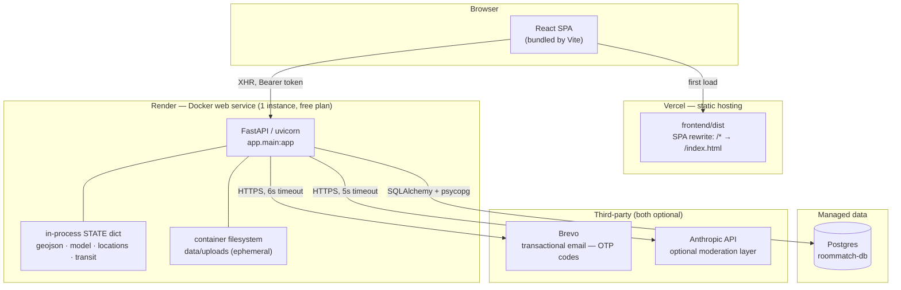
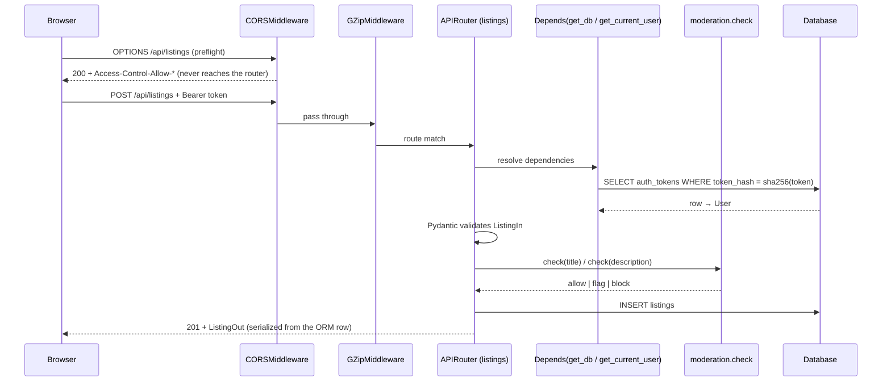
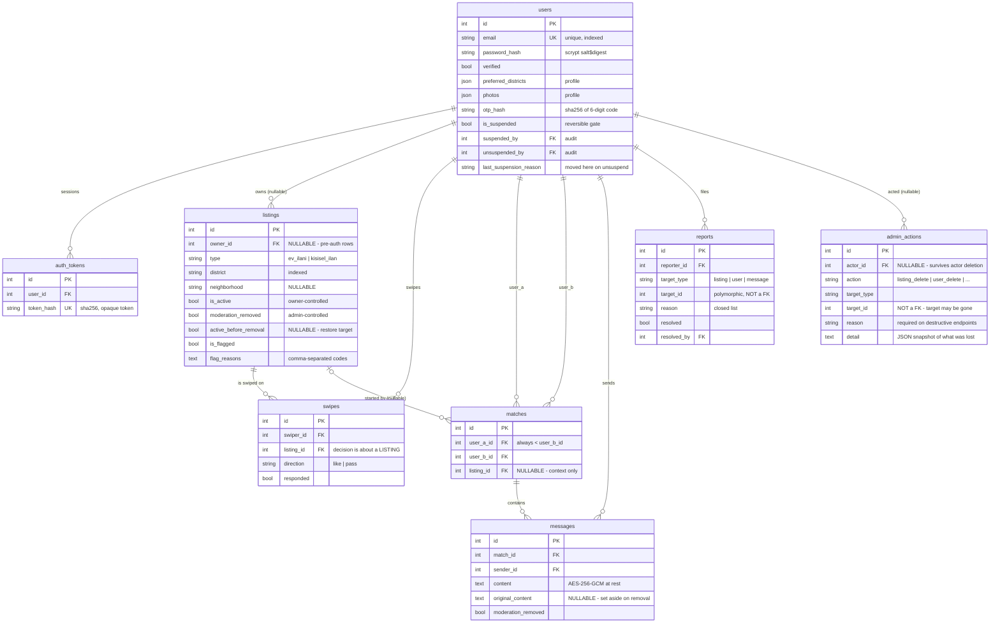
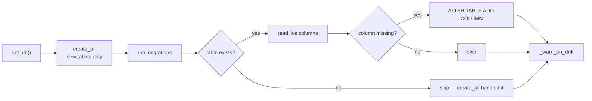

# Architecture

How this system is put together, and why.

This document is written for a developer who knows how to build web
applications but has never seen this repository. It moves from the outside in:
first the deployment shape, then the path a single request takes, then process
startup, then the database, then the code module by module, and finally how all
of it is tested.

Every claim below points at the code that backs it, as `path:line`. If you
cannot find the behaviour at that line, the document is wrong — not the code.

**Security is deliberately out of scope here.** Authentication design, the
admin trust model, encryption, and the deployment variables that can hand over
the admin panel are covered in [SECURITY.md](SECURITY.md). This document
mentions those mechanisms only where they explain the *shape* of the system.

---

## 1. The system at a glance



### What runs where, and why

**The frontend is static.** It is a Vite/React bundle with no server-side
rendering and no backend of its own; the only server-side configuration is a
catch-all rewrite so that client-side routes survive a page refresh
(`frontend/vercel.json:2`). The API address is baked in at build time from
`VITE_API_URL`, with a localhost fallback for development
(`frontend/src/lib/api.ts:12`). Consequence: **the browser talks to the API
directly** — there is no proxy layer that could hide the API, which is why CORS
configuration is load-bearing rather than cosmetic (`backend/app/main.py:176`).

**The backend is one Docker container.** Render builds from
`backend/Dockerfile`, and the build does something unusual: it *trains the
price model during the image build* (`backend/Dockerfile:36`). The trained
artifact therefore ships inside the image instead of being downloaded or
mounted at runtime. This keeps the runtime free of any model store, at the cost
of a slow build — the comment at `backend/Dockerfile:5` puts it at several
minutes, and the `PYTHONUNBUFFERED` note at `backend/Dockerfile:21` exists
because someone needed to see where those minutes went.

**One process, one worker.** The container's command starts uvicorn with no
`--workers` flag (`backend/Dockerfile:43`), so there is exactly one Python
process. That single fact explains several design choices later in this
document: the in-process `STATE` cache is not duplicated, and the in-memory
rate limiter (`backend/app/auth.py:46`) actually limits something.

**`--proxy-headers` is not decoration.** Uploaded-photo URLs are built from
`request.base_url` (`backend/app/uploads.py:75`). Behind Render's TLS
terminator, without the flag, that base URL would be `http://` and browsers
would block the images on an `https://` page — which is exactly what the
comment at `backend/Dockerfile:41` records.

**Postgres is provisioned by the blueprint**, and its connection string is
injected as `DATABASE_URL` (`render.yaml:38-41`). Locally the same code path
falls back to a single SQLite file (`backend/app/db.py:36`,
`backend/app/config.py:29`). Section 5 explains why that difference matters
more than it looks.

**Both third-party services are optional and fail soft.** Email sending is
skipped entirely unless `BREVO_API_KEY` and `EMAIL_FROM` are both set
(`backend/app/emailer.py:25-27`), and a failed send returns `False` rather than
raising (`backend/app/emailer.py:75-77`). The AI moderation layer only runs
when `ANTHROPIC_API_KEY` is present, and any exception inside it degrades
silently to the rule-based result (`backend/app/moderation.py:710-719`). The
platform runs, with reduced function, when both are absent.

**A scheduled GitHub Action pings the API every ten minutes**
(`.github/workflows/keepalive.yml`) because Render's free plan sleeps an idle
service after 15 minutes and a cold start has to reload everything in section 4.

---

## 2. Life of a request

Take one concrete endpoint end to end: `POST /api/listings`, the call the app
makes when a student publishes a room. The trace below was produced against a
locally running instance of this code.



### Step by step

**1. Middleware, outermost first.** Two middlewares are installed: GZip
(`backend/app/main.py:161`) and CORS (`backend/app/main.py:178`). Starlette
wraps the most recently added middleware *outermost*, so CORS sees the request
first. You can observe this: a preflight `OPTIONS /api/listings` returns `200`
with `access-control-allow-origin` even though no route handles `OPTIONS` — if
it reached the router it would be a `405`.

The allowed origins come from the `CORS_ORIGINS` environment variable, split on
commas, and fall back to a list of local development origins when unset
(`backend/app/main.py:164-184`). In the Render blueprint that variable is
deliberately left for the operator to fill in (`render.yaml:11-12`).

**2. GZip matters more than it usually does.** The threshold is 1024 bytes
(`backend/app/main.py:161`). This exists for one response in particular:
`GET /api/geojson` measures **3,473,852 bytes uncompressed and 920,001 bytes
with `Accept-Encoding: gzip`** — a 3.8× reduction on a payload every map user
downloads. (The code comment at `backend/app/main.py:160` estimates
"~4 MB → ~700 KB"; the measured numbers above are the current ones.)

**3. Routing.** Routers are included in `backend/app/main.py:148-154`. Each
module owns its prefix — `/api/listings` at `backend/app/listings.py:21`,
`/api/auth` at `backend/app/auth.py:30`, `/api/admin` at
`backend/app/admin.py:80` — except `swipes.py`, which registers a bare router
and spells out full paths per endpoint (`backend/app/swipes.py:21`,
`backend/app/swipes.py:123`, `backend/app/swipes.py:275`) because it serves two
unrelated prefixes, `/api/swipes` and `/api/matches`.

**4. Dependency injection.** The handler signature is the whole authorization
story:

```python
def create_listing(
    payload: ListingIn,
    db: Session = Depends(get_db),
    user: models.User = Depends(get_current_user),
):
```
`backend/app/listings.py:289-294`

- `get_db` opens one SQLAlchemy `Session` per request and closes it in a
  `finally` block (`backend/app/db.py:76-82`). It is a generator dependency, so
  the close runs after the response is produced.
- `get_current_user` (`backend/app/auth.py:300-305`) is a thin 401 wrapper over
  `get_optional_user` (`backend/app/auth.py:269-297`), which does the real
  work: read the `Authorization: Bearer` header
  (`backend/app/auth.py:32`), look up the **SHA-256 hash** of the presented
  token (`backend/app/auth.py:275-279`), expire tokens older than 30 days
  (`backend/app/auth.py:35`, `backend/app/auth.py:287-290`), and refuse
  suspended accounts (`backend/app/auth.py:294-295`).
- Both dependencies request `get_db`; FastAPI caches a dependency's result
  within a single request, so the auth lookup and the handler share one
  session and one transaction.

The three-way split — `get_db`, `get_optional_user`, `get_current_user` — is
what lets one endpoint be public-but-personalised. `GET /api/listings` takes
the *optional* user (`backend/app/listings.py:325`) so anonymous visitors get a
listing feed, while `?mine=1` and `?unswiped=1` raise or narrow only when a
user is present (`backend/app/listings.py:336-348`).

**5. Request validation.** `ListingIn` (`backend/app/listings.py:213-254`) is
not just types. `Literal["ev_ilani","kisisel_ilan"]` closes the type field
(`backend/app/listings.py:23`), photos are bounded at 3–6 with a stated reason
(`backend/app/listings.py:222-223`), and a `model_validator` enforces the
cross-field rule that a home listing needs rent and room count while a personal
listing needs a budget range (`backend/app/listings.py:244-254`). A violation
here is a `422` produced by FastAPI before any handler code runs.

**6. Business rules.** Title and description are moderated *separately* and the
results merged (`backend/app/listings.py:86-97`). The reason is stated in the
docstring and is worth repeating because it shaped the error contract: when
both fields were checked as one blob, a rejected user could not tell which
field to fix. So rejection returns a **structured** `detail` dict carrying
`field` and `reasons` (`backend/app/listings.py:42-62`), and never echoes the
user's own text back into the message.

**7. Persistence and response.** The row is inserted with the moderation
verdict attached (`backend/app/listings.py:297-306`) and returned through
`response_model=ListingOut`. `ListingOut` reads attributes off the ORM object
(`model_config = ConfigDict(from_attributes=True)`,
`backend/app/listings.py:260`), which is how `owner_name` and
`owner_university` — Python `@property` accessors on the model, not columns
(`backend/app/models.py:182-188`) — end up in the JSON.

There is a comment above `ListingOut` that is easy to skim past and shouldn't
be: it is **not** derived from `ListingIn`, because inheriting the input
validator would make the response schema re-run cross-field validation and turn
one malformed stored row into a `500` on every `GET`
(`backend/app/listings.py:257-258`).

**8. What a real call returns.** Creating a `2+1` in Kadıköy / Caferağa
Mah. yields `201` with `owner_university` auto-filled from the registration
e-mail domain (`backend/app/universities.py:79-85`), and the follow-up
`GET /api/listings/{id}/fair-price` returns a per-room band with
`district_level: false` and `neighborhood: "Caferağa Mah."`, i.e. the model
recognised the neighbourhood rather than falling back to the district average
(`backend/app/fairprice.py:126-131`).

---

## 3. Application startup

Everything expensive happens once, in an `asynccontextmanager` lifespan handler
attached to the app (`backend/app/main.py:70-144`, wired at
`backend/app/main.py:147`).

### What gets loaded

| Step | Code | What it does |
|---|---|---|
| Schema | `backend/app/main.py:77` | `init_db()` → `create_all` + `run_migrations` (`backend/app/db.py:61-73`) |
| Neighbourhood geometry | `backend/app/main.py:78-80` | parses `data/raw/mahalle_geojson.json` (4.1 MB, **968 features**) |
| Market prices | `backend/app/main.py:81-82` | joins the price CSV onto the geometry (`backend/app/heatmap.py:67-103`) |
| CPI indexing | `backend/app/main.py:91` | rescales every neighbourhood price to today (`backend/app/heatmap.py:150-168`) |
| Fair-price model | `backend/app/main.py:108-114` | `joblib.load` of a 6.2 MB artifact — **optional** |
| Location list | `backend/app/main.py:118-119` | district → neighbourhood tree for the listing form |
| Transit graph | `backend/app/main.py:124-137` | rail network + accessibility index — **optional** |

Observed on a developer machine, a real boot prints:

```
✅ Hazır: 968 mahalleden 489 tanesi fiyat verisiyle eşleşti (50.5%).
✅ Adil fiyat modeli yüklendi (medyan sapma %15.3).
✅ Konum listesi hazır: 38 ilçe, 539 mahalle.
✅ Toplu taşıma ağı yüklendi (261 istasyon; 455 mahalle yürüme mesafesinde).
```

### Why once per process, and what it costs

The heavy inputs are static files that do not change between requests, so
recomputing them per request would be pure waste. The GeoJSON↔CSV join is the
clearest case: prices do not depend on the user's budget, so the match runs at
boot and each `/api/heatmap` request only compares numbers to a budget —
documented as a deliberate performance decision at
`backend/app/heatmap.py:3-6`, and visible in the endpoint, which is a single
call into a pure function (`backend/app/main.py:236`).

Measured cost of the load, in isolation:

| Stage | Wall time | Resident memory delta |
|---|---|---|
| Parse GeoJSON | 0.02 s | ~32 MB |
| Annotate with prices | 0.01 s | ~1 MB |
| `joblib.load` of the model | 0.49 s | **~90 MB** |
| Build transit index | 0.10 s | ~1 MB |
| **Total** | **~0.6 s** | — |

(Measured on a warm filesystem cache; the whole lifespan handler, `init_db`
included, took 0.62 s wall time on the same run.)

The model dominates both time and memory: a 6.2 MB file on disk expands to
roughly 90 MB resident. That is the number to keep in mind before adding
uvicorn workers — the cache is per *process*, so `--workers 4` would mean four
copies. Today there is one worker (`backend/Dockerfile:43`).

### The `STATE` dictionary

`STATE` is a module-level dict (`backend/app/main.py:67`) holding six keys:

- `geojson` — the annotated feature collection, served verbatim by
  `/api/geojson` (`backend/app/main.py:93`, `backend/app/main.py:223`)
- `prices` — a flat list of average prices, extracted so the hot path never
  touches pandas (`backend/app/main.py:94-97`, and the comment saying exactly
  that)
- `counts` — listing counts per neighbourhood, used only to mark low-confidence
  medians (`backend/app/main.py:98-100`, threshold at
  `backend/app/heatmap.py:24`)
- `model` — the quantile models plus their training categories
  (`backend/app/main.py:109`); the artifact contains three quantile regressors
  (`low`/`mid`/`high`), the category lists for 38 districts and 571
  neighbourhoods, and the served median error
- `locations` — the district→neighbourhood list (`backend/app/main.py:119`)
- `access` — the transit accessibility index (`backend/app/main.py:130-132`)

`STATE.clear()` on shutdown (`backend/app/main.py:144`) keeps the dictionary
from outliving the app in tests that start and stop it repeatedly.

### Degradation is explicit, not accidental

Three of the six are optional, and each missing piece disables exactly one
feature with a `503` that names the fix:

- no model → `/api/estimate` returns 503 telling you to run the trainer
  (`backend/app/main.py:112-114`, `backend/app/main.py:259-266`)
- no transit file → `/api/alternatives` returns 503 naming the fetch script
  (`backend/app/main.py:138-141`, `backend/app/main.py:358-364`)
- data not yet loaded → map endpoints return 503 rather than an empty map
  (`backend/app/main.py:221-222`, `backend/app/main.py:234-235`)

There is one coupling worth calling out, because it is the kind of bug that
survives for months: rent indexing used to be applied only to the fair-price
endpoints, so the price advisor spoke in today's lira while the heatmap painted
the same neighbourhood in February 2025 prices — making budgets look more
sufficient than they were. The fix was to apply the factor **once, at load
time**, so `/api/geojson` and `/api/heatmap` cannot disagree
(`backend/app/main.py:85-91`, `backend/app/heatmap.py:150-158`).

---

## 4. The data model

Eight tables. The schema is defined once, as SQLAlchemy 2.0 declarative models
in `backend/app/models.py`, and every table is created from it
(`backend/app/db.py:72`).



### `users` — identity, profile and the suspension trail

One table holds credentials, the onboarding profile and the moderation state
(`backend/app/models.py:24-86`). Two design points are worth explaining.

**There is no roles table.** `User.is_admin` is a computed property that checks
membership in an environment-configured e-mail set
(`backend/app/models.py:82-86`, `backend/app/config.py:73-79`). That is a
consequential decision, and its trade-offs belong to
[SECURITY.md](SECURITY.md).

**Un-suspending leaves a trace.** Originally, lifting a suspension nulled the
`suspended_*` fields, which erased the answer to "why was this account
suspended and who reverted it". Now the reason is *moved* to
`last_suspension_reason` and the reverting admin is recorded
(`backend/app/models.py:65-74`). Keeping `suspended_reason` populated on an
active account was rejected for the opposite reason: the UI would present a
no-longer-effective reason as if it were in force.

### `listings` — three booleans that are not redundant

`is_active`, `moderation_removed` and `active_before_removal` look like they
could be one column. They cannot:

- `is_active=False` alone means *the owner closed it*
  (`backend/app/listings.py:500`).
- `moderation_removed=True` means *an admin took it down*
  (`backend/app/models.py:151`). Both states set `is_active=False`, but only
  the second is restorable by an admin and only the second shows up in
  `GET /api/admin/flagged?status=removed`.
- `active_before_removal` records whether the listing was live *at the instant*
  of takedown (`backend/app/models.py:152-164`). Without it, restore set
  `is_active=True` unconditionally and silently republished listings whose
  owners had already closed them. `NULL` means "removed before this column
  existed", and those rows fall back to the old behaviour — the schema carries
  its own history.

`owner_id` is nullable (`backend/app/models.py:112-115`) because listings
predate authentication. That single nullable column ripples outward: listing
queries need an explicit `OR owner_id IS NULL` when filtering by owner,
because SQL's `NULL NOT IN (...)` is `NULL`, not `TRUE`, and would silently
drop every anonymous row (`backend/app/listings.py:178-188`).

### `swipes` — why the decision points at a listing, not a person

A swipe is `(swiper_id, listing_id, direction)` with a uniqueness constraint on
the pair (`backend/app/models.py:191-209`). Attaching the decision to a
**listing** rather than to a user is the more informative choice, and it is
what the matching rule needs: one person may post several listings, and liking
"the 2+1 in Kadıköy" is not the same statement as liking its owner.

This shows up directly in the reciprocity check. A match fires when the current
user likes a listing *and* that listing's owner has previously liked **any**
listing of the current user — a join from swipe to listing to owner
(`backend/app/swipes.py:107-118`, used at `backend/app/swipes.py:163-169`). If
swipes pointed at users, that query would be trivial but the deck could not
distinguish "not interested in this room" from "not interested in you", and
`?unswiped=1` — which hides already-decided listings
(`backend/app/listings.py:340-348`) — would have no natural key.

The `responded` flag exists because a like has a second life: it appears in the
owner's "Likes" queue until the owner accepts or rejects it
(`backend/app/swipes.py:198-229`, `backend/app/swipes.py:265`). And re-deciding
the same listing updates the existing row only when the direction actually
changed, so re-liking cannot be used to spam an owner's queue
(`backend/app/swipes.py:147-152`).

### `matches` — normalised pairs, and a nullable `listing_id`

A match is one row per *pair*, with `user_a_id < user_b_id` enforced by sorting
before insert (`backend/app/swipes.py:88`) so that the unique constraint
(`backend/app/models.py:220`) catches the mirrored duplicate. Without the
normalisation, `(3,7)` and `(7,3)` would be two matches and two separate chats
for one relationship.

**`listing_id` is nullable on purpose.** The model comment states the rule:
the listing is the *reason a match began*, not its subject — "the match
survives even if the listing closes" (`backend/app/models.py:225-226`). Two
places depend on that:

- Permanently deleting a listing sets `matches.listing_id = NULL` and leaves
  the match and its messages intact (`backend/app/listings.py:164-166`), with
  the rationale spelled out at `backend/app/listings.py:145-150`: deleting a
  listing must not delete what people said to each other.
- The match list tolerates the null and simply omits the title
  (`backend/app/swipes.py:318`).

There is also a hard constraint underneath the philosophy: `matches.listing_id`
carries a real foreign key, so on Postgres a listing cannot be deleted while a
match still references it. Skipping the detach step would turn the admin delete
endpoint into a `500` (`backend/app/listings.py:151-154`).

### `messages` — removal that can be undone

Content is encrypted at rest before insert (`backend/app/messages.py:145`) and
decrypted on the way out (`backend/app/messages.py:39-47`). When an admin
removes a message, the row is **not** deleted — deleting it would break the
order and context of the conversation — and the existing value is *moved* to
`original_content` exactly as stored, ciphertext and all, so restoring writes
it back byte-for-byte (`backend/app/models.py:248-254`).

### `reports` — polymorphic by necessity

`Report` targets a listing, a user, or a message, addressed as
`(target_type, target_id)` (`backend/app/models.py:334-335`). Three separate
report tables, or three nullable foreign keys, would both have been valid — so
why this?

1. **The target may legitimately not exist.** Reports are meaningful precisely
   about content that is about to disappear. A real foreign key would forbid
   writing or keeping the row.
2. **One queue, one shape.** The admin queue lists all reports together, newest
   first, with one optional type filter (`backend/app/reports.py:148-166`). A
   single table makes that a plain query instead of a three-way union.
3. **The lookup is centralised, not scattered.** The type→model mapping lives
   in one dict used to verify the target exists at creation time
   (`backend/app/reports.py:47-51`, `backend/app/reports.py:115-117`), so the
   integrity the database is not enforcing is enforced once, in code.

The cost is honest and real: nothing stops orphans from accumulating. The code
pays that cost explicitly by sweeping dependent reports whenever a target is
destroyed — on listing deletion (`backend/app/listings.py:160-163`) and on
account deletion, including reports *about* the user and about their listings
and messages (`backend/app/auth.py:562-586`). The comment there states the
reason plainly: an unswept report becomes a queue entry that 404s when clicked.

Duplicate reporting is blocked by a unique constraint on
`(reporter_id, target_type, target_id)` (`backend/app/models.py:327-329`), and
the endpoint checks first *and* catches the `IntegrityError`, converting the
race-loser into the same `409` rather than a `500`
(`backend/app/reports.py:119-143`).

`admin_actions` uses the same polymorphic addressing for a stronger version of
the same reason (`backend/app/models.py:306-308`): it is the audit trail for
*permanent deletion*, so by definition the target is gone by the time the row
matters. Its `actor_id` is nullable so the record outlives the admin who wrote
it — otherwise the easiest way to erase your moderation history would be to
delete your own account (`backend/app/models.py:294-301`, and the sweep that
relies on it at `backend/app/auth.py:598-607`).

### The deletion order problem

`purge_user` (`backend/app/auth.py:503-617`) is the most intricate function in
the codebase, and its shape is dictated by the schema. Nullable foreign keys to
`users.id` are **derived from SQLAlchemy metadata** rather than listed by hand
(`backend/app/auth.py:474-500`), because the hand-written version broke three
separate times as new audit columns were added. Non-nullable references
(`swipes.swiper_id`, `matches.user_*_id`, `messages.sender_id`,
`reports.reporter_id`, `auth_tokens.user_id`) cannot be nulled and are deleted
in an explicit order instead.

Both deletion endpoints — the user's own (`backend/app/auth.py:620-639`) and
the admin's — call this one function, so the "what gets removed" logic exists
in exactly one place.

---

## 5. Migrations

### Why there is no Alembic

Stated at `backend/app/migrate.py:1-14`: Alembic was judged too heavy for this
project's size, so column drift is closed by hand in one module. Whether you
agree or not, the important thing is that the *replacement* is explicit about
its own limits.

`Base.metadata.create_all` creates missing **tables** but never adds a column to
an existing one (`backend/app/db.py:61-73`). In development that is invisible —
your SQLite file is created fresh from the current models. In production it is
the whole problem: Postgres holds live rows in tables created months ago.

### How `migrate.py` works



- `_SCHEMA` maps table → columns to add (`backend/app/migrate.py:45-105`).
- Live columns are read dialect-aware: `information_schema.columns` on
  Postgres, `PRAGMA table_info` on SQLite, generic inspector otherwise
  (`backend/app/migrate.py:108-126`). The Postgres branch filters on
  `table_schema = current_schema()`, because an identically named table in
  another schema would union its columns in and make a genuinely missing column
  look present (`backend/app/migrate.py:111-113`).
- `ALTER TABLE` gets `IF NOT EXISTS` on Postgres so two processes starting
  simultaneously — a rolling deploy — do not crash the second one
  (`backend/app/migrate.py:136-141`).
- Three invariants hold: nothing is ever dropped, only added; the whole thing
  is idempotent; and it runs at every boot (`backend/app/migrate.py:7-13`,
  called from `backend/app/db.py:73`).

The list also encodes a distinction that is easy to get wrong: **brand-new
tables are not listed**. `create_all` already creates them in their final form
and runs first, so adding them here would turn `_SCHEMA` into a second, partial
definition of the schema (`backend/app/migrate.py:39-44`).

`_Column.default` carries meaning beyond SQL. Where a default is given
(`False`), existing rows get it — "old rows count as not flagged". Where it is
omitted, `NULL` is the answer, and `NULL` means *genuinely unknown*. The
clearest case is `active_before_removal` (`backend/app/migrate.py:81-85`):
writing `False` would have silently kept previously removed listings offline
after a restore.

### The risk, stated out loud

`_SCHEMA` is a hand-maintained list. Add a column to `models.py`, forget to add
it here, and everything works locally — your local schema is born from
`create_all` — while production's older table lacks the column and the first
request touching it fails at runtime.

The mitigation is `_warn_on_drift` (`backend/app/migrate.py:183-210`): after
every migration run it diffs `Base.metadata` against the live database and
prints a loud warning naming each column present in the models and absent in
the database. Note what this is and is not — it is a **warning at startup**,
not a guard. The app still boots. Nothing fails until a request touches the
missing column.

The second line of defence is a test that runs migrations against a **frozen
snapshot of a genuinely deployed old schema**
(`backend/tests/test_migrate.py:22-27`). That snapshot must never be updated to
match today's models; if it were, the test would validate itself and stop
catching the forgotten column.

**Rule of thumb: adding a column to `backend/app/models.py` is a two-file
change.** The second file is `backend/app/migrate.py`.

---

## 6. Backend module tour

| Module | Lines | Responsibility |
|---|---:|---|
| `app/main.py` | 379 | app assembly, lifespan, map & price endpoints |
| `app/config.py` | 83 | paths resolved from `__file__`, admin e-mails, upload dir |
| `app/db.py` | 82 | engine, session factory, `init_db`, `get_db` |
| `app/models.py` | 348 | the eight tables |
| `app/migrate.py` | 210 | additive column migrations + drift warning |
| `app/auth.py` | 655 | registration, OTP, sessions, profile, account deletion |
| `app/listings.py` | 501 | listing CRUD, feed filters, fair-price passthrough |
| `app/swipes.py` | 325 | swipes, likes queue, match creation, match list |
| `app/messages.py` | 152 | per-match chat |
| `app/reports.py` | 171 | user reports + `require_admin` |
| `app/admin.py` | 1493 | the moderation surface, `/api/admin/*` |
| `app/moderation.py` | 858 | rule-based content checks (always on, offline) |
| `app/moderation_ai.py` | 165 | optional Anthropic classification layer |
| `app/crypto.py` | 192 | AES-256-GCM for message rows |
| `app/emailer.py` | 77 | OTP delivery via Brevo |
| `app/uploads.py` | 75 | photo upload + static serving |
| `app/pricing.py` | 84 | feature engineering shared by training and serving |
| `app/fairprice.py` | 131 | per-room fair share for a stored listing |
| `app/indexing.py` | 94 | CPI factor applied to model output |
| `app/heatmap.py` | 169 | GeoJSON↔CSV join, budget colouring |
| `app/transit.py` | 289 | rail graph, accessibility, alternative districts |
| `app/locations.py` | 72 | district→neighbourhood list for the form |
| `app/normalize.py` | 85 | Turkish text canonicalisation for place matching |
| `app/universities.py` | 85 | e-mail domain → university |
| `app/departments.py` | 250 | closed list of degree programmes |

### Modules that encode a decision worth reading

**`config.py` — paths from `__file__`, not from the working directory**
(`backend/app/config.py:3-11`). Every script under `scripts/` can be launched
from anywhere and still find its data. Small, but it removes a whole class of
"works on my machine".

**`db.py` — SQLite foreign keys are turned on deliberately**
(`backend/app/db.py:16-34`). SQLite disables FK enforcement by default, *per
connection*; Postgres always enforces. Left alone, the two environments drift
silently: a wrong deletion order passes locally and raises `IntegrityError` in
production. The listener is attached to the `Engine` **class**, not to one
engine instance, so every engine — including the throwaway ones tests create —
gets the same setting. That single choice is why `purge_user` and
`purge_listing` are correct rather than accidentally correct.

**`moderation.py` — a rule engine tuned against false positives.** It is pure,
dependency-free and always on (`backend/app/moderation.py:1-11`). The stated
bias is that blocking an innocent listing is worse than missing a rude word, so
`block` is reserved for unambiguous cases and everything heuristic can at most
`flag`. Turkish makes this genuinely hard: character folding turns the innocent
"sık" into a slur, so folded and unfolded text are scanned separately, matching
is word-based rather than substring-based, and there is an explicit safe-word
list (`backend/app/moderation.py:13-35`). Scam scoring is capped below the
block threshold so that category can never block anything
(`backend/app/moderation.py:67-72`).

**`moderation_ai.py` — an optional layer that cannot break the app.** It runs
only with an API key, only when the rules did not already block (avoiding
pointless cost and latency), with a 5-second timeout, and any failure returns
`None` so the caller falls back to the rule verdict
(`backend/app/moderation.py:694-719`, `backend/app/moderation_ai.py:36-47`).
The two results are combined by `merge`, where the stricter action wins and
reasons accumulate (`backend/app/moderation.py:725-743`).

**`crypto.py` — versioned ciphertext with a plaintext fallback.** Values are
tagged `enc:v1:` and anything untagged is treated as legacy plaintext and
returned as-is, because production already contains unencrypted rows
(`backend/app/crypto.py:23-26`). Undecryptable rows return the `[unreadable]`
sentinel rather than failing the whole conversation
(`backend/app/crypto.py:45-51`, `backend/app/crypto.py:157-178`). That sentinel
is a language-independent marker the frontend translates — not user-facing text
— which is why users are forbidden from typing it themselves
(`backend/app/messages.py:127-130`, `backend/app/moderation.py:782`).

**`pricing.py` — one feature pipeline, two callers.** Training and serving must
apply identical transforms or the model receives a distribution it never saw
(`backend/app/pricing.py:1-6`). The category lists are stored *with* the model
and reused at inference (`backend/app/pricing.py:51-79`), so an unseen
neighbourhood becomes `NaN` and the tree model handles it — degrading to a
district-level estimate rather than erroring.

**`locations.py` — an intersection, not a list.** The dropdown is the
intersection of the market-value CSV (which knows which district a
neighbourhood belongs to) and the model's known categories (which determine
whether a neighbourhood-level estimate is even possible)
(`backend/app/locations.py:1-16`). The principle: don't offer the user a choice
you cannot honour. If no model is loaded, the filter is skipped so the form
still works.

**`transit.py` — hops, not kilometres.** Straight-line distance is misleading in
Istanbul: the two sides of the Bosphorus are 1–2 km apart and half an hour
away. Proximity is therefore measured in rail stops with a transfer penalty
(`backend/app/transit.py:7-31`).

**`admin.py` — the largest module, and the one with a written constitution.**
Its header (`backend/app/admin.py:1-56`) states five principles: prefer the
reversible action; permanent deletion exists but requires a reason and writes
an audit row; a reporter's identity is never shown to the reported; an admin
sees only what the decision requires; and every action records who and when.
Two structural details follow from those: the audit row is written in the *same
transaction* as the action it describes, so a failed delete cannot leave a
record claiming success (`backend/app/admin.py:458-462`), and admins cannot
suspend or delete themselves or each other — a safety interlock, not a
permission rule, since the last admin locking themselves out is unrecoverable
(`backend/app/admin.py:1226-1251`).

---

## 7. Test strategy

**381 tests, all passing**, in ~16 s:

```
cd backend && source venv/bin/activate && python -m pytest tests/ -q
```

| File | Tests | Area |
|---|---:|---|
| `tests/test_admin.py` | 107 | admin moderation surface |
| `tests/test_moderation.py` | 61 | content-checking rules |
| `tests/test_admin_destructive.py` | 43 | permanent deletion endpoints |
| `tests/test_account_delete_references.py` | 30 | account deletion / FK sweep |
| `tests/test_suspension.py` | 16 | suspension semantics across features |
| `tests/test_listings.py` | 14 | listing CRUD |
| `tests/test_message_crypto.py` | 14 | message encryption |
| `tests/test_auth.py` | 13 | registration, OTP, sessions |
| `tests/test_messages.py` | 11 | chat endpoints |
| `tests/test_indexing.py` | 10 | CPI factor |
| `tests/test_swipes.py` | 10 | swipes and matching |
| `tests/test_reports.py` | 9 | user reports |
| `tests/test_listing_features.py` | 7 | feature filters |
| `tests/test_migrate.py` | 7 | migrations against a frozen old schema |
| `tests/test_universities.py` | 6 | e-mail domain → university |
| `tests/test_uploads.py` | 5 | photo upload validation |
| `tests/test_account.py` | 4 | profile / password |
| `tests/test_db_foreign_keys.py` | 4 | SQLite FK enforcement |
| `tests/test_departments.py` | 4 | closed department list |
| `tests/test_emailer.py` | 3 | Brevo delivery |
| `tests/test_listing_update.py` | 3 | PATCH semantics |
| **Total** | **381** | |

The distribution says something true about the project: **moderation,
reporting and administration are about 60% of the suite** (236 of 381). That
matches where the risk is — these are the code paths that delete data, hide
content and reveal private text.

### How a test is set up

Two `autouse` fixtures in `backend/tests/conftest.py` handle process-global
state that would otherwise leak between tests:

- rate-limit buckets are cleared before and after each test
  (`backend/tests/conftest.py:14-19`), since the limiter is a module-level dict
  (`backend/app/auth.py:46`);
- `ANTHROPIC_API_KEY` is deleted from the environment
  (`backend/tests/conftest.py:22-29`) so a developer's shell cannot make the
  suite hit the network and become non-deterministic.

Per-module fixtures build an in-memory SQLite engine with `StaticPool`, create
the schema from `Base.metadata`, and override the `get_db` dependency
(`backend/tests/test_listings.py:40-61`). Two consequences are deliberate:

1. Tests never touch the developer's `data/app.db`, and every run starts clean.
2. `TestClient` is used **without** its context manager, so the lifespan never
   runs (`backend/tests/test_listings.py:58-60`). Router tests do not pay the
   ~0.6 s data load — but they also run with an empty `STATE`, which is why
   fair-price behaviour has to be tested separately from routing.

### The SQLite/Postgres gap, and the test that guards it

This deserves its own section because it is the sharpest environment difference
in the project.

SQLite does not enforce foreign keys unless you ask, per connection. Postgres
always does. If tests ran with enforcement off, `purge_user` and
`purge_listing` could delete rows in an order that works locally and raises
`IntegrityError` in production — a `500` on "delete my account", found by users
rather than by CI.

`backend/tests/test_db_foreign_keys.py` guards the setting itself rather than a
behaviour, and its docstring says exactly that (`lines 1-7`). It asserts:

- the **application's own engine** has `PRAGMA foreign_keys = 1`
  (`backend/tests/test_db_foreign_keys.py:19-22`) — proving the setting lives
  in `app/db.py` and not in test setup;
- a freshly created engine has it too
  (`backend/tests/test_db_foreign_keys.py:25-35`) — proving the listener is
  bound to the `Engine` class;
- a violation actually raises, because reading the pragma is not proof
  (`backend/tests/test_db_foreign_keys.py:38-59`);
- deleting a user who filed a report is refused — the concrete constraint that
  forces `purge_user` to clear reports first
  (`backend/tests/test_db_foreign_keys.py:62-92`).

`conftest.py` deliberately does **not** repeat the pragma
(`backend/tests/conftest.py:8-11`): a second copy of the setting would let the
app and the tests drift apart, which is the exact failure being prevented.

### What the suite does not cover

- **No Postgres in CI.** Every test runs on SQLite. Dialect-specific paths —
  the `information_schema` branch (`backend/app/migrate.py:110-121`) and the
  `IF NOT EXISTS` form (`backend/app/migrate.py:141`) — are exercised only in
  production. The frozen-schema migration test reduces the risk; it does not
  remove it.
- **No frontend tests are counted here.** A vitest config exists
  (`frontend/vitest.config.ts`) and a `src/test` directory is present; this
  document's numbers are backend-only.
- **No end-to-end browser tests.** The trace in section 2 was produced by hand
  against a local server, not by an automated test.

---

## 8. Limitations — what this architecture does not do

Stated plainly, because a document that only lists strengths is not useful.

1. **Uploaded photos do not survive a redeploy.** Files are written to the
   container filesystem (`backend/app/uploads.py:71-73`,
   `backend/app/config.py:83`). The config comment says to point `UPLOADS_DIR`
   at a persistent disk in production — and `render.yaml` defines neither a
   disk nor that variable. On Render's ephemeral filesystem, every deploy or
   restart loses previously uploaded images while the listing rows keep
   pointing at their URLs. Listings created before a deploy will show broken
   images.

2. **The schema-drift guard warns; it does not stop anything.**
   `_warn_on_drift` prints at startup and the app proceeds
   (`backend/app/migrate.py:203-210`). A forgotten `_SCHEMA` entry still
   reaches production; it just announces itself in the logs first.

3. **Migrations are additive only.** Nothing is ever renamed, retyped or
   dropped (`backend/app/migrate.py:8`). Any change that is not "add a nullable
   or defaulted column" has no supported path and must be done by hand against
   the live database.

4. **Everything in-process is single-process.** The `STATE` cache
   (`backend/app/main.py:67`) and the rate limiter
   (`backend/app/auth.py:44-46`) are module-level dictionaries. Adding a second
   worker or a second instance would duplicate ~90 MB of model per process and
   divide the effective rate limit by the number of processes. The rate limiter
   also resets on every restart — and on the free plan, the service restarts
   whenever it wakes from sleep.

5. **Chat is polling, not push.** The client re-fetches on an interval;
   `after_id` exists to keep those polls incremental
   (`backend/app/messages.py:1-4`, `backend/app/messages.py:70-90`). There is
   no WebSocket, so message latency is bounded by the polling interval, and
   every open conversation costs a request per tick.

6. **`GET /api/matches` issues one query per match.** The last message is
   fetched in a Python loop (`backend/app/swipes.py:302-323`). Fine for a
   student with a handful of matches; linear growth in queries per request.

7. **Listing owners cannot reopen their own listings.** Closing is one-way from
   the user's side; only an admin endpoint can republish
   (`backend/app/listings.py:481-494` — the docstring says so explicitly).

8. **The listing feed is unpaginated.** `GET /api/listings` returns every
   matching active listing with no limit or offset
   (`backend/app/listings.py:309-363`), unlike the admin listing and report
   endpoints, which are bounded (`backend/app/reports.py:154`).

9. **Reports and audit rows can be orphaned by design.**
   `reports.target_id` and `admin_actions.target_id` carry no foreign key
   (`backend/app/models.py:335`, `backend/app/models.py:306-308`). Cleanup is
   application logic; any deletion path added in the future that forgets to
   sweep will leave queue entries pointing at nothing.

10. **Messages removed before `original_content` existed cannot be restored.**
    Their text was overwritten in place, and the migration cannot invent it
    (`backend/app/migrate.py:93-96`, `backend/app/admin.py:15-18`).

11. **The rent index is partly an estimate, not a published figure.**
    `ANCHOR_FACTOR = 1.656` is the midpoint of a derived band, roughly 16% above
    the exact headline-CPI chain, and the module says so in detail
    (`backend/app/indexing.py:27-45`). `HEADLINE_FACTOR` keeps the verifiable
    number visible so the decision can be audited or reverted, and
    `RENT_INDEX_FACTOR` can override it without a code change.

12. **Half the map has no price data.** 489 of 968 neighbourhoods matched the
    market-value CSV (50.5%) in the boot log above; the rest render as
    "no data". Neighbourhoods with fewer than 8 listings are coloured but
    flagged low-confidence (`backend/app/heatmap.py:20-24`).

13. **No structured logging, metrics or error tracking.** Diagnostics are
    `print()` calls to stdout (`backend/app/main.py:73`,
    `backend/app/migrate.py:176-177`, `backend/app/crypto.py:62-67`). There is
    no request log correlation and no alerting; the only liveness signal is the
    keepalive ping.

14. **A cold start is not free.** Free-plan sleep plus the ~0.6 s data load
    plus process startup means the first request after idling is noticeably
    slow. The 10-minute keepalive is a workaround, and GitHub disables
    scheduled workflows on repositories without commits for 60 days
    (`.github/workflows/keepalive.yml:2-4`).

---

## See also

- [SECURITY.md](SECURITY.md) — the threat model, authentication, the admin
  trust model, message encryption, and the deployment variables that matter.
- [../README.md](../README.md) — feature overview, models and method, running
  locally.
- [../DEPLOY.md](../DEPLOY.md) — deployment procedure and environment
  variables.
