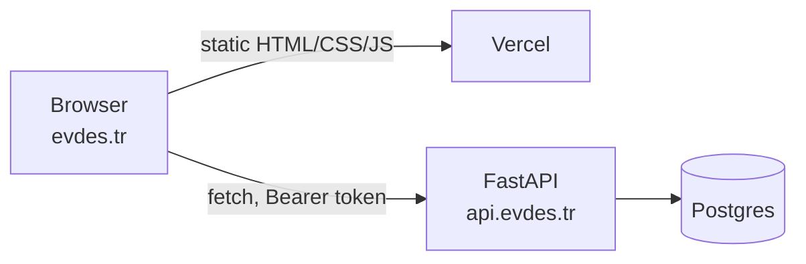

# Frontend architecture

This document explains how the `frontend/` client is built: what each library
in the stack is doing, which problem it solves, and where the interesting
decisions live in the code. It assumes you know React and TypeScript but have
never opened this repository.

Every claim below points at a file and line. If a statement here and the code
disagree, the code wins — please fix the document.

Security topics (token handling, admin authorization, moderation, message
encryption) are deliberately **not** covered here. See [SECURITY.md](SECURITY.md).

---

## 1. What the frontend actually is

A single-page React app served as static files from Vercel, talking to a
FastAPI backend on a different origin (`api.evdes.tr`). There is no server-side
rendering, no API routes, no Node process in production — the build output is
one HTML file, one CSS file and one JS bundle (`frontend/dist/`, produced by
`npm run build`).

The entry point is five lines: mount `<App />` into `#root` and import the
stylesheet (`frontend/src/main.tsx:1-5`). Everything else hangs off `App.tsx`.

That shape drives most of the choices below: everything is client-side, the
API base address must be injected at build time, and deep links need a
rewrite rule on the host (`frontend/vercel.json:2`).



---

## 2. The stack, piece by piece

Versions are from `frontend/package.json`.

| Library | Version | What it is doing here |
| --- | --- | --- |
| React | 18.3.1 | UI runtime. Function components + hooks only; there is no class component in `src/`. |
| TypeScript | 5.8.3 | Types are the cheapest test we have. Used aggressively for API response shapes (`src/lib/api.ts`) and translation keys (`src/i18n/translations.ts:881`). |
| Vite | 5.4.19 | Dev server and production bundler. See §3. |
| Tailwind CSS | 3.4.17 | Utility-first styling driven by CSS variables. See §4. |
| shadcn/ui | (vendored) | Not an npm dependency — the components are copied into `src/components/ui/`. See §4.3. |
| TanStack Query | 5.83.0 | Server-state cache: fetching, caching, invalidation. See §5. |
| React Router | 6.30.1 | Client-side routing. See §6. |
| framer-motion | 12.34.3 | Gesture handling and transitions — the swipe deck is a real drag gesture, not a CSS animation (`src/pages/SwipeScreen.tsx:453-476`). |
| Leaflet | 1.9.4 | Map rendering for the budget heatmap (`src/pages/Explore.tsx`). |
| next-themes | 0.3.0 | Light/dark/system theme, persisted, applied as a class on `<html>` (`src/App.tsx:31`). |
| sonner | 1.7.4 | Toast notifications — the app's main channel for "the server said no". |
| lucide-react | 0.462.0 | Icon set. |
| Vitest | 3.2.4 | Test runner. See §10. |

### Why these and not the obvious alternatives

**framer-motion instead of CSS transitions.** The swipe deck needs the card to
follow the finger, rotate proportionally to horizontal offset, and fade in a
LIKE/NOPE stamp as it goes. That is a continuous mapping from one drag value to
several style properties, which is exactly what `useMotionValue` +
`useTransform` express (`src/pages/SwipeScreen.tsx:453-456`); the drag
threshold that commits the swipe is a single comparison in `handleDragEnd`
(`src/pages/SwipeScreen.tsx:458-461`). Doing this with CSS classes would mean
tracking pointer events by hand.

**Leaflet instead of a React map wrapper.** `Explore` is the only map screen
and it needs imperative control: it creates the map once, keeps the polygon
layers in a ref array, and re-styles them in place when the budget slider moves
(`src/pages/Explore.tsx:39-45`, `:79-99`). Re-rendering all 968 polygons through
React on every slider tick would be slower and no clearer.

**next-themes instead of a hand-written theme context.** It handles the parts
that are annoying to get right: reading the OS preference, persisting the
choice, and avoiding a flash of the wrong theme. It is configured to write a
class (`attribute="class"`), which is what Tailwind's `darkMode: ["class"]`
expects (`src/App.tsx:31`, `frontend/tailwind.config.ts:4`).

**sonner *and* the shadcn toaster.** Both are mounted (`src/App.tsx:36-37`).
Almost all code imports `toast` from `sonner`; `CreateListing` is the odd one
out and imports it from `@/hooks/use-toast` (`src/pages/CreateListing.tsx:11`).
This is duplication, not design — see §11.

---

## 3. Vite

### Why not webpack

Vite's dev server does not bundle. It serves your source files as native ES
modules and lets the browser request them; only third-party dependencies are
pre-bundled. The practical effect on a project this size (2117 modules in the
production graph) is that cold start and hot updates stay near-instant
regardless of how many pages exist, because changing `Profile.tsx` invalidates
one module, not a graph.

Transforms run through SWC rather than Babel
(`@vitejs/plugin-react-swc`, `frontend/vite.config.ts:2,14`), a Rust
implementation of the same JSX/TS stripping.

### Dev server

`frontend/vite.config.ts:7-13`:

- `host: "::"` binds to all interfaces, so a phone on the same Wi-Fi can open
  the dev build — useful because this UI is mobile-first (bottom nav, safe-area
  padding at `src/components/layout/BottomNav.tsx:33`).
- `port: 8080`.
- `hmr.overlay: false` disables the full-screen red error overlay; errors still
  appear in the console.

The `@` alias maps to `src/` (`frontend/vite.config.ts:15-19`) and is mirrored
in `frontend/tsconfig.json:5-8` and `frontend/vitest.config.ts:13-15` so the
editor, the bundler and the test runner agree.

### Production build

`npm run build` runs `vite build` → Rollup → `dist/`. Current output:

```
dist/index.html                   0.84 kB │ gzip:   0.46 kB
dist/assets/index-<hash>.css     80.02 kB │ gzip:  17.88 kB
dist/assets/index-<hash>.js     942.88 kB │ gzip: 277.70 kB
```

One JS chunk, because every page is a static import in `src/App.tsx:9-26`.
Rollup warns about the 500 kB threshold on every build. This is a known,
unaddressed limitation (§11).

`npm run build:dev` produces the same bundle in development mode, and
`npm run preview` serves `dist/` locally (`frontend/package.json:9,11`) — useful
for reproducing a production-only bug like the one in §4.5.

### Environment variables

Vite exposes only variables prefixed `VITE_`, and it **inlines them at build
time** — they are string-substituted into the bundle, not read at runtime.
There is exactly one:

```ts
const BASE_URL = import.meta.env.VITE_API_URL ?? "http://127.0.0.1:8000";
```
`src/lib/api.ts:12`

The fallback means `npm run dev` works against a local backend with no `.env`
at all. `frontend/.env.example` documents it. Because the value is baked in,
pointing the frontend at a different API means a **rebuild**, not a restart —
on Vercel that is an environment variable plus a redeploy (`DEPLOY.md:233`).

---

## 4. Styling: Tailwind + design tokens + shadcn/ui

### 4.1 The utility-first idea

Instead of naming a component and writing a rule for it, you compose the rule
inline from single-purpose classes:

```tsx
<h1 className="text-2xl font-bold text-foreground">
```
`src/pages/Listings.tsx:974`

The payoff is that there is no stylesheet to grow, no dead CSS, and no naming
debate. The cost is long `className` strings. Where a pattern repeats across
screens it is promoted into a component class in `@layer components`
(`src/index.css:133-229`) — `.card-listing`, `.message-sent`,
`.bottom-nav-item`, `.glass-card` and friends. That layer is small on purpose:
it holds the handful of patterns that would otherwise be copy-pasted twenty
times.

Conditional class strings are merged with `cn()` (`src/lib/utils.ts:4-6`),
which is `clsx` (conditional joining) wrapped in `tailwind-merge` (last-wins
conflict resolution, so `p-2` passed by a caller beats a component's default
`p-4` instead of both landing in the class list).

### 4.2 Design tokens as CSS variables

Tailwind is not configured with literal colors. Every semantic color is a CSS
custom property holding **bare HSL channels**, defined twice — once for light
under `:root` (`src/index.css:16-62`) and once for dark under `.dark`
(`src/index.css:64-109`):

```css
:root { --primary: 24 12% 12%; }   /* ink   */
.dark { --primary: 36 26% 91%; }   /* cream */
```

The Tailwind config wraps them (`frontend/tailwind.config.ts:19-78`):

```ts
primary: { DEFAULT: "hsl(var(--primary))", foreground: "hsl(var(--primary-foreground))" }
```

Two consequences worth understanding:

1. **The channels are stored without `hsl()` so that opacity modifiers work.**
   `bg-primary/10` compiles to `hsl(var(--primary) / 0.1)`. If the variable
   already contained a full `hsl(...)` string, that syntax would be invalid.
   The same trick is used by hand in the stylesheet, e.g.
   `box-shadow: 0 4px 16px hsl(var(--mint) / 0.3)` (`src/index.css:155`).
2. **Nothing in the components knows which theme is active.** A button says
   `bg-primary text-primary-foreground`; whether that renders as dark-on-cream
   or cream-on-dark is decided entirely by which variable block is in scope.

The radius token works the same way: `--radius: 0.8rem` (`src/index.css:46`)
feeds `rounded-lg/md/sm` (`frontend/tailwind.config.ts:79-83`).

Beyond the standard shadcn token set there are five brand accents —
`--lavender`, `--sand`, `--coral`, `--mint`, `--indigo` (`src/index.css:48-52`,
dark values at `:95-99`), exposed as Tailwind colors at
`frontend/tailwind.config.ts:53-70`.

### 4.3 The `:root` / `.dark` switch

`darkMode: ["class"]` (`frontend/tailwind.config.ts:4`) tells Tailwind that
`dark:` variants key off a `.dark` ancestor rather than the OS media query.
`next-themes` is what puts that class on `<html>`, configured with
`attribute="class"` and `defaultTheme="dark"` (`src/App.tsx:31`).

Two entry points drive it:

- `ThemeToggle` — a two-state button in the app header
  (`src/components/ThemeToggle.tsx:18-27`), mounted by `AppHeader` next to the
  language switch (`src/components/layout/AppHeader.tsx:39-40`). It waits for a
  `mounted` flag before trusting `resolvedTheme`
  (`src/components/ThemeToggle.tsx:10-15`), because on the very first render
  next-themes has not yet read storage and the icon would otherwise flip.
- `Settings` — a three-way light / dark / system segmented control
  (`src/pages/Settings.tsx:15-19`, rendered at `:64-79`).

Because the switch is a class and the values are variables, a theme change is a
single class mutation on `<html>`. No component re-renders for color.

### 4.4 shadcn/ui: components you own

shadcn/ui is not installed from npm. `npx shadcn add <name>` copies the
component's source into your repo, and from then on it is your file. What *is*
installed is the headless behaviour underneath — the `@radix-ui/*` packages in
`frontend/package.json` — plus `class-variance-authority` for variant props and
`tailwind-merge` for the class merging in §4.1.

`frontend/components.json` records the generator's settings: `tsx: true`,
`cssVariables: true`, and the `@/components/ui` destination. The
`cssVariables: true` line is why every generated component speaks in
`bg-background` / `text-foreground` rather than literal slate colors — it is
what plugs the vendored components into the token system above.

The trade-off is honest: you get components you can edit without fighting a
library API, and in exchange nothing updates them for you and unused ones sit
in the tree forever (see §11).

### 4.5 Typography

Body text is Inter (`src/index.css:117-120`); `h1`–`h3` are Fraunces, a
variable serif, for an editorial feel (`src/index.css:123-126`). `h4`–`h6` fall
back to Inter deliberately (`:128-130`) so that small headings stay in the UI
voice. Tailwind's default sans stack is also set to Inter
(`frontend/tailwind.config.ts:16-18`).

### 4.6 The `@import` ordering trap (worth remembering)

Fonts are loaded from Google Fonts with a plain CSS `@import`
(`src/index.css:3`). It sits **above** the `@tailwind` directives
(`src/index.css:5-7`), and the comment on lines 1-2 records why:

> `@import`, CSS gereği tüm kurallardan önce gelmeli; `@tailwind`'in altında
> kalırsa derleyici bu satırı atıyor ve üretim derlemesinde yazı tipleri hiç
> yüklenmiyordu.

The CSS specification requires `@import` to precede every rule other than
`@charset` and `@layer`. `@tailwind base` expands into thousands of rules, so
an `@import` placed after it is illegal and gets dropped. In development this
often goes unnoticed because the fonts may already be cached; in the production
build the rule simply vanished and the whole app rendered in the system font.
This is the class of bug that only shows up after deploy — hence the comment
guarding the line, and hence `npm run preview` being the right way to check it.

---

## 5. Server state with TanStack Query

### 5.1 The distinction that makes the library make sense

Split your state in two:

- **Client state** — owned by this browser tab, nobody else can change it:
  which onboarding step you are on (`src/pages/Onboarding.tsx:26`), whether the
  filter modal is open (`src/pages/SwipeScreen.tsx:147`), which filters are
  currently applied (`:164`), the language, the theme. `useState` is the right
  tool.
- **Server state** — a *cached copy* of data that lives somewhere else and can
  change without telling you: listings, matches, messages, the moderation
  queue. It needs caching, staleness rules, deduplication, refetching, and
  error/loading tracking.

Writing the second kind with `useEffect` + `useState` means reimplementing all
of that per screen. React Query does it once. Its deduplication guarantee is
also free: two components mounting with the same `queryKey` produce **one**
request. That is what the comment at `src/pages/Onboarding.tsx:55-56` is
relying on — the district list uses the same `["locations"]` key as
`LocationPicker` (`src/components/LocationPicker.tsx:253`), so the two screens
share one fetch.

The client is created once with no global defaults (`src/App.tsx:28`), so every
policy below is set per query and is visible at the call site.

### 5.2 queryKey design

Keys here are arrays ordered from general to specific, because React Query
matches by **prefix**:

| Key | Where |
| --- | --- |
| `["listings"]` | `src/pages/Index.tsx:33` |
| `["listings", "deck", isLoggedIn, featureKey]` | `src/pages/SwipeScreen.tsx:174` |
| `["listings", "mine"]` | `src/pages/Profile.tsx:24` |
| `["matches"]` | `src/pages/Messages.tsx:33` |
| `["messages", id]` | `src/pages/ChatScreen.tsx:53` |
| `["received-likes"]` | `src/pages/Matches.tsx:53` |
| `["admin", "listings", query, status, page]` | `src/pages/Listings.tsx:852` |
| `["admin", "users", userStatus, userQuery, userPage]` | `src/pages/Admin.tsx:899` |
| `["locations"]` | `src/pages/Onboarding.tsx:63`, `src/components/LocationPicker.tsx:253` |
| `["fair-price", listingId]` | `src/components/FairPriceBadge.tsx:51` |

Two rules are being followed:

**Everything that changes the response goes in the key.** The swipe deck key
carries `isLoggedIn` and the joined feature filter, because both change what
`GET /api/listings` returns (`src/lib/api.ts:282-299`). Changing a filter chip
therefore *is* the refetch — no manual invalidation, no `useEffect`; the
comment at `src/pages/SwipeScreen.tsx:166-169` spells this out. The admin
tables put the search text, status filter and page offset in the key for the
same reason (`src/pages/Listings.tsx:852-861`).

**The prefix is the invalidation unit.** After any moderation action,
`queryClient.invalidateQueries({ queryKey: ["admin"] })` marks *every* admin
table stale in one call (`src/pages/Listings.tsx:867`, `src/pages/Admin.tsx:949`).
Similarly `["listings"]` sweeps the landing page, the deck and "my listings"
together.

### 5.3 staleTime — how long a cached answer is trusted

`staleTime` is "how long before this is considered old", not "when to delete
it". While fresh, a remount is served from cache with **no network request**.
The values chosen map to how volatile each resource actually is:

| Value | Query | Reasoning |
| --- | --- | --- |
| `Infinity` | report reasons, `src/components/ReportDialog.tsx:54` | A closed enum from the server; it cannot change during a session. Also `enabled: open` (`:53`) so it is not fetched until the dialog is first opened. |
| 24 h | districts/neighbourhoods `src/components/LocationPicker.tsx:255`, `src/pages/Onboarding.tsx:65`; departments `src/components/DepartmentPicker.tsx:24` | Static reference data — 38 districts, 539 neighbourhoods (`src/lib/api.ts:132-136`). |
| 1 h | fair-price badge, `src/components/FairPriceBadge.tsx:53` | A model output for a fixed listing; it only moves when the model is retrained. Paired with `retry: false` (`:54`) — the badge is decorative and hides itself on error (`:57`). |
| 60 s | listings, `src/pages/Index.tsx:35`, `src/pages/SwipeScreen.tsx:180` | New listings appear, but not by the second. |
| default (0) | matches, messages, all admin tables | Correctness beats traffic: a moderation table showing yesterday's queue is worse than an extra request. |

Two related knobs appear next to these:

- `refetchInterval: 4000` on chat messages (`src/pages/ChatScreen.tsx:56`).
  That is the entire real-time story — polling, no WebSocket.
- A `retry` override on the same query (`src/pages/ChatScreen.tsx:57-60`): a
  403 or 404 will never succeed on retry, so any status below 500 fails
  immediately and only 5xx/network errors get three attempts. Without it the
  "conversation not found" screen appeared seconds late.

A third knob worth noticing is `enabled`, used as a gate rather than a cache
policy: `enabled: isLoggedIn` on everything that needs a token
(`src/pages/Messages.tsx:35`), `enabled: isLoggedIn && me !== null` where the
request needs the profile too (`src/pages/Profile.tsx:26,32`), and
`enabled: isAdmin && tab === "…"` in the moderation panel
(`src/pages/Admin.tsx:886-918`).

### 5.4 `invalidateQueries` vs `setQueryData` — the swipe deck

This is the most instructive cache decision in the codebase.

`invalidateQueries` says *"this is wrong, go ask the server"*. It is the
default and the safe choice: after sending a chat message, both the thread and
the conversation list are invalidated (`src/pages/ChatScreen.tsx:66-69`), and
the server's version wins.

`setQueryData` says *"I know exactly what changed, patch the cache"*. It avoids
a round trip — but more importantly, it avoids a refetch **whose result would
destroy local state**.

The swipe deck is that case. `SwipeScreen` keeps the visible card stack in
component state (`src/pages/SwipeScreen.tsx:144`), rebuilt from the query
result by an effect (`:196-201`). If a swipe invalidated the deck query, the
effect would fire and reset the stack — the user's remaining cards would jump.
But leaving the cache untouched is also wrong: navigating away and back
remounts the component, which rebuilds the deck from that same stale cache and
resurrects cards the user already decided on.

The fix is to surgically drop the one decided listing from every deck-shaped
cache entry:

```ts
queryClient.setQueriesData<ApiListing[]>(
  { queryKey: ["listings", "deck"] },
  old => old?.filter(l => l.id !== listingId),
);
```
`src/pages/SwipeScreen.tsx:221-224`, with the reasoning written out at
`:216-220`. Note `setQueriesData` (plural): the key also carries `isLoggedIn`
and the feature filter, so there may be several matching entries — the prefix
hits all of them.

The contrast is right below. "Reset my deck" changes the answer wholesale, so
it invalidates instead (`src/pages/SwipeScreen.tsx:252-254`).

A related discipline shows up in `Matches` and `Notifications`, which copy the
query result into local queue state so a card can animate out before the server
confirms (`src/pages/Matches.tsx:58-61`, `src/pages/Notifications.tsx:52-55`).
Because those two *do* invalidate after the server answers
(`src/pages/Matches.tsx:73-74`), the effect re-seeds the queue from the fresh
list, which is the correct outcome there — the decided like is gone from the
server's response.

---

## 6. Routing and access control

### 6.1 The route table

`BrowserRouter` with a flat route list — no nested layouts, no route loaders
(`src/App.tsx:40-60`):

| Path | Page | Notes |
| --- | --- | --- |
| `/` | `Index` | Public landing page |
| `/onboarding` | `Onboarding` | 7-step signup |
| `/swipe` | `SwipeScreen` | The deck |
| `/notifications` | `Notifications` | Same data as `/matches`; unreachable from the nav |
| `/matches` | `Matches` | Received likes |
| `/messages` | `Messages` | Conversation list |
| `/chat/:matchId` | `ChatScreen` | One conversation |
| `/profile`, `/profile/edit` | `Profile`, `ProfileEdit` | |
| `/create-listing` | `CreateListing` | 5-step wizard |
| `/listings` | `Listings` | **Admin only** |
| `/explore` | `Explore` | Budget heatmap |
| `/safety` | `Safety` | Public |
| `/login` | `Login` | Password or e-mail OTP |
| `/settings`, `/settings/account` | `Settings`, `AccountSettings` | |
| `/admin` | `Admin` | **Admin only** |
| `*` | `NotFound` | |

`BrowserRouter` uses real paths, so the host must serve `index.html` for every
URL or a refresh on `/profile` 404s. That is the one line in
`frontend/vercel.json:2`.

### 6.2 Provider order

`src/App.tsx:30-68` nests, outermost first: `ThemeProvider` → `I18nProvider` →
`QueryClientProvider` → `AuthProvider` → `TooltipProvider` → toasters →
`BrowserRouter`. `AuthProvider` sits inside `QueryClientProvider` because it
calls the API on mount; `BrowserRouter` is innermost because nothing above it
needs the location.

### 6.3 Who is logged in

`AuthContext` (`src/contexts/AuthContext.tsx`) holds two things: a boolean
seeded synchronously from the presence of a token
(`src/contexts/AuthContext.tsx:33`) and the user object, which arrives
asynchronously from `GET /api/auth/me` on mount (`:36-48`). If that call fails
the token is cleared — a stale token cannot leave the UI in a half-logged-in
state.

**The window between those two matters.** For a short moment after a page
refresh, `isLoggedIn === true` but `user === null`. Guards that ignore this
will flash the wrong screen at a legitimate admin. Three guard styles are used,
chosen by how bad a wrong render would be:

**a) Redirect (hard gate).** The moderation panel:

```tsx
if (!isLoggedIn) return <Navigate to="/login" replace />;
if (user !== null && !user.is_admin) return <Navigate to="/" replace />;
```
`src/pages/Admin.tsx:983-984`

The `user !== null` clause is the whole point: while the profile is loading,
the page renders neither the panel nor a redirect. Queries are separately gated
with `enabled: isAdmin && tab === "…"` (`src/pages/Admin.tsx:886-918`), so
nothing is even requested until the verdict is in.

**b) In-place refusal.** `/listings` renders an explanatory screen with a link
to the deck instead of redirecting (`src/pages/Listings.tsx:942-954`). A
redirect away from a URL someone was sent is more confusing than a sentence.

**c) Modal gate.** Screens that are meaningful to look at while logged out
render normally and overlay `AuthGate` (`src/components/AuthGate.tsx`), e.g.
`src/pages/Profile.tsx:52-59`, `src/pages/Messages.tsx:99`,
`src/pages/Matches.tsx:291`.

Note the comment in `Profile`: the early returns come **after** all hooks
(`src/pages/Profile.tsx:49-51`), because React requires a stable hook order.

### 6.4 Navigation visibility is not authorization

`BottomNav` filters items by an `adminOnly` flag
(`src/components/layout/BottomNav.tsx:14-22`, filtered at `:29`), and `/admin`
is deliberately **not** in the bottom nav at all — the comment at
`src/components/layout/BottomNav.tsx:10-13` works out that a seventh tab gets
~39 px on a 320 px screen and the 10 px labels overflow. The panel is reached
from Settings instead, also gated on `is_admin`
(`src/pages/Settings.tsx:26-37`, the conditional item at `:35-37`).

All of this is cosmetic. Every one of these endpoints is enforced server-side;
the client hides buttons so that nobody is offered an action that is certain to
fail — a UX rule, not a security boundary. The comment above the `/admin` route
says so explicitly (`src/App.tsx:56-58`), the deck-reset button follows the same
logic (`src/pages/SwipeScreen.tsx:149-151`), and `src/lib/api.ts:515-516`
repeats it above the admin client functions.
See [SECURITY.md](SECURITY.md) for the enforcement side.

---

## 7. Internationalization

The app ships Turkish and English. The whole system is 81 lines
(`src/i18n/index.tsx`) plus a dictionary file.

### 7.1 Why not i18next / react-intl

The requirements here are narrow: two languages, flat string lookup, `{name}`
placeholders, and locale-aware numbers and dates. What a library would add on
top — ICU message syntax, plural categories, lazy-loaded namespaces, a compiler
step — is unused weight.

What the hand-rolled version buys instead is worth naming:

- **Keys are a TypeScript union.** `TranslationKey = keyof typeof tr`
  (`src/i18n/translations.ts:881`). A typo in `t("swipe.emptyTitl")` is a
  compile error, and every place that stores a key for later — filter chips
  (`src/components/FilterModal.tsx:39`), feature labels
  (`src/pages/CreateListing.tsx:41`), report reasons
  (`src/lib/reportReasons.ts`), nav labels
  (`src/components/layout/BottomNav.tsx:14`) — is type-checked too.
- **tr/en parity is enforced by the compiler.** The English dictionary is
  declared as `const en: Record<TranslationKey, string>`
  (`src/i18n/translations.ts:883`). Adding a Turkish key without its English
  twin fails `npx tsc --noEmit`. Both dictionaries currently hold 739 keys;
  they cannot drift, because drifting does not compile.

### 7.2 Key layout

Flat, dot-separated `<area>.<name>` (documented at
`src/i18n/translations.ts:1-6`): `common.save`, `nav.discover`,
`swipe.emptyTitle`, `admin.doneRestoreListing`. Flat rather than nested keeps
the `keyof` trick a one-liner.

### 7.3 Lookup, fallback, placeholders

```ts
t: (key, vars) => format(translations[lang][key] ?? translations.tr[key] ?? key, vars)
```
`src/i18n/index.tsx:67-70`

Turkish is the source language; a missing English string falls back to Turkish
rather than rendering blank, and a missing key renders as itself so the bug is
visible rather than invisible.

Placeholders are `{name}`, substituted by a regex; an unknown placeholder is
left verbatim instead of becoming `undefined` (`src/i18n/index.tsx:28-31`).
Example: `t("swipe.resetDone", { count: deleted })`
(`src/pages/SwipeScreen.tsx:255`).

Language detection prefers a stored choice, then the browser language, and
defaults to English for non-Turkish browsers (`src/i18n/index.tsx:10-15`). The
choice is persisted to `localStorage` (`:54-57`) and mirrored onto
`document.documentElement.lang` (`:50-52`) so screen readers and the browser's
own translation prompt see the right value.

`LanguageToggle` (`src/components/LanguageToggle.tsx`) is the header switch,
mounted by `AppHeader` (`src/components/layout/AppHeader.tsx:39`); `Settings`
has the explicit two-option control (`src/pages/Settings.tsx:21-24`).

### 7.4 Numbers and dates

`Intl.NumberFormat` is constructed once per language change and exposed as `n`
(`src/i18n/index.tsx:59-66`), so `12500` renders `12.500` in Turkish and
`12,500` in English. The raw BCP-47 `locale` string is exposed as well
(`src/i18n/index.tsx:7,60,65`) for date formatting at the call site, e.g.
`src/pages/Messages.tsx:18-25` and `src/pages/Admin.tsx:225-230`.

Timestamps get one more step first. The backend returns naive UTC ISO strings;
a browser reads those as local time and everything shifts by three hours.
`parseUtc` appends `Z` when no zone marker is present (`src/lib/date.ts:6-9`)
and is used everywhere a server timestamp is displayed.

### 7.5 The rule that keeps translations live

**Never store a translated string in state.** If you do, it freezes in the
language it was produced in and the UI goes bilingual after a toggle.

`Explore` demonstrates the fix: its status bar state holds `{ key, vars }`
pairs, translated during render (`src/pages/Explore.tsx:31-34`, `:49-51`, built
at `:92-95`).

Leaflet needs a variant of the same discipline. The map is created once, so
popup builders would capture the `t` and `n` of the first render forever; they
read through refs that are updated on every render instead
(`src/pages/Explore.tsx:54-59`). The same file uses the same trick for a
non-i18n reason — the map click handler would otherwise close over a stale
`budget` (`:61-65`).

A third variant: **the stored value and the visible label must be different
things.** Filter chips keep a stable Turkish `value` used for matching and a
translation `key` used for display (`src/components/FilterModal.tsx:36-49`);
listing feature checkboxes do the same, where `value` is literally the backend
column name (`src/pages/CreateListing.tsx:39-49`). Otherwise switching language
would silently change what gets filtered or submitted.

### 7.6 Translating outside React

`src/lib/api.ts` is not a component and cannot call a hook, but it needs a
fallback error message. `translate()` is the escape hatch
(`src/i18n/index.tsx:37-43`), used at `src/lib/api.ts:59`. It re-reads
`localStorage` on each call and does **not** subscribe to changes — the
docstring at `src/i18n/index.tsx:33-36` says to use `useI18n().t` in
components.

---

## 8. The API layer (`src/lib/api.ts`)

One module, 1027 lines, holding every endpoint the app touches plus a
TypeScript interface for every request and response. Pages import functions
from it and never call `fetch` directly, so there is exactly one place where
the base URL, the auth header and error decoding live.

### 8.1 The request helper

```ts
async function request<T>(path: string, init?: RequestInit): Promise<T> {
  const res = await fetch(`${BASE_URL}${path}`, {
    ...init,
    headers: {
      ...(init?.body ? { "Content-Type": "application/json" } : {}),
      ...authHeaders(),
      ...init?.headers,
    },
  });
  if (res.status === 204) return undefined as T;
  const data = await res.json().catch(() => null);
  if (!res.ok) throw apiErrorFrom(data, res.status, "common.requestFailed");
  return data as T;
}
```
`src/lib/api.ts:63-76`

Four details:

- `Content-Type` is added **only when there is a body**, so `GET` requests do
  not trigger an unnecessary CORS preflight.
- `204 No Content` is handled before parsing — `res.json()` on an empty body
  throws.
- A non-JSON error body degrades to `null` rather than throwing a `SyntaxError`
  that would mask the real HTTP status.
- Caller-supplied headers are spread last and can override everything.

`getJSON` / `postJSON` are thin wrappers (`src/lib/api.ts:78-81`).

File uploads bypass the helper (`src/lib/api.ts:1013-1027`): with `FormData` you
must **not** set `Content-Type`, because the browser has to generate the
multipart boundary. It still runs failures through the same error decoder
(`:1025`).

### 8.2 Tokens

`localStorage` under `roommatch_token`, with three tiny accessors and an
`Authorization: Bearer` header builder (`src/lib/api.ts:16-25`). Storage
trade-offs are a security topic — see [SECURITY.md](SECURITY.md).

### 8.3 `ApiError` and the three shapes of `detail`

Every failure becomes an `ApiError` (`src/lib/api.ts:33-55`) carrying:

- `message` — always safe to show a user,
- `status` — so callers can branch (used by the chat retry policy,
  `src/pages/ChatScreen.tsx:59-60`),
- `field` — which form field is at fault, or `null`,
- `reasons` — moderation reason codes such as `"kufur:siktir"`, or `[]`.

Producing `message` is harder than it sounds, because FastAPI's `detail` field
arrives in **three different shapes** (documented at `src/lib/apiError.ts:1-19`):

```jsonc
// 1. plain string — most endpoints
{"detail": "Bu ilanı zaten raporladın."}

// 2. object — moderation rejection, field-scoped
{"detail": {"message": "Açıklamada küfür …",
            "field": "description",
            "reasons": ["kufur:siktir"]}}

// 3. array — Pydantic validation error (e.g. fewer than 3 photos)
{"detail": [{"type": "too_short", "loc": ["body", "photos"],
             "msg": "List should have at least 3 items …"}]}
```

Only shape 1 was originally handled, so shapes 2 and 3 rendered as
`[object Object]` — the user was told nothing at the exact moment they most
needed telling.

`describeApiError(body, fallback)` (`src/lib/apiError.ts:94-106`) normalizes all
three:

- it unwraps `detail` if present, or accepts a bare detail value (`:95-98`);
- a non-empty string wins immediately (`:100-101`);
- an array is folded into deduplicated messages, with the field name pulled from
  Pydantic's `loc` (`:57-77`); `fieldFromLoc` (`:47-54`) skips the
  `body`/`query`/`path`/`header` prefix and array indices, so
  `["body","photos",0]` yields `"photos"`;
- an object is read as `{message, field, reasons}` (`:80-86`);
- anything else uses the caller's fallback (`:105`).

The helper is **pure** — no i18n import, no network. The caller passes the
already-translated fallback (`src/lib/api.ts:58-61`). That is what makes it
directly unit-testable (`src/test/apiError.test.ts`, 13 cases).

`field` is not decoration. `CreateListing` maps it back to the wizard step that
owns the field and jumps the user there:

```ts
const STEP_OF_FIELD: Record<string, number> = { title: 0, description: 0, photos: 3 };
```
`src/pages/CreateListing.tsx:37` (documented at `:31-36`)

---

## 9. Page-by-page tour

Endpoints are named as the client sees them; the functions are all in
`src/lib/api.ts`.

**`Index` — landing page** (`src/pages/Index.tsx`).
Marketing page whose content is real: it fetches `GET /api/listings`
(`:32-36`) and builds both the showcase row (`:37`) and the district statistics
— listing counts and median room share — from that live data (`:39-53`).
Logged-in admins get a different CTA target (`:147`).

**`Onboarding` — signup** (`src/pages/Onboarding.tsx`).
Seven steps (`STEP_COUNT`, `:20`; the step blocks start at `:267`, `:327`,
`:353`, `:404`, `:441`, `:518`, `:582`). Step 0 calls `POST /api/auth/register`
(`:143`) and does not call it twice if the user walks back (`:140-144`); step 1
verifies the e-mail code via `POST /api/auth/verify-otp`, logs in, and
pre-fills the university the server derived from the e-mail domain (`:156-163`);
the final step writes the whole profile with one `PATCH /api/auth/me`
(`:166-167`). Districts come from `GET /api/locations` (`:62-67`) and are
searched with the Turkish-insensitive matcher (`:12`, `:69-71`); departments
come from `DepartmentPicker`. Because e-mail delivery may not be wired, the OTP
can come back in the response as `dev_code` (`src/lib/api.ts:302-303`), which
the UI shows in a long-lived toast (`:145-146`).

**`Login`** (`src/pages/Login.tsx`).
Two modes on one form (`:19`): password (`POST /api/auth/login`) or e-mail code
(`POST /api/auth/request-otp` then `verify-otp`), `:42-58`.

**`SwipeScreen` — the deck** (`src/pages/SwipeScreen.tsx`).
The core screen. Fetches undecided listings via
`GET /api/listings?unswiped=true&features=…` (`:173-181`), renders a draggable
card stack (`:448-476`), and writes each decision with `POST /api/swipes`
(`:214`). Cache surgery is described in §5.4. A match raises a toast
(`:227-229`); a rejected swipe surfaces the server's reason instead of being
swallowed (`:231-236`). Filters live in `FilterModal`; the report box is
mounted **outside** the card because a dragged card carries a `transform`,
which would trap a `position: fixed` panel inside it (`:153-157`).

**`Matches` / `Notifications`** (`src/pages/Matches.tsx`,
`src/pages/Notifications.tsx`).
Both read `GET /api/swipes/received` and answer with
`POST /api/swipes/{id}/respond` (`Matches.tsx:52-56`, `:70-74`). They show the
same data; `/notifications` is no longer linked from the navigation
(`src/components/layout/BottomNav.tsx:7-8`).

**`Messages`** (`src/pages/Messages.tsx`).
Conversation list from `GET /api/matches` (`:32-36`). Last-message previews go
through the same sentinel handling as the thread: the server returns fixed
ASCII markers for removed or undecryptable text (`src/lib/api.ts:523,526`;
imported at `src/pages/Messages.tsx:8`, explained at `:14-16`).

**`ChatScreen`** (`src/pages/ChatScreen.tsx`).
One thread: `GET /api/messages/{matchId}` polled every 4 s (`:52-61`),
`POST /api/messages/{matchId}` to send (`:64-69`). Two failure modes get real
handling: a send rejected by moderation or a suspended counterpart puts the text
**back in the input** so it is not lost (`:70-80`); and a match missing from
`/api/matches` is not enough to claim "no such conversation", because the server
still allows reading history — the code distinguishes the two (`:102-112`).

**`Listings` — admin listing console** (`src/pages/Listings.tsx`).
Admin-only (`:942-954`). Server-side search with a 300 ms debounce (`:842-846`),
a status filter that resets to page 0 when it changes (`:849`), and 50-row pages
(`:46`, `:851-861`) over `GET /api/admin/listings`. Rows can be published,
edited or deleted (`adminPublishListing`, `adminUpdateListing`,
`adminDeleteListing`). The edit dialog's logic is extracted into pure functions
— see §10.

**`CreateListing`** (`src/pages/CreateListing.tsx`).
Five-step wizard producing one `POST /api/listings`. The entire request body is
built by one pure function from one draft object (`buildListingPayload`,
`:78-118`); the rules it encodes are (a) personal ads send neither neighbourhood
nor house features even if the user filled them in before switching type
(`:82-94`), and (b) house ads send **all seven** feature booleans explicitly, so
unchecked reads as `false` rather than "unknown" (`:96-102`). Photos upload
through `usePhotoUpload` (`src/hooks/use-photo-upload.ts:20-54`), which uploads
sequentially and keeps partial successes (`:37-45`). `FairPriceCheck` calls
`POST /api/estimate` (`src/components/FairPriceCheck.tsx:82`) for live guidance
while the price is typed.

**`Explore` — budget heatmap** (`src/pages/Explore.tsx`).
Leaflet map of neighbourhood polygons from `GET /api/geojson`, coloured by
`GET /api/heatmap?budget=` with the palette from `GET /api/legend` (`:6-13`).
Moving the slider only re-styles existing layers (`:79-99`); a sequence counter
drops out-of-order responses (`:80,83`). Low-confidence neighbourhoods stay
coloured but get a faded fill and a dashed outline rather than disappearing
(`:67-76`). The transit-based alternative-neighbourhood suggestion is
implemented but switched off behind a constant (`:17-20`).

**`Profile` / `ProfileEdit`** (`src/pages/Profile.tsx`,
`src/pages/ProfileEdit.tsx`).
Profile reads `GET /api/listings?mine=true` and `GET /api/matches` (`:23-33`)
and can delete a listing (`:36-44`). Editing writes `PATCH /api/auth/me`;
university is intentionally not editable because the server derives it from the
e-mail domain (`src/lib/api.ts:332`).

**`Settings` / `AccountSettings`** (`src/pages/Settings.tsx`,
`src/pages/AccountSettings.tsx`).
Theme, language, and links out. Account settings changes the password
(`POST /api/auth/change-password`, `AccountSettings.tsx:46`) and deletes the
account (`DELETE /api/auth/me`, `:62`), both requiring the current password
(`src/lib/api.ts:384-399`).

**`Admin` — moderation panel** (`src/pages/Admin.tsx`).
Four tabs — reports, flagged content, users, audit log (`:209`) — each with its
own query, none of them fetched until that tab is selected (`:884-918`). Ten
different actions run through one shared mutation (`:921-951`) which invalidates
the `["admin"]` prefix plus `["listings"]` and `["matches"]`.

**`Safety`** (`src/pages/Safety.tsx`).
A public page describing the protections that are *actually implemented*. The
comment block at `:14-25` pins down what each card may and may not claim
(rule-based moderation is always on, the AI layer only when a key is configured,
encryption is conditional and not end-to-end, listing deletion is really
deactivation). Editing this page without reading that comment will produce
claims the backend does not honour.

**`NotFound`** (`src/pages/NotFound.tsx`). 404 with a link home.

---

## 10. Testing

Vitest with a jsdom environment, globals enabled, and one setup file
(`frontend/vitest.config.ts:7-12`). The setup imports `jest-dom` matchers and
stubs `window.matchMedia`, which jsdom lacks and next-themes needs
(`src/test/setup.ts:1-15`).

Current state: **7 files, 71 tests**, all passing (`npx vitest run`, ~1 s).

| File | Tests | Subject |
| --- | --- | --- |
| `src/test/apiError.test.ts` | 13 | All three `detail` shapes |
| `src/test/search.test.ts` | 14 | Turkish-insensitive matching |
| `src/test/adminListingEdit.test.ts` | 16 | Admin listing edit form ↔ patch |
| `src/test/adminUsers.test.ts` | 13 | User-row actions, audit-log detail parsing |
| `src/test/restoreOutcome.test.ts` | 8 | Which sentence a restore prints |
| `src/test/createListingPayload.test.ts` | 6 | Listing request body |
| `src/test/example.test.ts` | 1 | Placeholder |

### The pattern: extract the decision, test the decision

None of these tests render a component. Instead, the logic worth protecting is
pulled out of the component as an exported pure function, and the JSX is left
untested:

| Function | Defined at | Answers |
| --- | --- | --- |
| `buildListingPayload` | `src/pages/CreateListing.tsx:78` | What goes in the POST body? |
| `formFromListing` / `buildListingPatch` / `validateListingForm` | `src/pages/Listings.tsx:337`, `:364`, `:409` | Which fields actually changed; is the form valid? |
| `restoreOutcome` | `src/pages/Admin.tsx:157` | Which message describes what the server did? |
| `userRowActions` | `src/pages/Admin.tsx:120` | Which buttons may this row show? |
| `parseActionDetail` | `src/pages/Admin.tsx:134` | Decode the audit-log `detail` JSON |
| `normalizeText` / `matchesQuery` / `filterByQuery` | `src/lib/search.ts:36`, `:51`, `:59` | Does this text match this query? |
| `describeApiError` | `src/lib/apiError.ts:94` | What do we tell the user? |

Why this is worth the small awkwardness of exporting from a page module:

1. **These are where the bugs were.** Each test file names the incident it
   prevents. `restoreOutcome.test.ts:1-22` documents a real one: the server can
   return `200` having changed *nothing* (the original message text was never
   stored), and the UI told the admin "restored" anyway — made worse because
   `api.ts` had typed `restored` as the literal `true`, so TypeScript had
   eliminated the `false` branch. `adminUsers.test.ts:1-17` protects two other
   promises: no destructive button on an admin row (the server refuses with
   400/403, so offering it advertises a permission that does not exist), and an
   audit-log row must survive a malformed `detail` field, because the record that
   most needs reading is exactly the one you would be hiding.
2. **They are fast and total.** 71 assertions run in about a second and can
   enumerate every branch — all three `detail` shapes, all five restore outcomes,
   all seven feature booleans. Driving the same coverage through rendered
   components would need mount, fake timers and a mocked fetch per case.
3. **They pin behaviour to the server's real responses.** The fixtures are copied
   from live output — `restoreOutcome.test.ts:30-74`,
   `adminListingEdit.test.ts:10-42` (including the three-valued
   `true` / `false` / `null` feature columns).

One test crosses layers on purpose: `restoreOutcome.test.ts:131-155` asserts that
every key the function can produce exists in **both** dictionaries, and that the
warning sentences do not contain a "restored" claim in either language. It is the
one place where copy is treated as behaviour.

The pattern has a visible cost, and the linter names it: exporting a non-component
from a page module breaks React Fast Refresh, so `npx eslint .` currently reports
seven `react-refresh/only-export-components` warnings on `Admin.tsx`,
`Listings.tsx` and `CreateListing.tsx`. The rule is left at `warn`
(`frontend/eslint.config.js:22`); testability was judged worth a slower hot
reload on three files.

### What runs where

```bash
cd frontend
npx tsc --noEmit   # types, incl. the tr/en dictionary parity check (§7.1)
npm test           # vitest run
npm run build      # vite build → dist/
npm run lint       # eslint
```

At the time of writing `tsc` and `vitest` are clean; `eslint` reports 1 error
and 17 warnings (§11).

---

## 11. Limitations — what this frontend does not do

Honest list, all verified against the current tree.

**Testing**

- **No component or integration tests.** `@testing-library/react` and `jest-dom`
  are installed and `src/test/setup.ts` prepares for them, but there is not a
  single `.tsx` test file. Nothing verifies that a page renders, that a guard
  redirects, or that a form submits.
- **No end-to-end tests**, no mocked-network tests. `src/lib/api.ts` — every
  request the app makes — has zero direct test coverage.
- `src/test/example.test.ts` is a placeholder asserting `true === true`.

**Type safety**

- `strict` is **off**, and so are `strictNullChecks`, `noImplicitAny`,
  `noUnusedLocals` and `noUnusedParameters` (`frontend/tsconfig.json:9-14`,
  `frontend/tsconfig.app.json:19-23`). The API interfaces are precise, but the
  compiler will not force you to honour `T | null`.
- API responses are asserted, not validated: `return data as T`
  (`src/lib/api.ts:75`). A backend field rename becomes `undefined` at runtime,
  not a type error. `zod` is in `package.json` but is not imported anywhere in
  `src/`.

**Performance and bundling**

- **One 943 kB chunk** (278 kB gzipped). No route-level code splitting: every
  page is a static import in `src/App.tsx:9-26`, so a visitor to the landing page
  downloads Leaflet, the admin panel and framer-motion. Rollup emits the
  chunk-size warning on every build.
- Dead weight in the bundle: `recharts`, `zod`, `cmdk`, `embla-carousel-react`,
  `input-otp` and `date-fns` are dependencies but are imported nowhere in `src/`;
  `react-hook-form` is used only by `src/components/ui/form.tsx`, which no page
  imports. Most of `src/components/ui/` is unused shadcn scaffolding.
- Fonts load from the Google Fonts CDN at runtime (`src/index.css:3`) — a
  third-party request on first paint, and no local fallback if it is blocked.

**Robustness**

- **No error boundary anywhere.** A render-time exception blanks the page; there
  is no `componentDidCatch` or `ErrorBoundary` in `src/`.
- No offline handling, no request timeouts, no cancellation on unmount beyond
  what React Query does by default.
- No retry/backoff policy is configured globally; the overrides that exist are
  per-query (`src/pages/ChatScreen.tsx:57-60`,
  `src/components/FairPriceBadge.tsx:54`, `src/components/LocationPicker.tsx:256`).

**Functionality**

- **Chat is polling, not real-time.** A 4-second interval
  (`src/pages/ChatScreen.tsx:56`); no WebSocket, no read receipts, no typing
  indicators, no push notifications.
- **There is no public listing browser.** `/listings` is admin-only
  (`src/pages/Listings.tsx:943`); ordinary users can only see listings one card
  at a time in the deck.
- The transit-based alternative-neighbourhood recommendation is **disabled**
  behind `ALTERNATIVES_ENABLED = false` (`src/pages/Explore.tsx:20`); the backend
  endpoint and the client code both still exist.
- `/notifications` duplicates `/matches` and is unreachable from the UI
  (`src/components/layout/BottomNav.tsx:7-8`).
- `src/data/mockData.ts` is still imported by `src/pages/SwipeScreen.tsx:14`
  (for types only) and has not been removed.

**i18n**

- **No pluralization and no gender/number rules.** `format()` does `{name}`
  substitution and nothing else (`src/i18n/index.tsx:28-31`); counts are handled
  by writing sentences that work for any count.
- **No date/relative-time abstraction.** Each screen calls
  `toLocaleDateString`/`toLocaleTimeString`/`toLocaleString` with its own options
  (e.g. `src/pages/Messages.tsx:22-24`, `src/pages/Admin.tsx:225-230`), so
  formats can drift between screens.
- Both dictionaries are loaded in the bundle; there is no lazy loading per
  language.
- `translate()` outside React does not react to a language change
  (`src/i18n/index.tsx:33-43`).
- Some user-facing strings are still hardcoded rather than keyed — the filter
  chip identities are Turkish literals by design
  (`src/components/FilterModal.tsx:41-49`), but `ProfileEdit` also ships a
  hardcoded 17-district Turkish list (`src/pages/ProfileEdit.tsx:15`) instead of
  reading `GET /api/locations` the way `Onboarding` does.

**Consistency**

- Two toast systems are mounted (`src/App.tsx:36-37`); `sonner` is the de facto
  standard, but `src/pages/CreateListing.tsx:11` uses the shadcn one.
- Three different auth-guard styles coexist (§6.3). Each is defensible on its own
  screen, but there is no shared guard component.
- Colors are tokenized, yet several shadows are written as raw `rgba()` — inline
  styles that ignore the theme (`src/components/layout/BottomNav.tsx:32`,
  `src/pages/SwipeScreen.tsx:282`, `src/pages/Listings.tsx:966`) and literals
  inside `src/index.css` (`:137`, `:146`, `:213`, `:227`).

**Tooling**

- CI runs no frontend checks — the repository has no GitHub Actions workflows at
  all, so `tsc`, `vitest` and `eslint` are manual. (Keeping the Render backend
  awake is now an external uptime monitor, DEPLOY.md §5.)
- `npm run lint` is not clean: one error (`@typescript-eslint/no-require-imports`
  on `frontend/tailwind.config.ts:140`) and 17 warnings. Also
  `@typescript-eslint/no-unused-vars` is switched off entirely
  (`frontend/eslint.config.js:23`).
- No accessibility audit. `aria-label` is used on icon buttons, `ReportDialog`
  restores focus to the trigger on close (`src/components/ReportDialog.tsx:45-48`)
  and the `LocationPicker` menu supports keyboard navigation
  (`src/components/LocationPicker.tsx:40-43`), but focus management, contrast and
  screen-reader flow have not been systematically checked.
- `bun.lockb` and `package-lock.json` are both committed; the documented workflow
  is npm (`frontend/README.md`).
