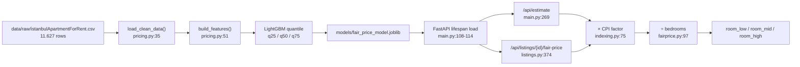

# The Fair-Rent Model — From Raw CSV to a Price Band

This document explains how `evdes.tr` decides whether a room's asking rent is
fair. It is written for an engineer who knows machine learning but has never
opened this repository.

Every claim below is anchored to a `file:line` reference. Numbers quoted as
"measured" were reproduced by running the project's own code against the
committed dataset; where a number could **not** be reproduced, this document
says so instead of repeating it.

Security topics (authentication, moderation, admin powers, key handling) are
deliberately out of scope — see [`SECURITY.md`](SECURITY.md).

---

## 1. The problem: why a band and not a number

A student sees a listing: *"Kadıköy, 2+1, 22.000 ₺/month for your room."* The
question they actually want answered is not "what is this room worth to the
nearest lira" — it is **"am I being overcharged?"**

Those are different questions, and only the second one is answerable from the
data we have. The dataset knows a flat's district, neighbourhood, room count,
area, building age and floor. It does *not* know the view, the renovation
state, whether the boiler works, or how desperate the landlord is. Two flats
with identical features legitimately differ by 30–40% in the market.

A point estimate hides that. Saying *"this flat is worth 38.710 ₺"* claims a
precision the data cannot support, and it makes the model look wrong every
single time — because it is wrong, by construction, on almost every listing.

So the model predicts **three** numbers instead of one: the 25th, 50th and 75th
percentile of the rent distribution for a flat with those features. The output
is a range, and the verdict is a set membership test:

- asking price below the 25th percentile → `below` (suspiciously cheap)
- inside → `fair`
- above the 75th percentile → `above`

That comparison lives in `backend/app/main.py:333-338` and, for saved listings,
`backend/app/fairprice.py:99-104`.

The mechanism that produces percentiles is **quantile regression**: instead of
minimising squared error (which estimates the conditional *mean*), the model
minimises the pinball loss at a chosen quantile α, which estimates the
conditional α-quantile. LightGBM exposes this as `objective="quantile"` with
`alpha=…`, configured in `backend/scripts/train_model.py:52-68` and instantiated
per quantile at `backend/scripts/train_model.py:34` and `:207-211`.



---

## 2. The data

### 2.1 What ships in the repo

`backend/data/raw/istanbulApartmentForRent.csv`, wired up as `LISTINGS_CSV` in
`backend/app/config.py:19`. Measured: **11.627 data rows**, eight columns, all
numeric columns already integer-typed:

| column | meaning | note |
|---|---|---|
| `district` | İstanbul district (İlçe) | leading/trailing spaces in the raw file — stripped at `pricing.py:40` |
| `neighborhood` | Mahalle | same stripping, `pricing.py:41` |
| `room` | bedroom count (the "2" in "2+1") | |
| `living room` | living-room count (the "+1") | |
| `area (m2)` | gross area | |
| `age` | building age in years | |
| `floor` | floor number, negative = basement | |
| `price` | monthly asking rent (₺) | **not clean — see below** |

There is **no date column.** This matters enormously and Section 7 is entirely
about coping with it.

### 2.2 Why the price column has to be filtered

The scrape mixed several kinds of rows into one `price` column. Measured on the
de-duplicated frame: minimum 40, maximum 23.000.000, median 22.000. Three
populations are visible:

1. **Genuine monthly rents** (the bulk, ~20–50k ₺).
2. **Sale prices** that leaked in from for-sale listings (up to 23.000.000 ₺).
3. **Rents typed in thousands** — a row saying `40` means 40.000 ₺. The first
   two rows of the CSV are literally `... ,90,45,3,260` and `... ,150,11,0,850`.

There is no column that distinguishes them, so the only available tool is a
plausibility band. `backend/app/pricing.py:15` sets it:

```python
MIN_RENT, MAX_RENT = 3_000, 500_000
```

Applied at `pricing.py:44`. The same band, with the same reasoning written out,
is repeated for the heat-map pipeline at
`backend/scripts/build_market_values.py:16-17`.

This is a blunt instrument and it is expensive. Measured drop counts:

| step | rows in | rows out | dropped |
|---|---|---|---|
| raw CSV | — | 11.627 | — |
| `drop_duplicates()` (`pricing.py:38`) | 11.627 | 11.388 | 239 |
| price ∈ [3.000, 500.000] (`pricing.py:44`) | 11.388 | 8.368 | 3.020 |
| `BOUNDS` on the five numeric columns (`pricing.py:45-46`) | 8.368 | 8.325 | 43 |

**Training set: 8.325 listings, 38 districts, 571 neighbourhoods.** The same
counts are recorded inside the shipped artifact (`n_samples`, and the category
lists — measured: 38 / 571).

Note what the price band costs: 3.020 rows, roughly a quarter of the data, and
2.966 of those are *below* 3.000 ₺. Many of them are certainly real rents typed
in thousands that we could have recovered by multiplying by 1.000 — but "typed
in thousands" and "genuinely a 900 ₺ room in a village" are indistinguishable
without a date and a unit convention, so the code refuses to guess.

### 2.3 The impossible-value bounds

`backend/app/pricing.py:21-27`:

```python
BOUNDS = {
    "area (m2)": (20, 1000),
    "age":       (0, 100),
    "living room": (0, 5),
    "room":      (1, 11),
    "floor":     (-3, 30),
}
```

These exist because the raw file contains physically impossible entries.
Measured on the raw column ranges: `area (m2)` reaches **178.158**, `age`
reaches **1864** (a year typed into an age field), `living room` reaches **965**,
`room` reaches **180**.

Only 43 rows (0,5% of the price-filtered frame) fall outside the bounds, but
they are the rows that break everything downstream. Measured: on the
price-filtered frame *before* bounds, the Pearson correlation between raw
`area (m2)` and raw `price` is **0.049** — a single 178.158 m² row is enough to
flatten it. After the bounds are applied, the correlation the model actually
trains on, `log(area)` vs `log(price)`, is **0.587**.

> The comment at `pricing.py:17-20` states this as "0.05 → 0.59". Both endpoints
> reproduce, but they are not the same statistic: 0.049 is the raw-unit
> correlation before bounds, 0.587 is the log-log correlation after. The
> direction and the lesson are right; the comparison is apples-to-oranges.

The bounds are not only a training-time filter. They are re-used as the
**API's request validation**: `backend/app/main.py:53-59` builds the Pydantic
`Field(ge=…, le=…)` constraints directly from `BOUNDS`, so a request outside the
training domain gets a 422 instead of a confident extrapolation. The docstring
at `main.py:47-48` says exactly why. This is a small thing that is easy to get
wrong — a model asked about a 5.000 m² flat will happily return a number.

---

## 3. Feature engineering

All of it is in one file, `backend/app/pricing.py`, and this is the single most
important architectural decision in the modelling code.

### 3.1 The features

`pricing.py:29-32`:

```python
NUMERIC_FEATURES     = ["room", "living room", "log_area", "age", "floor"]
CATEGORICAL_FEATURES = ["district", "neighborhood"]
FEATURES             = NUMERIC_FEATURES + CATEGORICAL_FEATURES
TARGET               = "log_price"
```

Built at `pricing.py:63-79`. Why each one:

- **`room`, `living room`** — pass through unchanged. They are the layout the
  Turkish market actually advertises ("2+1"), and they are what the roommate
  split later depends on (Section 8).
- **`log_area`** (`pricing.py:66`) — area is right-skewed and its effect on rent
  is multiplicative, not additive. Ten extra m² is worth a lot on a 50 m² flat
  and almost nothing on a 300 m² one. Taking the log linearises that.
- **`age`, `floor`** — pass through. `floor` is kept signed so that basements
  (−3) stay distinguishable from ground floor.
- **`district`, `neighborhood`** — location, the dominant price driver, encoded
  as pandas `CategoricalDtype` (`pricing.py:70-77`) rather than one-hot.
  LightGBM and XGBoost consume categorical dtypes natively and split on category
  subsets; with 571 neighbourhoods, one-hot would produce a 571-column sparse
  block that tree models split badly. (The Ridge baseline, which *cannot* take
  categoricals, one-hots them explicitly at `train_model.py:96` and casts back to
  string at `train_model.py:111-114`.)

### 3.2 Why `log(price)` is the target

Set at `train_model.py:167` (`y = np.log(df["price"].astype(float))`), reversed
at `train_model.py:39-40` and at prediction time with `np.exp(...)` in
`main.py:287-290` and `fairprice.py:92-95`.

Two reasons, both spelled out at `pricing.py:54-57`:

1. Rent is right-skewed; the log makes the target roughly symmetric, which is
   what squared/pinball losses assume.
2. It converts absolute error into **proportional** error. A 2.000 ₺ miss on a
   10.000 ₺ flat is a disaster; on a 100.000 ₺ flat it is noise. Optimising in
   log space tells the model that, without any custom loss.

One consequence worth stating plainly: `exp(median of log y) = median of y`, so
the q50 model in log space is a genuine median predictor in ₺ space. That is
true for quantiles but **not** for the mean — an ordinary `objective="regression"`
model trained on `log(price)` and exponentiated returns a *median-ish* value, not
the conditional mean. Since we only ever serve quantile models, this bias never
reaches a user.

### 3.3 Training/serving skew — why this file exists at all

The module docstring (`pricing.py:1-6`) states the rule: training and serving
must run the *same* transformations, or the model receives inputs from a
different distribution than it was fit on. This is the classic
training/serving-skew bug, and it is silent — nothing crashes, the numbers just
get quietly worse.

The repo enforces it structurally rather than by convention. `build_features()`
has exactly three callers, and they are training, the estimate endpoint, and the
listing endpoint:

- `backend/scripts/train_model.py:166` (training)
- `backend/app/main.py:274` (`POST /api/estimate`)
- `backend/app/fairprice.py:77` (`GET /api/listings/{id}/fair-price`)

The one thing that cannot be recomputed at serving time is the **category
encoding**. A pandas categorical column encodes to integer codes based on the
category list; if serving builds its own list from a single-row DataFrame, every
code is wrong. So the training category lists are extracted
(`extract_categories`, `pricing.py:82-84`), saved *inside the model artifact*
(`train_model.py:215`) and passed back into `build_features` at serving time
(`main.py:284`, `fairprice.py:88`). The model file and its encoding travel
together and cannot desynchronise.

Unseen categories become `NaN` (`pricing.py:60-61`), which LightGBM handles as a
missing value rather than an error — a listing in a neighbourhood the model has
never seen still gets an answer, just a district-level one. The system then
*tells the user that*: `known_neighborhood` at `main.py:304-306`,
`district_level` at `fairprice.py:127`, surfaced in the UI as
`fair.unknownNeighborhood` (`frontend/src/i18n/translations.ts:1021-1022`). The
listing form goes further and removes unknown neighbourhoods from the dropdown
entirely (`backend/app/locations.py:29-58`), so the fallback is rare by design.

---

## 4. The model

### 4.1 Configuration

`backend/scripts/train_model.py:52-68` — one factory, used for every LightGBM
variant:

```python
n_estimators=600, learning_rate=0.05, num_leaves=31,
min_child_samples=20, subsample=0.8, subsample_freq=1,
colsample_bytree=0.8, reg_lambda=1.0, random_state=SEED
```

Rationale, in the terms this dataset imposes:

- **600 trees at lr 0.05** — the standard "many small steps" trade. With 8.325
  rows this trains in seconds, so there is no reason to be stingy.
- **`num_leaves=31`** — LightGBM's default, and it is a *leaf-wise* growth
  budget, not a depth. On 8k rows a bigger tree overfits fast.
- **`min_child_samples=20`** — the load-bearing regulariser here. With 571
  neighbourhood categories, the measured median neighbourhood has only 7
  listings and 289 of 719 district–neighbourhood pairs have fewer than 5. Without
  a leaf-size floor the model would carve out a leaf per thin neighbourhood and
  memorise it.
- **`subsample=0.8` + `subsample_freq=1`, `colsample_bytree=0.8`,
  `reg_lambda=1.0`** — ordinary stochastic-GBM regularisation. `subsample_freq`
  must be set or LightGBM silently ignores `subsample`.
- **`random_state=42`** (`train_model.py:30`) — used for the model *and* every
  `KFold` (`train_model.py:104`, `:126`, `:152`), so the metric tables in this
  document and in `backend/README.md` are reproducible.

There was **no hyperparameter search.** These are defensible defaults, not tuned
values, and Section 10 lists that as a known gap.

### 4.2 Three models, not one

`train_model.py:34`:

```python
QUANTILES = {"low": 0.25, "mid": 0.5, "high": 0.75}
```

Final fitting at `train_model.py:206-211` — each quantile is a **separate
LightGBM model trained on the full cleaned dataset**, and all three are stored
in one artifact (`train_model.py:213-221`).

Because they are fit independently, nothing guarantees q25 ≤ q50 ≤ q75 for a
given input — this is the well-known *quantile crossing* problem. The serving
code does not pretend otherwise; it simply sorts:

- `backend/app/main.py:292` — `low, mid, high = sorted(band.values())`, with the
  comment "Çeyreklik modelleri bağımsız eğitildiği için nadiren sıra bozulabilir."
- `backend/app/fairprice.py:92-96` — same, via `sorted(...)`.

Sorting is a legitimate (and monotonicity-restoring) repair for crossed
quantiles. It is not a fix for *why* they cross, but at this data size the
alternative — a monotone joint quantile model — is not worth the complexity.

### 4.3 The artifact

`train_model.py:213-223` writes a single joblib dict to
`backend/models/fair_price_model.joblib` (path from `config.py:26`; git-ignored,
6,2 MB, measured):

| key | contents |
|---|---|
| `models` | `{"low": q25, "mid": q50, "high": q75}` |
| `categories` | training category lists for `district` / `neighborhood` |
| `cv_results` | the full CV table, or `None` in `--fast` mode |
| `served_model` | `"LightGBM q50"` |
| `served_medape` | the median error shown to users |
| `baseline_medape` | neighbourhood-median baseline error (`nan` in `--fast`) |
| `n_samples` | 8.325 |

Loaded once per process in the FastAPI lifespan (`main.py:108-114`) into
`STATE["model"]`. If the file is missing the API still boots — only
`/api/estimate` is disabled, returning 503 via `_require_model()`
(`main.py:259-267`) and `fairprice.py:71-73`.

---

## 5. XGBoost: what is actually true

This is the part of the story most likely to be told wrong, so here it is
exactly, from the code.

**XGBoost is real, and it is used — but only in the offline evaluation, never in
production.** Four independent facts establish this:

1. **It is a comparison entry, not a serving model.** `make_xgb()` at
   `train_model.py:71-88` returns a configured `XGBRegressor`, and it is
   referenced exactly once: in the CV contest list at `train_model.py:183`
   (`("XGBoost", make_xgb)`). The models that get fitted on the full data and
   saved are built by `make_lgbm(objective="quantile", …)` at
   `train_model.py:208`. XGBoost never touches the artifact.

2. **The import is lazy, inside the function** (`train_model.py:75`:
   `from xgboost import XGBRegressor`). The comment at `train_model.py:72-74`
   gives the reason: the Docker image must not need xgboost or its ~300 MB
   NVIDIA dependency chain. A module-level import would break the container at
   *import* time even though the code path is never taken.

3. **It is a dev-only dependency.** `backend/requirements-dev.txt:5-6` lists
   `xgboost>=2.0` under the comment "Model eğitimi (scripts/train_model.py — CV
   karşılaştırması)". `backend/requirements.txt` does **not** contain it — it
   only notes at lines 17-19 that xgboost lives in the dev file. Runtime pulls in
   `lightgbm`, `joblib` and `scikit-learn` (`requirements.txt:15-20`); scikit-learn
   is required not for prediction but because `LGBMRegressor` subclasses
   sklearn's `BaseEstimator` and joblib needs the class available to unpickle.

4. **The production build never runs that code path.**
   `backend/Dockerfile:36` runs `python -m scripts.train_model --fast`, and
   `--fast` (`train_model.py:171-177`) skips the whole four-model CV block
   including the XGBoost row. `Dockerfile:2-5` and `:33-35` state this as the
   design intent: a single-stage image with runtime deps only.

**Summary:** XGBoost is a benchmark competitor that runs when a developer
executes `python -m scripts.train_model` locally with dev dependencies
installed. It is absent from the container, absent from the artifact, and absent
from every request path. The served model is LightGBM q50, recorded explicitly
as `served_model: "LightGBM q50"` (`train_model.py:217`).

Verified by execution: with `xgboost 3.3.0` installed in the local venv, the
XGBoost CV row reproduces (see the table in Section 6.2).

---

## 6. Evaluation

### 6.1 Why MedAPE

`train_model.py:37-49` computes four metrics, and crucially it does so **in ₺,
not in log space** — `np.exp` is applied to both truth and prediction at
`train_model.py:39-40` before any error is measured. An R² of 0.8 in log space
tells a user nothing; "half of my estimates are within 15% of the truth" tells
them everything.

The headline metric is **MedAPE** — median absolute percentage error
(`train_model.py:47`):

```python
"MedAPE%": np.median(error / actual) * 100
```

- **Percentage**, because a 5.000 ₺ miss means different things at different
  price levels — the same reason `log(price)` is the target.
- **Median** rather than mean, because MAPE is dominated by the cheapest
  listings (dividing by a small `actual` explodes the ratio) and because the
  dataset still contains mislabelled rows after cleaning. The median is the
  honest summary of typical performance.

MAE, MedAE and R² are reported alongside for context but are not what the
product promises.

### 6.2 The 5-fold cross-validation table

`cross_validate()` (`train_model.py:102-118`) builds out-of-fold predictions
with `KFold(n_splits=5, shuffle=True, random_state=42)`, constructing a fresh
model per fold (`train_model.py:108`) so nothing leaks across folds.

Reproduced by running the repository's own functions against the committed CSV
(`load_clean_data` → `build_features` → `cross_validate` / `baseline_metrics`):

| Model | MAE (₺) | MedAE (₺) | **MedAPE** | R² |
|---|---|---|---|---|
| Baseline (neighbourhood median) | 19.655 | 7.000 | **25,0%** | 0,357 |
| Ridge (one-hot) | 14.112 | 5.243 | **18,3%** | 0,582 |
| XGBoost | 13.103 | 4.566 | **16,0%** | 0,535 |
| LightGBM (squared loss) | 13.391 | 4.655 | **16,3%** | 0,542 |
| **LightGBM q50 (served)** | **11.573** | **4.442** | **15,1%** | **0,668** |

These match `backend/README.md:134-141` to the printed precision.

Three things this table is for:

1. **The baseline is a tripwire.** `baseline_metrics()`
   (`train_model.py:121-143`) predicts the training-fold median rent of the
   listing's neighbourhood, falling back to the district median, then the global
   median (`train_model.py:131-140`). It uses no features beyond location. If a
   gradient-boosted model with six features cannot beat "look up the
   neighbourhood median", the features are worthless. The real headline of this
   project is **25,0% → 15,1%**, not "15,1%" on its own.
2. **Ridge is a sanity floor.** A linear model on one-hot locations reaching
   18,3% says the problem is largely linear-in-log-space; the trees add ~3
   points on top.
3. **The reported error is the error of the model users actually get.** The last
   row is not "the best model we tried" — it is the same `objective="quantile",
   alpha=0.5` configuration that is refit on the full data and saved
   (`train_model.py:187-188`, and the comment above it makes the point
   explicitly). Reporting the squared-loss LightGBM's 16,3% while serving the
   quantile model would be a subtle lie.

Note the curiosity in the table: q50 wins on *every* metric, including R², even
though R² rewards conditional-mean estimation and the quantile objective is not
trying to minimise squared error. On this data the median is simply a more
robust target than the mean — the surviving outliers drag a squared-loss model
around, and the pinball loss ignores them.

**LightGBM was not chosen because it won the accuracy contest.** XGBoost is
within 0,4 points of plain LightGBM (16,0% vs 16,3% — measured 15,983 vs
16,339), and `train_model.py:200-201` prints that caveat at the end of every
full run. LightGBM was chosen because
`objective="quantile"` gives the *band* the product needs.

### 6.3 `--fast` mode, and why the shipped number is 15,3% not 15,1%

`main(fast=True)` (`train_model.py:160-177`) skips the CV contest entirely and
calls `single_fold_medape()` (`train_model.py:146-157`): one 80/20 split — the
first fold of the same `KFold` — one q50 fit, one MedAPE.

The reason is deployment, not science. `Dockerfile:33-35` explains it: the
Render free build machine has 2 cores (pinned via `OMP_NUM_THREADS=2`,
`Dockerfile:30-31`), and the four-model CV takes ~40 minutes there
(`train_model.py:163`) purely to produce a report nobody reads at runtime.

But the number is still *measured*, not made up. The docstring at
`train_model.py:148-150` is explicit: the point is to fill the "median error"
field shown to users honestly, at a tenth of the cost.

Measured, both paths:

| path | what is computed | value |
|---|---|---|
| full run (`python -m scripts.train_model`) | 5-fold OOF MedAPE of q50 | **15,139%** |
| `--fast` (Docker, `Dockerfile:36`) | single-fold (80/20) MedAPE of q50 | **15,311%** |

The locally committed artifact was built with `--fast`: measured
`served_medape = 15.311…`, `cv_results = None`, `baseline_medape = nan`. That
15,3% is what `/api/estimate` returns as `median_error_pct`
(`main.py:316`, `fairprice.py:122`) and what the disclaimer renders
(`frontend/src/i18n/translations.ts:1016-1017`).

So **both numbers are correct and they measure different things**: 15,1% is the
5-fold cross-validated figure quoted in the READMEs; 15,3% is the single-split
figure carried by the deployed artifact. The ~0,2-point gap is split noise, and
it is in the expected direction — one 80/20 split trains on less data than each
of five 80/20 folds does in aggregate.

> **Inconsistency worth knowing:** the landing page hard-codes "15.1%"
> (`frontend/src/i18n/translations.ts:939`, TR at `:64`) while the fair-price
> disclaimer reads the live `median_error_pct` from the API. On the current
> deployment those two numbers differ (15,1 vs 15,3). The disclaimer is the one
> tied to the actual served model.

---

## 7. CPI indexing — dragging 2025 liras into today

### 7.1 Why it is unavoidable

The training data has no date column. `backend/app/indexing.py:55` records the
best available answer:

```python
DATA_PERIOD = "2025-02"
```

and the module docstring (`indexing.py:3-5`) is candid that this comes from when
the dataset was collected, not from the data itself.

In an economy with Turkish inflation, a model trained on February 2025 prices
speaks in February 2025 liras. Serving those numbers unadjusted would tell every
user their rent is "above the fair range" — not because it is, but because the
ruler has shrunk.

### 7.2 How the anchor was derived

`indexing.py:7-18` documents the derivation from TÜİK press bulletins, and it is
worth reading closely because the arithmetic contains a trap.

TÜİK **rebased** its index in 2025: the February 2025 bulletin uses 2003=100,
the June 2026 bulletin uses 2025=100. Index *levels* across the rebase cannot be
divided. What survives a rebase are the published *ratios*, so the chain is
built from ratios:

| ratio | value | source |
|---|---|---|
| Feb 2025 vs Dec 2024 | +7,42% | bulletin 54177 |
| Jun 2025 vs Dec 2024 | +16,67% | bulletin 58289, comparison column |
| Jun 2026 vs Jun 2025 | +32,11% | bulletin 58289 |

Feb 2025 → Jun 2025 = 1,1667 / 1,0742 = **1,086111**
Feb 2025 → Jun 2026 = 1,086111 × 1,3211 = **1,434861**

That is `HEADLINE_FACTOR` (`indexing.py:59`), and
`backend/tests/test_indexing.py:18-30` recomputes it from the three published
ratios so that a future hand-edit cannot silently corrupt it.

### 7.3 Headline vs housing — and the honest admission

`HEADLINE_FACTOR` is **not what gets served**. `indexing.py:20-25` argues it is a
lower bound, for two reasons:

1. The housing group rose faster than headline CPI — 45,14% year-on-year in
   June 2026 (headline 32,11%), 70,81% in February 2025 (headline 39,05%).
2. TÜİK's rent item measures what *sitting tenants* pay, and those were capped
   by law for years. Our dataset is **asking** rents on new listings, which are
   not capped.

The served anchor (`indexing.py:62-63`) is:

```python
ANCHOR_PERIOD = "2026-06"
ANCHOR_FACTOR = 1.656
```

And here the code does something documentation usually fails to do — it labels
its own number as **partly an estimate** (`indexing.py:27-43`). The housing
chain cannot be completed because TÜİK did not publish the housing-group
Feb→Jun 2025 interval, so it is *bounded* instead:

- housing Jun 2026 / Jun 2025 = 1,4514 (published)
- housing Feb 2025 → Jun 2025 ∈ [1,0861 … 1,1962]
  - lower: housing moves at headline pace (conservative — housing ran *above*
    headline throughout)
  - upper: February 2025's housing monthly rate (+4,58%) sustained for four months
- ⇒ Feb 2025 → Jun 2026 ∈ [1,576 … 1,736], midpoint **1,656**

1,656 is the midpoint, ~16% above the exact headline chain.
`indexing.py:40-43` states plainly: *"YAYIMLANMIŞ BİR SAYI DEĞİLDİR"* — it is
not a published figure. `HEADLINE_FACTOR` is kept in the file purely so the
decision stays auditable and reversible.
`backend/tests/test_indexing.py:33-45` asserts the anchor stays inside the
derived band and above the headline factor.

**This is the single largest source of uncertainty in the whole pipeline.** The
model's own median error is ~15%; the indexing factor carries a band of roughly
1,576–1,736, i.e. about ±5% around the midpoint, applied multiplicatively on top
of every estimate. And that band assumes asking rents track the housing CPI
group at all — an assumption, not a measurement.

### 7.4 Applying and updating it

`rent_index()` (`indexing.py:75-94`) returns `(factor, period)`:

1. If the `RENT_INDEX_FACTOR` environment variable is set, it wins
   (`indexing.py:81-86`) — an escape hatch to correct the factor in production
   without a code change or to pin it in tests. A malformed value falls through
   to the table rather than taking `/api/estimate` down.
2. Otherwise start from `ANCHOR_FACTOR` and compound every month recorded in
   `MONTHLY_AFTER_ANCHOR` (`indexing.py:67`, applied at `:90-93`).

`MONTHLY_AFTER_ANCHOR` is currently **empty**, so the served factor is exactly
1,656 for period `2026-06`. Maintenance is one line per TÜİK bulletin, as
documented at `indexing.py:47-49`. The anchor only needs recomputing if TÜİK
rebases again.

The factor is applied to all three quantiles before anything else happens:
`main.py:295-297` and `fairprice.py:91-95`. It is also applied to the heat-map's
neighbourhood medians (`main.py:91`) so the map and the advisor cannot disagree.
The response carries `index_factor`, `data_period`, `indexed_to` and `indexed`
(`main.py:318-321`) so the UI can state what was done — including the
"NOT indexed" variant of the disclaimer
(`frontend/src/i18n/translations.ts:1018-1019`) for when indexing is switched off.

---

## 8. From flat rent to room share

The model predicts the rent of a **whole flat**. Nobody on this platform rents a
whole flat; they rent a room in one. The bridge is
`backend/app/fairprice.py`, whose docstring (`fairprice.py:1-14`) states the
housemate model:

- **Bedrooms are private** — one person per bedroom.
- **Living room, kitchen, bathroom are shared** — nobody is billed for them
  separately; their cost dissolves into everyone's share.

Therefore a **"2+1" flat houses two people, and the rent is split two ways.**
The "+1" (living room) is deliberately *not* counted as a person. This is the
one modelling decision here that is a social judgement rather than a statistical
one, and it is the conservative choice: counting the living room as a third
bedroom would divide by 3 and make every asking price look overpriced.

Implementation:

- `parse_rooms()` (`fairprice.py:31-39`) takes `"2+1"` → `2`; unknown or
  unparseable → 2 (`at least 1`, via `max(1, int(head))`).
- The band is divided at `fairprice.py:97`:
  `room_low, room_mid, room_high = (v / rooms for v in band)`.
- On `/api/estimate` the same split is `share = max(payload.room, 1)`
  (`main.py:300-302`) — a 1+1 or 1+0 has no split, the share is the whole rent.
- The verdict compares the **asking room share** against the **room band**
  (`fairprice.py:99-104`). The listing form asks for exactly that — "Monthly rent
  you ask from your roommate", placeholder "Room share — e.g. the total rent
  divided per room" (`frontend/src/i18n/translations.ts:1280-1281`).
- `/api/estimate` lets the caller choose which basis to compare on, via
  `basis: "flat" | "room"` (`main.py:62-64`, applied at `main.py:328-332`).
- The response returns **both** the room figures and the whole-flat figures
  (`fairprice.py:110-117`) plus `bedrooms`, `occupants` and `shared_areas`
  (`fairprice.py:119-121`) so the UI can show its arithmetic instead of
  asserting a number.

Saved listings carry less information than the `/api/estimate` form does — no
area, age or floor — so `fairprice.py:23-25` fills in district-level defaults:

```python
DEFAULT_AREA = {1: 55.0, 2: 90.0, 3: 125.0, 4: 160.0}
DEFAULT_AGE   = 15
DEFAULT_FLOOR = 3
```

These are assumptions, not data. A listing whose flat is much larger or much
newer than the default for its room count will be estimated with a systematic
bias, and nothing in the response signals that. It is the least defensible piece
of the pipeline.

The endpoint is `GET /api/listings/{id}/fair-price`
(`backend/app/listings.py:374-399`); it only answers for `type == "ev_ilani"`
listings that have a rent (`listings.py:387-390`) and 503s if the model is not
loaded (`listings.py:395-398`).

Equal-sized rooms are assumed — the dataset has no per-room areas
(`fairprice.py:12-13`).

---

## 9. Retraining

```bash
cd backend
source venv/bin/activate
pip install -r requirements-dev.txt     # adds xgboost + pytest
python -m scripts.train_model           # full run: CV table + final models
python -m scripts.train_model --fast    # what Docker does: no CV contest
```

Output: `backend/models/fair_price_model.joblib` (`config.py:26`). It is
git-ignored (`backend/.gitignore:23`); production rebuilds it during the image
build (`Dockerfile:36`), so **pushing a new model file is not how you deploy a
new model — pushing new data or new training code is.**

The script prints a sample prediction at `train_model.py:227-235` (Kadıköy /
Caferağa, 2+1, 90 m², age 20, floor 3) as an eyeball check. Note it prints the
**un-indexed** band — raw model output in Feb-2025 liras — so it will read low
compared to what the API returns.

Things to watch:

1. **The server must be restarted.** The artifact is read once at startup
   (`main.py:108-110`). A new file on disk changes nothing until the process
   reloads.
2. **Never edit `pricing.py` without retraining.** Changing `BOUNDS`,
   `FEATURES`, or the encoding while an old artifact is on disk is exactly the
   training/serving skew this design exists to prevent — and it fails silently,
   because the feature *names* still line up.
3. **Watch the neighbourhood count.** `/api/locations` filters the listing form's
   dropdown to the model's known neighbourhoods (`locations.py:29-58`), so a
   retrain that loses categories silently shrinks the form. Compare
   `len(categories["neighborhood"])` against the current 571.
4. **New data means a new `DATA_PERIOD`.** If the CSV is replaced with fresher
   listings, `indexing.py:55` must change and `ANCHOR_FACTOR` must be
   recomputed from the new base month — otherwise every estimate is inflated
   twice.
5. **`--fast` and the full run write different metadata.** `--fast` leaves
   `cv_results = None` and `baseline_medape = nan`, and `served_medape` becomes
   the single-split number. Anything reading those fields must tolerate both.
6. **Run the tests:** `python -m pytest tests/ -q` (381 tests). The indexing
   tests (`tests/test_indexing.py`) will catch a mangled CPI chain; nothing in
   the suite validates model accuracy, so the CV table is the only guard there.

---

## 10. Limitations — what this model does not do

**Data**

- **The date is an assumption, not a fact.** The CSV has no date column
  (`indexing.py:3-5`). `DATA_PERIOD = "2025-02"` rests on collection metadata
  outside the repository. If it is wrong, the CPI factor is wrong, and every
  estimate is wrong by a constant multiple.
- **One stale sentence remains about that date.** The root `README.md:44`
  correctly names the training period as `2025-02`, matching `indexing.py:55`.
  But `README.md:180` still says "the listing dataset reflects early-2026
  prices" — it does not; the dataset is February 2025 and is *indexed forward*
  to June 2026. The code is the authority; that one README line is stale.
- **A quarter of the data is thrown away** (3.020 of 11.388 rows) because rent
  units are ambiguous. Some of those are recoverable real listings.
- **De-duplication is exact-match only** (`pricing.py:38`). The same flat
  re-listed with a one-lira difference survives as two rows, which lets near
  copies land in both train and test folds and makes CV scores somewhat
  optimistic.
- **571 neighbourhoods, 8.325 listings.** Measured: the median
  district–neighbourhood pair has 7 listings and 289 of 719 pairs have fewer
  than 5. Neighbourhood-level estimates in thin areas rest on very little.

**Features**

- **Location is only a name.** No distance to metro, no sea view, no
  Bosphorus/coast proximity, no floor-plan quality, no furnishing, no
  renovation state, no building amenities. These drive a large share of real
  price variance, and their absence is a floor under the achievable error.
- **`age` is building age, not renovation age.** A 40-year-old gut-renovated
  flat and a 40-year-old neglected one are identical to the model.
- **No interaction is modelled explicitly** — trees find some, but e.g.
  `area × neighbourhood` (price per m² varies hugely by location) is left to
  the boosting to discover.

**Model**

- **No hyperparameter tuning.** The values at `train_model.py:53-64` are
  reasonable defaults chosen once, not searched.
- **Quantile crossing is repaired by sorting** (`main.py:292`,
  `fairprice.py:92`), not prevented.
- **q25/q75 are not calibrated.** Nothing in the repository checks that ~50% of
  held-out listings actually fall inside the predicted band. The band's *width*
  is an unvalidated claim, even though the median's accuracy is measured.
- **No monitoring or drift detection.** The model is trained at image build and
  never evaluated against live listings.
- **No per-segment error breakdown.** The 15% median error is a single global
  number; performance on 1+1s vs 5+1s, or on cheap vs expensive districts, is
  not measured.

**Indexing**

- **`ANCHOR_FACTOR = 1.656` is a midpoint estimate, not a published statistic**
  (`indexing.py:40-43`). The derived band is 1,576–1,736.
- **It assumes asking rents follow the housing CPI group.** Sitting-tenant rent
  caps mean that assumption is directionally conservative, but it is untested.
- **A single national factor is applied to every neighbourhood.** Micro-market
  divergence — one district gentrifying faster than another — is invisible to
  it.
- **The table needs manual maintenance.** `MONTHLY_AFTER_ANCHOR` is empty
  (`indexing.py:67`); if nobody adds monthly rates, estimates drift further
  below reality every month past June 2026.

**Room split**

- **Equal-sized rooms are assumed** (`fairprice.py:12-13`).
- **"Bedrooms = occupants"** ignores couples sharing a room, someone sleeping in
  the living room, or an owner-occupier who keeps the big room.
- **Listing-level estimates use invented defaults** for area/age/floor
  (`fairprice.py:23-25`), and the response does not flag when a default was
  used — unlike the neighbourhood fallback, which is flagged
  (`fairprice.py:127`).

**Scope**

- **This is not an appraisal.** Every response carries `median_error_pct` and
  the UI renders a disclaimer saying so
  (`frontend/src/i18n/translations.ts:1016-1019`).
- **The landing page's "15.1%" is hard-coded**
  (`frontend/src/i18n/translations.ts:939`) while the deployed artifact reports
  15,3%.
- **Security, abuse and privacy are out of scope here** — see
  [`SECURITY.md`](SECURITY.md).
