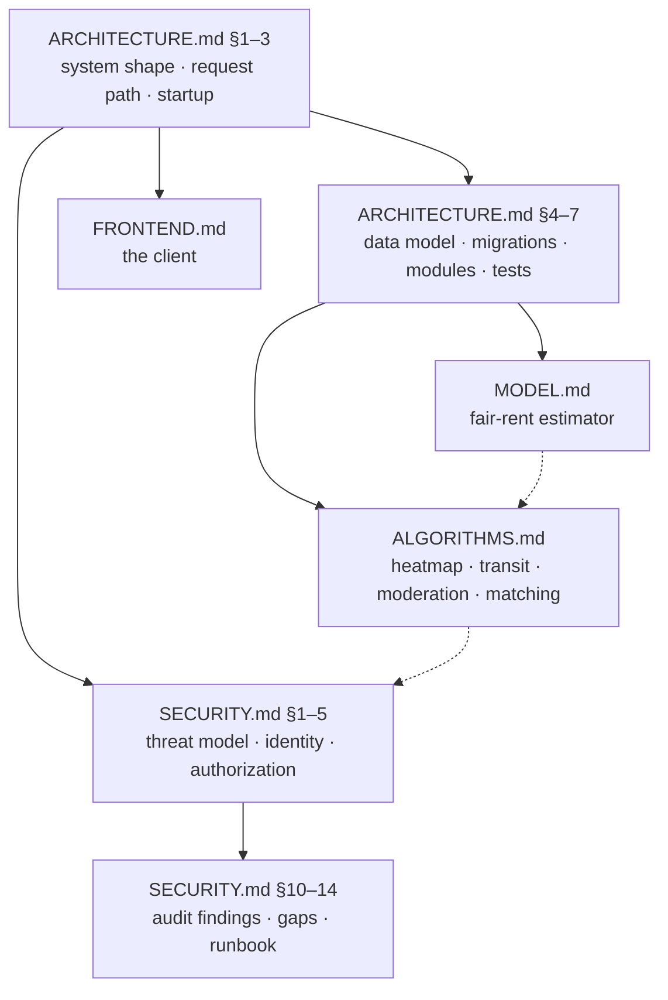

# Documentation

This folder holds the long-form documentation for **RoomMatch / evdes.tr** — a
roommate-matching platform for university students in Istanbul, with a
machine-learned fair-rent advisor attached to it.

The [root README](../README.md) is the *product* view: what the app does, how to
run it, what the environment variables are. The five documents here are the
*engineering* view: why each subsystem is shaped the way it is, how it actually
works, and where it falls short. They assume you know how to build software but
have never opened this repository.

**They are not a tour of the code.** Each one starts from the problem, explains
the mechanism, and only then points at the implementation — so you should be
able to read a section, close it, and still be able to predict what the code
does.

---

## The five documents

| Document | The question it answers | Size |
|---|---|---|
| [ARCHITECTURE.md](ARCHITECTURE.md) | *How is the system put together?* Deployment shape, the life of a single request, process startup and the in-memory `STATE`, the database schema, the home-grown migration system, a module-by-module tour of `backend/app/`, and the test strategy. | ~980 lines |
| [MODEL.md](MODEL.md) | *How does it decide a rent is fair?* The raw dataset, feature engineering, why the answer is a band and not a number, quantile LightGBM, honest evaluation against a neighbourhood-median baseline, CPI indexing, and the flat-rent → room-share split. | ~800 lines |
| [ALGORITHMS.md](ALGORITHMS.md) | *What about everything that isn't the model?* The budget heatmap over 968 neighbourhood polygons, transfer-weighted alternative-neighbourhood search over the rail network, the Turkish-aware moderation rule engine, and the match/likes logic. | ~990 lines |
| [FRONTEND.md](FRONTEND.md) | *How is the client built?* The stack piece by piece (Vite, Tailwind + design tokens, shadcn/ui, TanStack Query, react-router, i18n), the API layer, a page-by-page tour, and what the tests cover. | ~1050 lines |
| [SECURITY.md](SECURITY.md) | *Who can do what, and what breaks under attack?* Threat model, trust boundaries, identity, authorization, content safety, cryptography — plus the results of an adversarial audit against a local instance: 17 findings (6 high, 5 medium, 6 low), what held under attack, what is accepted risk, and an incident runbook. | ~1280 lines |

The scope split is deliberate and consistent: **security lives in one document
only.** ARCHITECTURE, MODEL, ALGORITHMS and FRONTEND each say so explicitly in
their opening paragraphs and defer to SECURITY.md rather than half-covering
authentication, admin powers or encryption.

Deployment is likewise out of scope for all five — that is [DEPLOY.md](../DEPLOY.md).

---

## Where to start

If you are new here, read **[ARCHITECTURE.md](ARCHITECTURE.md) sections 1–3
first** (the system at a glance, the life of a request, startup). Roughly forty
minutes, and everything else becomes optional rather than prerequisite: the other
four documents are siblings, not a sequence, and you can stop after the branch
you need.



By what you are trying to do:

- **"I need to change an API endpoint."** ARCHITECTURE.md §2 (life of a request)
  and §6 (module tour), then SECURITY.md §5 (authorization — ownership checks
  and the admin guard) before you touch anything that reads or writes another
  user's data.
- **"I need to retrain or fix the price model."** MODEL.md end to end; §9 is the
  retraining procedure and §7 is the CPI factor you will have to update as TÜİK
  publishes.
- **"The heatmap / district suggestions / moderation look wrong."** ALGORITHMS.md
  — one numbered section per algorithm, and §5 tells you where the tunable
  constants live.
- **"I'm working on the UI."** FRONTEND.md, then ALGORITHMS.md §1 if you touch
  the map.
- **"I'm reviewing this for safety, or something happened."** SECURITY.md §2
  (threat model) → §10 (findings) → §14 (incident runbook).
- **"I'm deploying it."** [DEPLOY.md](../DEPLOY.md), and SECURITY.md §7.3 on
  `MESSAGE_KEY` loss before you generate one.

---

## Quick start

Setup — prerequisites, the two-terminal local run, demo seeding, deployment — is
in the root README and is not repeated here:

- **Run it locally:** [root README](../README.md), section *Running locally
  (two terminals)*
- **Deploy it:** [DEPLOY.md](../DEPLOY.md)
- **Sub-project notes:** [`backend/README.md`](../backend/README.md) ·
  [`frontend/README.md`](../frontend/README.md)

What the root README does not spell out is how to check that a working tree is
healthy before and after a change. All four commands below were run against
commit `51e5bb4`; the numbers are what they printed.

```bash
# backend — 381 passed
cd backend && source venv/bin/activate && python -m pytest tests/ -q

# frontend — 71 passed in 7 files
cd frontend && npm test

# frontend — type check (clean; `vite build` transpiles without checking types,
# so this is a separate manual step — FRONTEND.md §11)
cd frontend && npx tsc --noEmit

# frontend — production bundle, the same command Vercel runs
cd frontend && npm run build   # succeeds; the 500 kB chunk warning is known
```

`npm run lint` is *not* clean and is not a gate — FRONTEND.md §11 lists the one
error and 17 warnings it currently reports. What the test suites do and do not
cover is ARCHITECTURE.md §7 (backend) and FRONTEND.md §10 (frontend).

---

## How these documents are written

Four conventions, worth knowing before you read or extend them:

1. **Every claim carries a `file:line` reference.** If the code and a document
   disagree, the code wins and the document is a bug. This project has shipped
   documentation and UI copy that promised things the code did not do — more
   than once — which is why the rule exists.
2. **Numbers labelled "measured" were reproduced** by running this repository's
   own code. Where a number could not be reproduced, the document says so
   instead of repeating it (MODEL.md §6.3 is the worked example: the 15,1% in
   the READMEs and the 15,3% the deployed artifact reports are both correct and
   measure different things).
3. **Every document ends with a limitations section** — "what this does not do".
   Read it. Known gaps are listed rather than hidden, including gaps between a
   docstring's promise and the code's behaviour.
4. **English prose, Turkish code comments.** That is the repository's existing
   convention, and these documents follow it.

---

## Glossary

Terms that appear across several documents, with the code that defines them.

**MedAPE** — *median* absolute percentage error, the model's headline accuracy
metric: `np.median(error / actual) * 100`
(`backend/scripts/train_model.py:47`). Median rather than mean, so a handful of
mispriced luxury flats cannot dominate the score. The API returns it on every
estimate as `median_error_pct` (`backend/app/fairprice.py:122`). Full treatment,
including why it is only meaningful next to a baseline: MODEL.md §6.

**Quantile regression** — instead of predicting the average rent, predict the
*n*-th percentile of it. LightGBM is trained three times with
`objective="quantile"` and a different `alpha` each time
(`backend/scripts/train_model.py:52-67`), at 0.25 / 0.50 / 0.75
(`QUANTILES`, `train_model.py:34`, used at `:207-211`). The three outputs become
the low / mid / high edges of the fair band. Why a band is the honest answer:
MODEL.md §1 and §4.

**CPI (TÜFE) indexing** — the training data's price level is February 2025
(`DATA_PERIOD = "2025-02"`, `backend/app/indexing.py:55`), so under Turkish
inflation the raw prediction is in stale liras. Every prediction is therefore
multiplied by an index factor before it reaches the user
(`backend/app/fairprice.py:91-94`). The factor is `ANCHOR_FACTOR = 1.656`
anchored at June 2026 (`indexing.py:62-63`), compounded by one entry per newly
published TÜİK bulletin in `MONTHLY_AFTER_ANCHOR` (`indexing.py:67`, applied at
`:88-92`), and overridable without a code change via the `RENT_INDEX_FACTOR`
environment variable (`indexing.py:81-86`). The anchor is a bounded *estimate*,
not a published number, and the module docstring shows the derivation
(`indexing.py:20-45`). MODEL.md §7 walks through it, including the rebasing trap
that makes the two bulletins' index levels non-comparable.

**Room share (oda payı)** — the model predicts the rent of a *whole flat*, but
nobody here rents a whole flat; they rent a room in one. So the band is divided
by the number of **bedrooms**: `"2+1"` → 2 (`backend/app/fairprice.py:31-39`),
and `room_low, room_mid, room_high = (v / rooms for v in band)`
(`fairprice.py:97`). The "+1" living room is deliberately not counted as a
person — the conservative choice, since dividing by 3 would make almost every
asking price look overpriced. MODEL.md §8.

**Low confidence** (heatmap) — a neighbourhood whose median price is computed
from fewer than `MIN_LISTINGS = 8` listings (`backend/app/heatmap.py:24`,
evaluated at `:134-136`). It is still coloured, but the flag travels with the
response (`heatmap.py:145-146`) so the client can draw it faded rather than
present a two-listing median as fact. ALGORITHMS.md §1.

**Moderation flag** — the middle verdict of three. The rule engine returns
`allow`, `flag` or `block` (`backend/app/moderation.py:52`); `block` rejects the
content outright, while `flag` publishes it *and* sets `is_flagged` on the row
(`backend/app/models.py:167` for listings, `:257` for messages), which puts it in
the admin review queue. The optional AI layer can only make a verdict stricter,
never looser. Rules and Turkish-specific evasion handling: ALGORITHMS.md §3;
trust model and admin powers: SECURITY.md §6.

**At-rest encryption** — chat messages are stored AES-256-GCM encrypted under
`MESSAGE_KEY`, in the format `"enc:v1:" + base64(nonce ‖ ciphertext+tag)`
(`backend/app/crypto.py:23`, prefix at `:36`); values without that prefix are
treated as legacy plaintext and returned unchanged (`crypto.py:157-160`). This
protects the database, **not** the conversation: the server holds the key and
can therefore read every message, so it is explicitly not end-to-end
(`crypto.py:5-8`). If `MESSAGE_KEY` is unset the app still runs and messages are
written in plain text; if it is lost, everything encrypted under it is
unrecoverable. SECURITY.md §7.1–7.3.

---

## Limitations — what this index does not do

- **It is an index, not a summary.** Nothing here is a substitute for the
  document it points at; the one-line descriptions are navigation aids and will
  drift before the documents do.
- **Section numbers are hard-coded.** The cross-references above ("SECURITY.md
  §10", "MODEL.md §7") are not links to anchors and will silently point at the
  wrong section if a document is renumbered. Check the target's own table of
  contents if a reference looks off.
- **The measured numbers are a snapshot** of commit `51e5bb4` on `main`: 381
  backend tests passing, 71 frontend tests passing, a clean `tsc`, a successful
  build. Nothing re-verifies them: the repository's only GitHub Actions workflow
  is a keepalive ping (`.github/workflows/keepalive.yml`), so every command above
  is manual — as FRONTEND.md §11 also notes for `tsc`, `vitest` and `eslint`.
- **The five documents are not uniformly current.** Only SECURITY.md pins itself
  to a commit (`51e5bb4`, §15); the others carry no staleness marker, so a
  claim's `file:line` reference is the only reliable freshness check.
- **Coverage is uneven.** The offline pipeline is only covered where a
  runtime feature depends on it — `build_market_values.py` and
  `fetch_transit.py` appear inside ALGORITHMS.md §1–2 and MODEL.md §2, and
  `seed_demo.py` is not documented anywhere beyond a one-line mention in the
  root README. The email path stops at SECURITY.md §8.1. Operations —
  monitoring, backups, rollback — is documented neither here nor in DEPLOY.md.
- **`backend/README.md` is not part of this set.** It is an older Turkish
  project overview and describes some things aspirationally (it mentions
  Mapbox and a KNN-based suggester, neither of which is what ships). Where it
  and these documents disagree, these documents are the ones checked against
  the code.
