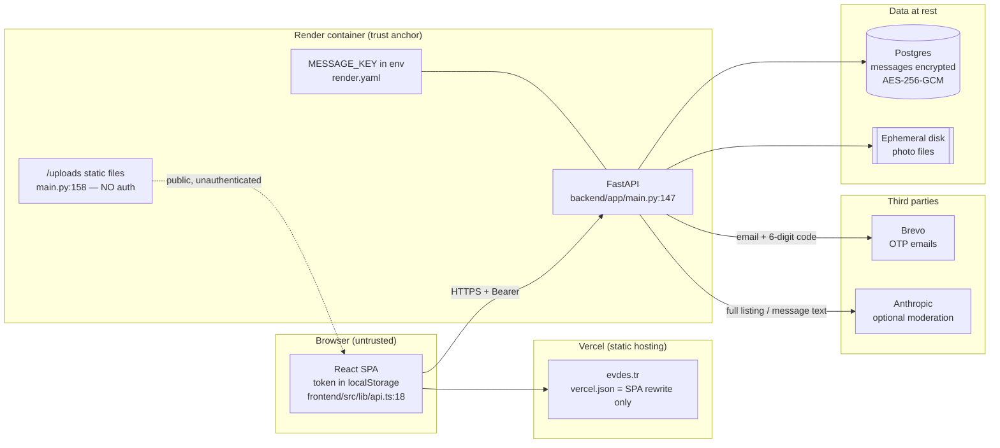

# Security

This document describes the security model of the RoomMatch / evdes.tr platform
and the results of an adversarial audit of it.

It is written for an engineer who knows software but has never read this
codebase. Each section starts with the *problem* the mechanism exists to solve,
then explains *how* the mechanism works, and only then points at the code. Every
claim carries a `file:line` reference so you can check it yourself — this
project has repeatedly shipped documentation and UI copy that promised things
the code did not do, and section 10 below documents two places where that is
still true today.

**Nothing here was tested against production (`api.evdes.tr`).** All exploitation
was reproduced against a throwaway local instance on `127.0.0.1:8377` with an
isolated SQLite database. Where a finding depends on production configuration
that could not be read without touching production, it is labelled as such in
section 11.

---

## 1. What is being protected

| Asset | Where it lives | Why an attacker wants it |
|---|---|---|
| Student identity (name, university, department, year) | `users` table, `backend/app/models.py:24` | Social engineering, targeting a specific person |
| Private chat messages | `messages.content`, encrypted at rest (`backend/app/models.py:234`) | Rental-deposit scams, harassment, doxxing |
| Uploaded photos (faces, apartments) | `data/uploads/`, served publicly at `/uploads` (`backend/app/main.py:158`) | Re-identification, harassment, reuse in fake listings |
| Session tokens | `auth_tokens.token_hash` (`backend/app/models.py:89`) | Account takeover |
| Admin capability | Derived purely from email membership (`backend/app/models.py:83`) | Full moderation control: read flagged private messages, permanently delete accounts |
| Service availability | Render free tier, single container, free Postgres | Extortion, sabotage, or simple vandalism |

---

## 2. Threat model

The realistic adversaries for a student housing platform, ordered by how likely
they are to actually show up:

### 2.1 The scammer (most likely)

Posts an attractive room below market rate, moves the conversation to WhatsApp,
asks for a deposit by bank transfer, disappears. This is the single most common
real-world attack on roommate platforms in Turkey, and it is what the fair-rent
advisor and the `dolandiricilik` (fraud) moderation category exist for.

**Defences:** rule-based moderation flags fraud patterns
(`backend/app/moderation.py:677`), optional AI layer
(`backend/app/moderation_ai.py:80`), user reporting
(`backend/app/reports.py:106`), admin suspension
(`backend/app/admin.py:1311`), and the fair-price estimate that makes a
suspiciously cheap listing visibly suspicious.

**Not defended:** identity is an email address, not a person. Nothing ties an
account to a real human. A banned scammer re-registers in thirty seconds — and
per finding **H5**, not even with a university address.

### 2.2 The harasser

Uses matching as a channel to reach a specific student. The product design
limits this structurally: messaging only opens after a *mutual* like
(`backend/app/messages.py:50`, `_require_participant`), so there is no
unsolicited-message surface at all. Reporting a message is available
(`backend/app/reports.py:106`) and the admin can overwrite the text with a
sentinel while keeping the row (`backend/app/admin.py:759`).

**Not defended:** there is no user-level block/mute. The only remedies are
report → admin suspension, or account deletion.

### 2.3 The spammer / bulk-content attacker

Wants to publish many listings or messages cheaply. This is the threat the audit
found the platform least prepared for: findings **H2** and **H3** together let a
single account write unbounded amounts of data through an endpoint that is then
served to every anonymous visitor.

### 2.4 The scraper

Wants the student roster: who is on the platform, from which university, in
which district. Two separate leaks feed this — `GET /api/listings` returns owner
name and university without authentication (**L3**), and the auth endpoints
answer "is this address registered?" to strangers (**M3**). Combined with the
predictable `ad.soyad@ogr.university.edu.tr` pattern used by Turkish
universities, this is a real enumeration path.

### 2.5 The account-takeover attacker

Wants someone else's session. The high-value target is not a student account but
an address in `ADMIN_EMAILS` (`backend/app/config.py:73`), because admin rights
are *derived from the email string alone* — there is no separate role column and
no second factor (`backend/app/models.py:83`). Whoever controls that mailbox
controls moderation, including permanent deletion.

### 2.6 The vandal (denial of service)

Wants the site down. On a free-tier Render container with 512 MB of RAM, this is
cheap: see **H1** (unbounded request bodies), **H2** (unbounded stored payloads)
and **M1** (locking a specific user out of their own account with five
requests).

### Explicitly out of scope

Nation-state adversaries, physical access to Render's infrastructure, malicious
Render/Brevo/Anthropic insiders, and compromise of the operator's own laptop.
The at-rest message encryption (section 7) is deliberately *not* a defence
against a compromised application server; it defends against a leaked database
dump.

---

## 3. Trust boundaries



The single trust anchor is the Render container. It holds the message
decryption key, so "encrypted messages" means *encrypted against a database
leak*, not against the server itself. The `/uploads` mount is outside every
authorization check by design — it is a plain static file server.

---

## 4. Identity

### 4.1 The `.edu.tr` restriction — the product's central promise

The whole trust proposition is "verified Istanbul university students". The
mechanism that is supposed to enforce it is a domain restriction on sign-up.

**What actually exists:** exactly one check, in the browser, in the onboarding
form's "can I advance to the next step" predicate:

```
frontend/src/pages/Onboarding.tsx:124
  case 0: return email.includes("@") && email.includes(".edu.tr") && ...
```

The server-side validator only requires an `@` and a dot in the domain part:

```
backend/app/auth.py:159-168   class EmailIn._normalize
  if "@" not in v or "." not in v.split("@")[-1]:
      raise ValueError("Geçerli bir e-posta adresi girin.")
```

A client-side check is not a security control; it is a form hint. `curl` skips
it. This is finding **H5** and it was reproduced: `attacker@gmail.com`
registered, verified, and then carried out the rest of the audit session.

The university name shown on a profile is derived from the email domain
(`backend/app/universities.py:10` `DOMAINS`, applied at
`backend/app/auth.py:325`) and cannot be edited by the user — `UserUpdate`
deliberately omits the field (`backend/app/auth.py:208`). That part works: an
account with a non-university address simply has no university, rather than a
forged one. But the account exists and is fully functional.

**Stops:** a casual user from typo-ing a personal address into the sign-up form.
**Does not stop:** anyone who has ever seen a browser devtools Network tab.

### 4.2 OTP (one-time code)

Registration issues a 6-digit code; the account is not `verified` until the code
comes back.

- Generated with a CSPRNG: `secrets.randbelow(1_000_000)`, `backend/app/auth.py:129`.
- Stored as an unsalted SHA-256 of the code (`_issue_otp` → `_sha256`,
  `backend/app/auth.py:105`), with a 10-minute TTL (`OTP_TTL`,
  `backend/app/auth.py:34`).
- Compared with `hmac.compare_digest` (`backend/app/auth.py:400`) — constant
  time, so no timing oracle on the code itself.
- Single use: cleared on success (`backend/app/auth.py:403-405`).
- Brute force is bounded by the rate limiter: 5 attempts per 15 minutes
  (`backend/app/auth.py:44-45`), against a 10⁶ space.

**Stops:** using an email address you do not control; online brute force of the
code.
**Does not stop:** anything once the code is in a log line — see **M2**. The
hash is unsalted over a 10⁶ space, so it inverts in under a second.

There is a development escape hatch: when `DEV_OTP=1`, the code is returned *in
the API response* (`backend/app/auth.py:135-136`, `:152-153`). The code default
is `"1"` — the unsafe value. Production is only safe because `render.yaml` pins
`DEV_OTP: "0"` explicitly, and that file carries a long comment explaining why
the value is written in the blueprint rather than left to the dashboard. Any
deployment that does *not* use this blueprint is insecure by default (**L6**).

### 4.3 Passwords

- Hashed with `scrypt`, N=2¹⁴, r=8, p=1, 16-byte random salt per password:
  `backend/app/auth.py:40`, `:109-115`.
- Verified in constant time via `hmac.compare_digest`, `backend/app/auth.py:123`.
- Policy is length only: minimum 8 characters, maximum 128
  (`backend/app/auth.py:172`). No complexity rule, no breached-password check.
- Changing the password invalidates every session
  (`backend/app/auth.py:468-470`) — a real logout-everywhere, not just the
  current device.

**Stops:** offline cracking of a leaked hash at any meaningful rate for a decent
password.
**Does not stop:** credential stuffing with a password the student already
reused elsewhere. N=2¹⁴ is also below the current OWASP recommendation of 2¹⁷
(**L6**).

### 4.4 Session tokens

- Opaque 256-bit random string, `secrets.token_urlsafe(32)`,
  `backend/app/auth.py:353`.
- Only the SHA-256 hash is stored (`backend/app/models.py:89`,
  `backend/app/auth.py:354`) — a database leak does not yield usable sessions.
  Plain SHA-256 is correct here and not a weakness, because the input is already
  256 bits of entropy; there is nothing to brute-force.
- 30-day TTL, enforced on read and the expired row deleted
  (`TOKEN_TTL`, `backend/app/auth.py:35`, `:283-289`).
- Suspension deletes all of a user's tokens (`backend/app/admin.py:1336-1338`),
  and `get_optional_user` re-checks `is_suspended` on every request as a second
  gate (`backend/app/auth.py:294-295`) in case a row survives.
- Logout deletes the single token (`backend/app/auth.py:643-655`).

**Stops:** stale sessions surviving a suspension or a password change; session
recovery from a database dump.
**Does not stop:** theft from the browser. The token lives in `localStorage`
(`frontend/src/lib/api.ts:16-20`), which is readable by any script that achieves
XSS. There is no HttpOnly cookie, no CSP, and no `Referrer-Policy` — see **M5**.

### 4.5 Rate limiting

One in-memory token bucket, keyed by `(action, email)`, 5 requests per 15
minutes:

```
backend/app/auth.py:44-58
  _RATE_BUCKETS: dict[tuple[str, str], list[datetime]] = {}
  def _rate_limit(action: str, email: str) -> None: ...
```

It is applied to exactly four endpoints: `register` (`:312`), `request-otp`
(`:336`), `login` (`:361`), `verify-otp` (`:385`).

**Stops:** online brute force of one specific account's password or OTP.
**Does not stop:**
- Bulk registration — the key includes the email, so a fresh address gets a
  fresh bucket (**H3**).
- Any content-producing endpoint. Listings, messages, uploads and reports have
  no limit at all (**H3**).
- Being weaponised against the victim: five wrong passwords lock the *real
  owner* out for 15 minutes, and a successful login does not reset the bucket
  (**M1**).
- Multi-process deployments. The bucket is per-process memory and resets on
  restart; the module comment at `backend/app/auth.py:42-43` says so honestly.

---

## 5. Authorization

### 5.1 Ownership checks

Every mutation of a user-owned row re-reads the row and compares owner ids
server-side. The pattern is consistent:

| Action | Check | Code |
|---|---|---|
| Edit listing | `user.id != row.owner_id` → 403 | `backend/app/listings.py:438` |
| Deactivate listing | same | `backend/app/listings.py:499` |
| Read chat | not a participant → 403 | `backend/app/messages.py:50-57` |
| Send message | same helper | `backend/app/messages.py:107` |
| Respond to a like | like must be on *your* listing → 403 | `backend/app/swipes.py:261` |

Mass assignment is closed by schema design rather than by a blocklist:
`UserUpdate` (`backend/app/auth.py:208`) simply does not declare `email`,
`university`, `verified`, `is_suspended` or `id`, and Pydantic drops unknown
keys. `is_admin` cannot be assigned at all because it is a computed property,
not a column (`backend/app/models.py:83`). This was probed during the audit and
held (section 12).

### 5.2 Admin authority

Admin status is membership in a set of email addresses:

```
backend/app/models.py:83-87
    @property
    def is_admin(self) -> bool:
        from app.config import ADMIN_EMAILS
        return self.email.lower() in ADMIN_EMAILS
```

`ADMIN_EMAILS` comes from an environment variable with a hard-coded default of
the maintainer's own addresses (`backend/app/config.py:73-79`). Enforcement is a
single dependency, `require_admin` (`backend/app/reports.py:54`), applied to
every `/api/admin/*` route: 401 without a token, 403 with a non-admin token.

The design consequence is stated plainly in the config comment itself
(`backend/app/config.py:64-72`): there is no second factor and no separate role,
so compromising one mailbox yields full moderation power *including permanent
deletion*. This is an accepted risk, documented at the point of definition,
which is the right place for it.

### 5.3 Protected boundaries, and why they exist

Two operations — suspend and permanent delete — refuse to act on the acting
admin or on any other admin:

```
backend/app/admin.py:1226-1252   _protect_admin_accounts
    if target.id == admin.id:  400
    if target.is_admin:        403
```

The docstring is explicit that this is a **safety interlock, not a permission
boundary**. The reasoning: there is no endpoint that can un-suspend or restore
the last admin, because reaching that endpoint requires being an admin. A single
click would irreversibly destroy platform governance. The same argument extends
to admin-on-admin actions: if two admins could delete each other, one
compromised mailbox would be enough to wipe the moderation team.

Crucially, this does not remove anyone's right to delete their own account.
`DELETE /api/auth/me` remains open to admins and requires the password
(`backend/app/auth.py:621-640`). What is blocked is the accidental,
one-click-plus-reason-box path — not the deliberate, authenticated one.

There is also a deliberate *absence*: no impersonation endpoint. The reasoning
is written down at `backend/app/admin.py:45-49` — an admin can already see
reported and flagged content, but taking over a session to read private chats or
write in someone's name is a categorically different power. If the need ever
arises, the correct answer is a read-only viewer.

### 5.4 Ordering rule that is easy to get wrong

`_protect_admin_accounts` checks "is it me" *before* "is the target an admin",
because the admin is themselves an admin and the checks would otherwise return
the wrong status code and the wrong message (`backend/app/admin.py:1244-1247`).
Small, but it is the kind of ordering bug that makes an error message lie.

---

## 6. Content safety

### 6.1 Layer 1 — rules, always on

`backend/app/moderation.py` is a pure, dependency-free, Turkish-aware text
checker. Its design bias is stated up front (`backend/app/moderation.py:6-10`):
this is a rental listing site, so **wrongly blocking an innocent listing is
worse than missing a rude word**. Therefore `block` is produced only for
unambiguous profanity, hate speech and sexual harassment; everything heuristic
(fraud suspicion, contact details, off-platform redirection) produces at most
`flag`.

The hard part is Turkish false positives — "sıkıntı", "ışık", "amaç", "mal" all
collide with profanity stems once Turkish characters are folded. Four mitigations
are documented and implemented at `backend/app/moderation.py:14-36`: word-boundary
matching instead of substring scanning, separate folded/unfolded passes for short
colliding stems, an explicit `_SAFE_TOKENS` allowlist, and no short English stems
at all. Evasion handling (zero-width characters, Cyrillic/Greek homoglyphs,
leetspeak, space removal) is described in the same block.

Thresholds: `BLOCK_THRESHOLD = 1.0`, `FLAG_THRESHOLD = 0.4`, and the fraud
category is capped at `_SCAM_MAX = 0.9` so that it can *never* block on its own
(`backend/app/moderation.py:66-73`).

Enforcement points: listings check title and description separately so the error
can name the offending field (`backend/app/listings.py:65-97`); messages check
the body (`backend/app/messages.py:132-140`). Blocked content returns 422;
flagged content is published with `is_flagged=True` and lands in the admin queue.

### 6.2 Layer 2 — AI, optional and strictly-additive

`backend/app/moderation_ai.py` sends the text to Anthropic's API
(`claude-haiku-4-5`, `:38`) for classification. Three properties make this safe
to bolt on:

1. **Off by default.** It runs only if `ANTHROPIC_API_KEY` is set
   (`backend/app/moderation.py:711-713`).
2. **Never blocking on failure.** Timeout (5 s, `moderation_ai.py:42`), network
   error or malformed JSON all yield `None`, and the caller silently falls back
   to the rule result (`backend/app/moderation.py:704-720`).
3. **Can only tighten.** Results are combined with `merge`, where the stricter
   verdict wins and reasons are unioned (`backend/app/moderation.py:725`). The
   AI cannot un-block something the rules blocked; in fact the rules short-circuit
   before calling it when they already said `block`
   (`backend/app/moderation.py:702-703`).

### 6.3 Reporting

Users report a listing, a user or a message from a closed reason list
(`backend/app/reports.py:26-42`). Reporting requires a login — the docstring at
`backend/app/reports.py:111` says why: to close the anonymous-report-flood
surface. The same user cannot report the same target twice, enforced both by a
pre-check and by a database `UniqueConstraint`, with the race losing side turned
into a 409 rather than a 500 (`backend/app/models.py:326-329`,
`backend/app/reports.py:133-145`).

What is *missing* is an access check on the target: any authenticated user can
report message id 7 regardless of whether they can see it. That is finding
**H4**.

### 6.4 Admin queue

The queue is built around a set of principles written out at the top of the
module (`backend/app/admin.py:1-56`). They are numbered there; the numbering is
kept here so the two can be read side by side. Principle 3b (no impersonation)
is covered in section 5.3 and principle 4 (every action is recorded) in
section 9.

- **1 — Reversible first.** Suspend rather than delete, hide rather than erase.
  Removed content stays findable at `GET /api/admin/flagged?status=removed`, a
  message's text is moved to `original_content` rather than overwritten, and
  restore endpoints exist for both listings and messages.
  *Honest exception, documented in the same block:* messages removed before
  those columns existed genuinely lost their text; restore returns
  `restored:false` and deliberately leaves the flag up so the record stays
  findable.
- **1b — Destructive paths exist, but separate and logged.** `DELETE
  /api/admin/listings/{id}` and `DELETE /api/admin/users/{id}` require a
  reason, write an `AdminAction`, and — importantly — *conversations survive*:
  deleting a listing NULLs `matches.listing_id` rather than deleting the chat
  (`backend/app/listings.py:136-170`).
- **2 — The reporter is never shown to the reported.** These endpoints are
  admin-only and reporter identity does not leak out of them. See **L1** for
  the one place where this principle leaks in the opposite direction.
- **3 — The admin sees only what the decision requires.** A reported message
  returns *that message*, not the conversation
  (`backend/app/admin.py:375-388`). The user list returns email addresses only
  for suspended accounts (`backend/app/admin.py:1202-1225`), and email is
  searchable (`?q=`) without being returned — "find this address" does not
  require seeing all addresses.

The `?q=` search escapes LIKE wildcards (`backend/app/admin.py:479-487`),
otherwise a `%` search would quietly return the whole table and the admin would
believe they had found what they searched for.

---

## 7. Cryptography

### 7.1 Message encryption at rest

Chat messages are encrypted before being written and decrypted on read:

- AES-256-GCM, 12-byte random nonce per message, stored as
  `enc:v1:` + base64(nonce ‖ ciphertext ‖ tag) — `backend/app/crypto.py:145-155`.
- Decryption at `backend/app/crypto.py:157-180`; a value not starting with the
  prefix is treated as legacy plaintext and returned as-is, because production
  already contains plaintext rows from before the feature existed.
- Applied at the write path (`backend/app/messages.py:145`) and both read paths
  (`backend/app/messages.py:39-46`, `backend/app/admin.py:381`).
- A row that fails to decrypt returns the sentinel `[unreadable]`
  (`backend/app/crypto.py:51`) rather than 500-ing the whole conversation. The
  sentinel is language-independent on purpose; the UI translates it.

### 7.2 Why this is not end-to-end encryption

The key is an environment variable on the server
(`backend/app/crypto.py:83-113`). The server therefore *can* read every message,
and does — the moderation layer runs on plaintext before encryption
(`backend/app/messages.py:132`), and the admin queue decrypts reported messages
(`backend/app/admin.py:381`).

This is a deliberate trade-off, not an oversight. Real end-to-end encryption
would make server-side moderation impossible, and on a platform whose primary
threat is deposit fraud conducted *inside the chat*, losing moderation would cost
more than at-rest encryption buys. What at-rest encryption actually protects
against is narrow and worth stating precisely: **a leaked database dump or a
stolen backup.** It protects against nothing else.

The codebase enforces the honesty of this claim in three places: the module
docstring instructs that no user-facing text may say "end-to-end"
(`backend/app/crypto.py:5-8`), the messages module repeats it
(`backend/app/messages.py:6-8`), and the Safety page copy says it outright —
"the decryption key lives on the server, so anyone with access to the server can
read the messages" (`frontend/src/i18n/translations.ts:1540`, TR at `:668`).

### 7.3 Key management and the loss scenario

`MESSAGE_KEY` accepts two formats (`backend/app/crypto.py:83-120`):

1. base64 of exactly 32 bytes — the preferred form, produced by
   `python -m app.crypto --genkey`.
2. Any raw string of ≥ 32 characters, from which the key is derived with a
   single unsalted SHA-256 (`backend/app/crypto.py:111-112`).

Format 2 exists for a concrete operational reason: Render's `generateValue: true`
produces a string that is not base64-of-32-bytes, and without this branch the
blueprint's own generated key would have been silently rejected and messages
written in plaintext. The cost is that no entropy check is performed on the raw
path — see **L5**.

**The failure mode that matters:** if `MESSAGE_KEY` is absent or malformed,
encryption silently disables itself and messages are stored as plaintext, with
only a log warning (`backend/app/crypto.py:90-94`, `:115-119`). The app keeps
working. `render.yaml` and `DEPLOY.md §1.1` both carry warnings about this.

**If the key is lost or rotated:** every message encrypted under the old key
becomes permanently unreadable and renders as `[unreadable]`. There is no key
rotation mechanism, no key versioning beyond the `v1` string in the prefix, and
no re-encryption script. `render.yaml` instructs the operator to copy the
generated value out of the dashboard and back it up after the first deploy. That
backup is the entire recovery plan.

### 7.4 Other cryptographic choices

| Use | Primitive | Location | Note |
|---|---|---|---|
| Password storage | scrypt N=2¹⁴, r=8, p=1, per-password salt | `backend/app/auth.py:40` | Below OWASP's 2¹⁷ (**L6**) |
| Session token storage | SHA-256 of a 256-bit random token | `backend/app/auth.py:105`, `:353` | Correct — input already has full entropy |
| OTP storage | SHA-256 of a 6-digit code, unsalted | `backend/app/auth.py:105`, `:130` | 10⁶ space; inverts instantly (**M2**) |
| Upload filenames | `secrets.token_hex(16)` | `backend/app/uploads.py:72` | Unguessable, but see **H6** |
| Message AEAD | AES-256-GCM, no AAD | `backend/app/crypto.py:153`, `:175` | Ciphertext not bound to its row (**L6**) |

---

## 8. Privacy and third parties

Two external services receive user data.

### 8.1 Brevo — transactional email (always on in production)

`backend/app/emailer.py:29-77`. What is sent: the recipient's email address and
the 6-digit login code, in both the subject line and the body
(`backend/app/emailer.py:38-56`). Brevo was chosen because its free tier allows
sending to arbitrary recipients from a verified sender without domain
verification (`backend/app/emailer.py:5-8`).

Failure handling is careful about logging: when Brevo rejects a send, only the
provider's status code and error text are logged — **never the code or the
recipient** (`backend/app/emailer.py:65-69`).

Behaviour when email is unconfigured depends on `DEV_OTP`: with `DEV_OTP=0` the
request fails loudly with 502 rather than silently leaving the user without a
code (`backend/app/auth.py:146-150`).

### 8.2 Anthropic — content classification (opt-in)

`backend/app/moderation_ai.py`. Runs only when `ANTHROPIC_API_KEY` is set. What
is sent: **the full text of the listing or message being screened**, truncated
to 4000 characters (`moderation_ai.py:45`), plus a fixed system prompt. No user
id, no email, no name — just the text and a `İLAN`/`SOHBET MESAJI` label
(`_KIND_LABEL`, `moderation_ai.py:70`, interpolated into the user turn at
`:94-97`).

This is disclosed to users. The Safety page states that while the layer is on,
"the full text of the listings and messages being screened is sent to Anthropic
for classification" (`frontend/src/i18n/translations.ts:1534`, TR at `:662`).
That is an unusually honest piece of product copy and it matches the code.

### 8.3 What is not disclosed

There is no privacy notice and no `/privacy` route. Brevo (email processing) and
Render (database hosting, outside Turkey) appear in no user-facing text. Under
KVKK this is a compliance gap — see **L6**.

---

## 9. Audit trail

Reversible moderation actions record their actor in their own row:
`reports.resolved_by` / `resolved_at` (`backend/app/models.py:344-346`),
`users.suspended_by` / `suspended_at` / `unsuspended_by` / `unsuspended_at`
(set at `backend/app/admin.py:1325-1329` and `:1364-1368`), and
`reviewed_by` / `reviewed_at` on listings and messages.

Irreversible actions cannot do that — the row itself disappears — so they go to a
dedicated table:

```
backend/app/models.py:270-317   class AdminAction
  actor_id     (nullable FK to users)
  action       "listing_delete" | "user_delete" | "listing_update" | "listing_publish"
  target_type  "listing" | "user"
  target_id    (Integer, deliberately NOT a foreign key — the target is gone)
  reason       (mandatory on destructive endpoints)
  detail       (JSON: what the deleted row contained, what an edit overwrote)
  created_at
```

Three design decisions worth understanding:

- **The audit row is written in the same transaction as the action**
  (`backend/app/admin.py:448-477`, `db.flush()` not `db.commit()`). If they were
  separate commits, a failed deletion could leave behind a log entry claiming a
  deletion that never happened.
- **Reversible actions are deliberately *not* written here**
  (`backend/app/admin.py:33-36`). They already carry their actor in their own
  columns, and recording the same event twice means the two records can
  eventually disagree.
- **Deleting an admin does not delete their audit trail.** `actor_id` is
  nullable and `purge_user` NULLs it rather than cascading
  (`backend/app/auth.py:594-608`). The comment says why: otherwise the easiest
  way to erase your own moderation history would be to delete your own account.

What is recorded on a user deletion includes the deleted account's email, name
and university (`backend/app/admin.py:1416-1422`) — necessary to answer "which
account did I delete", but it means an audit row outlives the erasure request
that produced it (**L6**).

---

## 10. Audit results — verified findings

All findings below were **reproduced by execution** against a local instance
(`127.0.0.1:8377`, isolated SQLite, `DEV_OTP=1`, a single admin address), unless
the entry says otherwise. Severity reflects damage a real attacker can do to a
real user, not theoretical worst case.

### HIGH

#### H1 — Chunked uploads bypass the body-size limit → unbounded disk/memory write

**Where:** `backend/app/uploads.py:54-55` (the Content-Length check),
`backend/app/main.py` (no ASGI-level body cap anywhere).

The endpoint tries to reject oversized bodies before reading them by inspecting
the `content-length` header. A request sent with `Transfer-Encoding: chunked`
has no `content-length`, so the check never fires — and Starlette's multipart
parser has already spooled the entire part to a temporary file before the
endpoint function runs. `file.read(MAX_BYTES + 1)` at `backend/app/uploads.py:58`
therefore limits nothing that matters.

Reproduced with a raw socket, watching the server process's open temp file grow:
12.5 MB at ~3 s, 25.1 MB at ~6 s, 75.5 MB at ~18 s and still growing, before the
413 was finally returned *after the whole body hit disk*. The same unbounded
buffering applies to non-upload JSON endpoints, since Starlette reads the body
into memory.

**Impact:** one verified account with a handful of concurrent connections fills
the container's ephemeral disk and IO, or OOMs a 512 MB free-tier instance.
Service outage.

**Fix:** cap the request body at the reverse proxy (Render / Cloudflare), and
additionally stream-limit in the app via `Request.form(max_part_size=…)` or an
ASGI `receive` wrapper. A `file.read()` limit alone cannot work — parsing
finishes first.
**Effort:** medium (half a day); proxy config as a 1-hour stopgap.

#### H2 — Unbounded element length in `photos` / `preferred_districts` → stored amplification on an anonymous endpoint

**Where:** `backend/app/listings.py:223` (`photos: Field(..., min_length=3,
max_length=6)` constrains the *count*, not the elements),
`backend/app/auth.py:246` (`preferred_districts: list[str] | None` — no
constraint at all), `backend/app/auth.py:248` (same problem for profile photos).

Pydantic's `max_length` on a `list[str]` bounds the number of items. Nothing
bounds the length of each item, and nothing bounds the list length for
`preferred_districts`.

Reproduced:

```
POST /api/listings   photos = ["A" * 2_000_000] * 6        -> 201
anon GET /api/listings                                     -> 12,001,715 bytes
PATCH /api/auth/me   preferred_districts = ["A"*10000]*2000,
                     photos = ["x"*2_000_000]*6            -> 200
GET  /api/auth/me                                          -> 32,006,380 bytes
```

**Impact:** `GET /api/listings` is unauthenticated
(`backend/app/listings.py:325`, `get_optional_user`), so a single bloated row is
served to **every visitor**. Postgres storage and Render bandwidth are exhausted
by one attacker. Combined with H3 (no rate limit) it scales.

**Fix:** constrain per element —
`list[Annotated[str, StringConstraints(max_length=500)]]` for photo URLs;
`max_length=10` on the `preferred_districts` list plus `max_length=40` per item.
**Effort:** very low, 2–3 lines. Best impact-to-effort ratio in this report.

#### H3 — No rate limit on any content-producing endpoint

**Where:** rate limiting exists only at `backend/app/auth.py:49` and is applied
only to the four auth endpoints. Unprotected:
`backend/app/listings.py:290` (create listing),
`backend/app/messages.py:101` (send message),
`backend/app/uploads.py:41` (upload),
`backend/app/reports.py:106` (create report).

Reproduced: 80 sequential `POST /api/listings` with one token → 80 × 201, no
throttling. Registration with unique addresses → all 201, because the bucket key
includes the email (`backend/app/auth.py:51`).

**Impact:** one account writes unlimited listings, messages and uploads; with H1
and H2 this fills disk and database. Separately, bulk fake-account creation is
not impeded at all.

**Fix:** apply the existing `_rate_limit` bucket keyed on `user.id` to uploads,
listings, messages and reports; add an IP-keyed limit to registration. Note that
a multi-process deployment needs shared state (Redis) — the current bucket is
per-process.
**Effort:** medium (half a day) extending existing infrastructure.

#### H4 — The report endpoint is an existence oracle, and lets an attacker inject private messages into the moderation queue

*(Originally rated HIGH by the scanning pass; downgraded to MEDIUM after
verification — reasoning below.)*

**Where:** `backend/app/reports.py:115-117` — the target is fetched by id with no
access check; `backend/app/admin.py:375-388` — `_message_summary` decrypts the
content for the admin view. No rate limit on the endpoint.

Reproduced with account X, which is **not** a participant in match 1:

```
GET  /api/matches/1/messages         (X)   -> 403 "not a participant"
POST /api/reports {message, id=1}    (X)   -> 201
POST /api/reports {message, id=2}    (X)   -> 201
POST /api/reports {message, id=3..11}(X)   -> 404      <- id enumeration oracle
Admin GET /api/admin/reports?target_type=message:
  report#1 message#1 sender=Deniz  PLAINTEXT: "...my address is Nişantaşı..., phone 0532..."
  report#2 message#2 sender=Elif   PLAINTEXT: "IBAN for the deposit: TR33 ..."
```

**Impact, reassessed.** Two real effects: (a) the 201/404 difference enumerates
valid message, user and listing ids with no rate limit; (b) an attacker can push
a private message they are not party to into the moderation queue, breaking
principle 3 ("the admin sees only what the decision requires") from the outside.

**But** the framing "the attacker can read all messages in plaintext" is wrong.
Only the **admin** sees the plaintext. The attacker obtains no content — verified
directly: X could not read a single message. Real privacy damage is therefore
lower than first claimed. → **MEDIUM**.

**Fix:** add an access check in `create_report` — for a message target the
reporter must be a participant in the match, otherwise 404; for a listing, the
listing must be visible to them. Add a per-user rate limit on the endpoint.
**Effort:** low-to-medium.

#### H5 — The `.edu.tr` requirement is client-side only

**Where:** `backend/app/auth.py:159-168` (`EmailIn._normalize` checks only for
`@` and a dot in the domain). The only real check is
`frontend/src/pages/Onboarding.tsx:124`.

Reproduced: `register {"email": "attacker@gmail.com"}` → 201, `verify-otp` → 200,
fully functional account. That account was then used to execute H2, H3 and H4.

**Impact:** the platform's entire trust model — "verified Istanbul university
students" — is not enforced anywhere on the server. This is not just a technical
gap; the product *sells* it. `frontend/src/i18n/translations.ts:659` and `:1531`
say sign-up is only possible with a `.edu.tr` address, and the same claim appears
at `:65`, `:80`, `:88`, `:212`, `:597`, `:605`. Worse, the Safety page carries an
explicit in-code promise that it lists only guarantees *actually implemented*
(`frontend/src/pages/Safety.tsx:14`) — for this card, that promise is false.

Severity is HIGH for the product trust model; direct technical exploitability is
closer to MEDIUM.

**Fix:** add a domain rule to `EmailIn` (`domain == "edu.tr" or
domain.endswith(".edu.tr")`) with an explicit exemption list for the non-`.edu.tr`
address in `ADMIN_EMAILS` (`bariskirat5@gmail.com`,
`backend/app/config.py:76`), and align it with `backend/app/universities.py`. If
the rule is *not* going to be enforced, the Safety and landing copy must be
corrected instead.
**Effort:** low.

#### H6 — Account deletion does not delete uploaded photos, and photo URLs are unauthenticated and permanent

**Where:** `backend/app/auth.py:503` (`purge_user` touches only database rows),
`backend/app/listings.py:136` (`purge_listing`, same), `backend/app/main.py:158`
(`StaticFiles` mount with no auth). Confirmed by grep: neither purge function
references `UPLOADS_DIR` or `unlink`.

Reproduced:

```
POST   /api/uploads                     -> /uploads/b58976c0….png
GET    /uploads/b58976c0….png (no auth) -> 200
DELETE /api/auth/me (with password)     -> 204
GET    /uploads/b58976c0….png (AFTER)   -> 200      <- still served
```

**Impact:** students' face and profile photos remain publicly reachable after
they delete their account. This contradicts the product's own promise that
account deletion is permanent and "your profile, listings, matches and messages
are completely deleted" (`frontend/src/i18n/translations.ts:673-674`), and it is an
incomplete response to a KVKK Art. 7 erasure request.

Severity is HIGH on privacy/compliance grounds; technically MEDIUM (the
filenames are 16 random bytes, so an attacker must already know the URL).

**Fix:** in `purge_user` and `purge_listing`, unlink files under `UPLOADS_DIR`
whose names match the `secrets.token_hex(16).<ext>` pattern referenced by the
deleted rows' `photos` arrays. Add simple reference counting for the case where
the same photo is used by more than one row.
**Effort:** low-to-medium (deletion plus the sharing edge case).

### MEDIUM

#### M1 — Login/OTP lockout DoS: five requests lock a victim out of their own account for 15 minutes

*(Rated HIGH by the scanning pass; downgraded — availability-only, reversible, no
confidentiality or integrity loss.)*

**Where:** `backend/app/auth.py:49-58` — the bucket key is `(action, email)` with
no IP dimension, and a successful login does not clear the bucket. Called at
`backend/app/auth.py:361`.

Reproduced: 5 wrong passwords from the attacker → 401 ×5; then the **victim**
with the correct password → 429 "too many attempts… 15 minutes".
`request-otp` and `verify-otp` behave the same.

**Impact:** anyone who knows a victim's email address can keep them locked out in
15-minute increments.

**Fix:** add an IP dimension to the key; **reset the bucket on successful
login**; prefer exponential backoff over an email-keyed hard lockout.
**Effort:** low-to-medium.

#### M2 — `password_hash` and `otp_hash` appear in plaintext in error logs; `otp_hash` inverts in ~0.3 s

**Where:** `backend/app/db.py:44` — `create_engine(...)` is called without
`hide_parameters=True`.

Reproduced against the real engine with a failing INSERT:

```
hide_parameters: NOT set (parameters visible)
password_hash visible in exception: True
otp_hash      visible in exception: True
[parameters: ('deniz@…', 'SALT$SECRETDIGEST…', 'c658c2f6…OTPHASH')]
```

`otp_hash` is an unsalted SHA-256 over a 6-digit code — a 10⁶ search space,
seconds on any CPU. Anyone with access to Render's logs (or who catches a 500
window) can recover a live OTP.

**Impact:** conditional (requires a 500 *and* log access), but the consequence is
account takeover. The `password_hash` exposure is much less serious because it is
scrypt-protected; the sharp edge is the OTP.

**Fix:** `create_engine(..., hide_parameters=True)`; store the OTP as
`HMAC-SHA256(server_secret, code)` instead of a bare hash.
**Effort:** very low for the one-liner; slightly more for the HMAC change.

#### M3 — Email enumeration (explicit, plus a timing channel)

**Where:** `backend/app/auth.py:317-319` (register returns 409 "already
registered"), `backend/app/auth.py:338-341` (request-otp returns 404 "not
registered"), and `backend/app/auth.py:363-368` — when the user does not exist,
`_verify_password` is never called, so no scrypt work is done and the response is
measurably faster.

Reproduced:

```
register   {registered address}    -> 409 "already registered"
request-otp{unregistered address}  -> 404 "not registered"
request-otp{registered address}    -> 200
12 DIFFERENT @marmara.edu.tr       -> [404] × 12, no 429 at any point
```

The last line is the important one: the rate limiter is keyed on the email, so
scanning *different* addresses is unlimited.

**Impact:** "is X on this platform" is answered to strangers, and Turkish
universities use predictable `firstname.lastname@ogr.university.edu.tr` patterns,
so a student roster can be scanned. Sensitive on a roommate platform.

**Fix:** return a uniform 200 from `request-otp`; for register, either send an
"you already have an account" email and return 200, or accept the leak
consciously; add an IP-keyed limit; run a dummy scrypt verification when the user
does not exist to flatten the timing channel.
**Effort:** low-to-medium — doing this without breaking the registration UX takes
some thought.

#### M4 — Upload URLs are derived from the `Host` header, and static files carry no `nosniff` / `Content-Disposition`

**Where:** `backend/app/uploads.py:75` builds the returned URL from
`request.base_url`; `backend/Dockerfile:43` runs uvicorn with
`--forwarded-allow-ips '*'`; `backend/app/main.py:158` mounts `StaticFiles` with
no header customisation.

Reproduced:

```
POST /api/uploads -H "Host: evil.attacker.tld"
  -> {"url": "http://evil.attacker.tld/uploads/….png"}
GET /uploads/<file> response headers: content-type: image/png
  (no X-Content-Type-Options, no Content-Disposition)
```

**Impact:** the poisoned URL can be written into a `photos[]` array and is then
served to other users inside an ``, leaking their IP and User-Agent to
the attacker's server (tracking), and allowing post-moderation content swaps.
Whether Render forwards a client-controlled `Host` in production could not be
verified (attacking production is out of scope). This is *not* an XSS today —
separate origin, and the browser does not sniff.

**Fix:** build the URL from a fixed `PUBLIC_BASE_URL` / `UPLOADS_BASE_URL`
environment variable; restrict `photos` elements to an allowlist of the app's own
`/uploads/` prefix (which closes the URL half of H2 at the same time); add
middleware that sets `X-Content-Type-Options: nosniff` and
`Content-Disposition: attachment` on static responses.
**Effort:** low.

#### M5 — No security headers on either the API or the frontend

**Where:** `backend/app/main.py:161-187` — the only middleware is GZip and CORS;
no security-header middleware exists. `frontend/vercel.json` contains a SPA
rewrite and nothing else — no `headers` block.

Verified by reading the code and `vercel.json`; production response headers were
deliberately **not** fetched (see section 11).

**Impact:** the session token lives in `localStorage`
(`frontend/src/lib/api.ts:16-20`), so any future XSS converts directly into
session theft; no CSP and no `frame-ancestors` means no clickjacking defence; no
HSTS on the API.

**Fix:** a small FastAPI middleware emitting `X-Content-Type-Options: nosniff`,
`Referrer-Policy: no-referrer`, `X-Frame-Options: DENY` and HSTS; a `headers`
block in `frontend/vercel.json` adding CSP, XCTO and XFO.
**Effort:** low.

### LOW

#### L1 — The suspension reason (a free-text admin note) is shown to the suspended user, and can expose the reporter

**Where:** `backend/app/auth.py:375` calls
`_reject_if_suspended(user, include_reason=True)` on the login path;
`SuspendIn.reason` (`backend/app/admin.py:133`) is unfiltered free text.

Reproduced:

```
suspend reason = "…reported by Cem"
login (correct password) -> 403 "…Reason: …reported by Cem"   <- leaks
request-otp              -> 403 generic sentence              <- does not leak
```

The current design is already a deliberate improvement — the docstring at
`backend/app/auth.py:67-101` explains that the reason used to be returned
unconditionally, so a stranger who only knew the email address could read the
full moderation note via `request-otp`. Now it is shown only after the password
is verified.

**Impact:** the person who proves the password *is* the person who was reported,
which conflicts with admin principle 2 ("the reporter is never shown to the
reported"). Mitigated by the fact that the note is admin-written, so an admin can
simply choose not to name anyone. → LOW-to-MEDIUM.

**Fix:** a separate `internal_note` column plus a user-facing reason *code*; or,
cheaper, a warning in the admin UI that this text will be shown to the user.
**Effort:** medium (schema plus UI).

#### L2 — `_RATE_BUCKETS` grows without bound (slow memory leak)

**Where:** `backend/app/auth.py:46` and `:51` — `setdefault` creates a key that is
never removed; the pruning at `:52` only trims the timestamp list inside a bucket
that is being accessed.

Every unique email address ever seen leaves a permanent dictionary key. A
measurement of 200k unique addresses reported ~59.5 MiB; the mechanism is
confirmed by reading the code. This should be addressed as part of fixing H3.

**Fix:** a TTL-bounded LRU (`cachetools.TTLCache`) or periodic sweep; Redis for
multi-process deployments.
**Effort:** low.

#### L3 — Anonymous `GET /api/listings` returns the owner's name and university

**Where:** `backend/app/listings.py:285-286` (`owner_name`, `owner_university` on
`ListingOut`) with the endpoint depending on `get_optional_user`
(`backend/app/listings.py:325`).

Reproduced:

```
anon GET /api/listings ->
  {'owner_id': 1, 'owner_name': 'Deniz', 'owner_university': 'Yıldız Teknik Üniversitesi'}
```

**Impact:** a scraper with no account collects name + university + district +
photos, and `owner_id` hands it ready-made ids for the H4 oracle.

**Fix:** return `owner_name` / `owner_university` only to authenticated callers
(None for anonymous), or move the endpoint to `get_current_user`.
**Effort:** low.

#### L4 — Match/like enumeration via the 404-vs-403 distinction

**Where:** `backend/app/messages.py:53-57` (non-participant → 403) and
`backend/app/swipes.py:261` (respond → 403). No content leaks; only the existence
and rough count of rows is observable.

Worth noting for consistency: `backend/app/swipes.py:263` deliberately returns
**404** for a suspended swiper (so suspension status does not leak) but leaves
**403** for a non-participant — the same reasoning was applied to one branch and
not the other.

**Fix:** return 404 to non-participants as well.
**Effort:** very low.

#### L5 — No entropy check on the raw-string `MESSAGE_KEY` path

**Where:** `backend/app/crypto.py:111-112` — only a length check (≥ 32) followed
by a single unsalted SHA-256.

Verified by code reading. Production risk is small because `render.yaml` uses
`generateValue: true`, which yields a high-entropy string; the exposure is an
operator who pastes a weak value by hand. If a database dump leaks, a weak key is
then dictionary-attackable.

**Fix:** accept only `base64(32 bytes)` and fail loudly at startup on a malformed
value rather than silently falling back to plaintext; or apply scrypt/argon2 plus
an entropy threshold on the raw path.
**Effort:** low.

#### L6 — Other hardening items

| Item | Where | Status | Fix |
|---|---|---|---|
| `/docs` and `/openapi.json` open in production | `backend/app/main.py:147` (no `docs_url=None`) | 200/200 locally; not directly exploitable since authz is enforced, but it eases reconnaissance | `docs_url=None, redoc_url=None, openapi_url=None` in production |
| `DEV_OTP` code default is `"1"` | `backend/app/auth.py:136` | `render.yaml` pins `"0"`, so *this repo's* production is safe; risk is any deployment not using the blueprint. Reproduced locally: the first account to register an `ADMIN_EMAILS` address became admin instantly, and the OTP came back in the response body | Default to `"0"` so the unsafe value is opt-in |
| scrypt N=2¹⁴ | `backend/app/auth.py:40` | Below OWASP's N=2¹⁷; `password_hash` is `String(200)`, which accommodates an upgrade | Raise N, re-hash on next successful login |
| AES-GCM used without AAD | `backend/app/crypto.py:153`, `:175` | Ciphertext is not bound to its row, so a DB-write attacker could move messages between rows. Requires database write access — this is defence-in-depth, not a primary control | Pass `message.id` / `match_id` as associated data |
| Container runs as root | `backend/Dockerfile` (no `USER` directive) | — | Add a non-root `USER` |
| No KVKK privacy notice; Brevo/Render transfers undisclosed | no `/privacy` route exists | Anthropic *is* disclosed honestly (`translations.ts:1534`); Brevo and Render appear nowhere | Write the notice, add the route |
| `react-router-dom@6.30.1` | `frontend/package.json` | `@remix-run/router` open-redirect XSS advisory (fixed in 6.30.4+). **No concrete path from untrusted input to navigation was found in this codebase** — vulnerable version only, exploitability not demonstrated | `npm audit fix` |
| Python dependencies pinned with `>=` | `backend/requirements.txt` | Non-reproducible builds; no known critical CVE in the currently installed versions | Pin exact versions, add a lockfile |
| Deleted account's email survives in the audit trail | `backend/app/admin.py:1416-1422` (`detail`), `backend/app/admin.py:1202-1225` (search-prefix narrowing can reconstruct an email letter by letter) | Only relevant against a curious-admin model | Store a hash or a redacted form; drop email search |

---

## 11. Not verified, corrected, or overstated

Recording these matters as much as recording the findings.

- **"An attacker can read ALL private messages in plaintext via the report
  oracle."** Partly false. Only the **admin** sees plaintext. Verified directly:
  the attacking account was never a participant in the match and could not read a
  single message — it could only push the message into the queue. H4 was
  downgraded to MEDIUM accordingly.
- **Login lockout / OTP oracle rated "HIGH".** Availability-only and fully
  reversible → MEDIUM.
- **Production `DEV_OTP=0`, production `Host` header behaviour, production
  security headers.** Attacking production is out of scope, so these are
  confirmed only from code and from `render.yaml` plus a local instance. The
  claim that production returns no HSTS/CSP/XCTO/XFO comes from a `curl -I`
  observation reported during the audit and was **not independently re-verified
  here**.
- **`react-router-dom` advisory.** The vulnerable version is present; no
  exploitable path within this application was found.

---

## 12. Areas that were attacked and held

These were probed and did not break. They are listed so that a future reader
does not re-litigate them, and so that a future change that breaks one of them is
visibly a regression.

- **IDOR.** Attacker → `PATCH`/`DELETE` on another user's listing → 403
  (`backend/app/listings.py:438`, `:499`). `POST` to a match they are not part of
  → 403 (`backend/app/messages.py:57`). `GET` of an inactive listing → 404.
- **Mass assignment.** `PATCH /api/auth/me` with `is_admin`, `verified`, `email`,
  `university`, `password_hash`, `is_suspended`, `id` → none changed. The schema
  does not declare them (`backend/app/auth.py:208`) and `is_admin` is a property,
  not a column (`backend/app/models.py:83`).
- **Admin authorization.** Non-admin → `GET /api/admin/summary` → 403; anonymous
  → 401 (`backend/app/reports.py:54`).
- **SQL injection.** `/api/admin/users?q=` with `'`, `' OR 1=1--`,
  `a%' UNION SELECT 1,2,3--`, `%`, `_` → all 200, no errors. Raw SQL exists only
  in `backend/app/migrate.py` and interpolates a constant schema; user input never
  reaches it.
- **File-type and path traversal on upload.** Magic-byte signature verification
  (`backend/app/uploads.py:29-37`) rejects SVG/HTML with 415; the stored filename
  is generated server-side (`backend/app/uploads.py:72`) so `../` in the client
  filename is irrelevant.
- **Session hygiene.** Suspension and password change drop all tokens
  (`backend/app/admin.py:1336`, `backend/app/auth.py:468`); 30-day TTL enforced
  on read; `get_optional_user` re-checks suspension as a second gate
  (`backend/app/auth.py:294`).
- **Foreign-key cleanup on account deletion.** A user with heavy FK references
  deleted cleanly (204, no 500). The nullable-FK sweep is derived from SQLAlchemy
  metadata rather than a hand-maintained list
  (`backend/app/auth.py:474-500`) — the docstring records that the same
  "cannot delete account" bug recurred three times before this. *(Photo files are
  the exception — H6.)*
- **CORS.** `allow_credentials` is never passed, so it defaults to False
  (`backend/app/main.py:178-186`); no ACAO is returned to an arbitrary origin.
- **SSRF.** No user-supplied URL is ever fetched by the server; photo URLs are
  stored and echoed, never dereferenced server-side.
- **Frontend XSS.** No `dangerouslySetInnerHTML`, `innerHTML`, `eval`, or
  user-controlled `href`; React escapes by default. `photos` accepts
  `javascript:` and `data:` URLs but they only ever land in ``, so this
  is not XSS today — the tracking risk is captured in M4.
- **OTP cryptography.** CSPRNG generation, single use, 5-attempts-per-15-minutes,
  10-minute TTL, constant-time comparison (`backend/app/auth.py:128-132`,
  `:400`). *(The storage weakness is M2.)*

---

## 13. Known gaps and accepted risks

Things this platform deliberately does not do, or does not yet do. None of these
are findings; they are the boundaries of the current design.

1. **Identity is an email address.** No student-card verification, no phone
   number, no ID check. A determined bad actor re-registers after a ban. (And
   per H5, currently without even needing a university address.)
2. **Admin authority is a string comparison.** No second factor, no role table,
   no separation between "can suspend" and "can permanently delete". Documented
   as an accepted risk at `backend/app/config.py:64-72`.
3. **Encryption is at-rest only.** The server can and does read messages —
   necessarily, because moderation runs on plaintext. See section 7.2.
4. **No key rotation.** Losing `MESSAGE_KEY` permanently destroys all encrypted
   messages. The only recovery is an operator's manual backup of the value.
5. **Rate limiting is per-process and in-memory.** It resets on restart and does
   not work correctly under more than one worker.
6. **Uploads are ephemeral and public.** The Render free plan has no persistent
   disk, so photos vanish on redeploy (`DEPLOY.md`) — and, per H6, do *not*
   vanish on account deletion. Files are served with no authorization
   (`backend/app/main.py:158`).
7. **Listing deletion is deactivation, not deletion.** `DELETE
   /api/listings/{id}` sets `is_active=False` and the row stays
   (`backend/app/listings.py:500`). The Safety copy says this explicitly
   (`frontend/src/i18n/translations.ts:673-674`). Only *account* deletion is
   permanent, and only in the database.
8. **A user cannot re-publish their own deactivated listing.** Republishing
   currently goes through an admin (`POST /api/admin/listings/{id}/publish`).
   Documented honestly in the endpoint docstring at
   `backend/app/listings.py:476-493`.
9. **No user-level block or mute.** The only remedies are report and admin
   suspension.
10. **No KVKK privacy notice.** See section 8.3.
11. **Moderation is intentionally lenient.** `block` is reserved for
    unambiguous violations; fraud heuristics can never block on their own
    (`backend/app/moderation.py:70-72`). Scam listings *will* get published and
    depend on user reports.

---

## 14. Incident response runbook

What is actually possible today, with the endpoint that does it. Anything not
listed here does not exist.

### A. A user is scamming, harassing, or spamming

1. **Suspend the account** — `POST /api/admin/users/{id}/suspend` with a reason
   (`backend/app/admin.py:1311`). This immediately: blocks login, **deletes all
   of their sessions** (`:1336-1338`), and hides their listings. It does *not*
   touch `is_active`, so unsuspending restores everything exactly
   (`backend/app/admin.py:1346`).
2. **Mind what you write in the reason.** It is shown to the user on their next
   login attempt (finding **L1**). Never name a reporter.
3. Reversible. Prefer this over deletion, always.

### B. Content must come down

- **Listing:** `POST /api/admin/flagged/listing/{id}/review` to remove.
  Reversible via `POST /api/admin/listing/{id}/restore`; the removed item stays
  findable at `GET /api/admin/flagged?status=removed`.
- **Message:** same review endpoint. The text is moved to `original_content` and
  replaced by the `[removed_by_moderation]` sentinel; the row is kept so the
  conversation's ordering and context are not destroyed
  (`backend/app/admin.py:88-92`). Reversible — *except* for messages removed
  before those columns existed, where the text is genuinely gone and restore
  returns `restored:false`.

### C. Data must be permanently erased (legal request, real-person data)

- `DELETE /api/admin/users/{id}` or `DELETE /api/admin/listings/{id}`, both with
  a **mandatory reason**, both writing an `AdminAction`
  (`backend/app/admin.py:1382`, `:1144`).
- **Conversations survive a listing deletion by design** —
  `matches.listing_id` is NULLed (`backend/app/listings.py:164-166`).
- ⚠️ **Photo files are NOT deleted (H6).** Until that is fixed, complete
  erasure requires manually removing the files from `UPLOADS_DIR` on the Render
  disk. Collect the URLs from the account's `photos` arrays *before* deleting
  the row — afterwards they are unrecoverable.
- ⚠️ The audit entry retains the deleted account's email
  (`backend/app/admin.py:1416-1422`).

### D. A session is believed to be compromised

- **The user's own move:** `POST /api/auth/change-password` — this deletes every
  token for that user (`backend/app/auth.py:468-470`), a genuine
  log-out-everywhere.
- **The admin's move:** suspend, which drops all tokens
  (`backend/app/admin.py:1336`), then unsuspend. Clumsy, but it is the only
  admin-side session revocation that exists.
- **There is no "revoke all tokens" endpoint** and no per-device session list.
- Worst case: delete every row in `auth_tokens` directly in the database. Every
  user is logged out.

### E. `MESSAGE_KEY` is believed to be compromised

**Rotation is not supported.** Changing the key makes every existing encrypted
message permanently unreadable — they will render as `[unreadable]`
(`backend/app/crypto.py:51`, `:176-179`). There is no re-encryption script.

Doing it anyway requires writing a migration that decrypts with the old key and
re-encrypts with the new one, run while both keys are available. Plan for this
before you need it.

### F. The service is being flooded (H1 / H2 / H3)

There is no application-level throttle to reach for. The available levers are all
outside the app:

1. Rate-limit or body-cap at Render / Cloudflare.
2. Identify the offending account and suspend it (which kills its tokens).
3. If a bloated row is being served to everyone (H2), delete or truncate it
   directly in the database — `GET /api/listings` is anonymous, so every visitor
   pays for it until you do.

### G. Suspected admin-account compromise

1. Remove the address from `ADMIN_EMAILS` in the Render environment and
   redeploy. Because `is_admin` is computed per request from that set
   (`backend/app/models.py:83`), authority disappears on the next request — no
   database change needed. This is the fastest kill switch in the system.
2. **An admin cannot suspend or delete another admin** — this is intentional
   (`backend/app/admin.py:1226`). Step 1 is the mechanism; there is no in-app
   alternative.
3. Review `GET /api/admin/actions` (`backend/app/admin.py:1448`) for
   `user_delete` / `listing_delete` / `listing_update` entries. Note that
   reversible actions such as suspensions are *not* in this table by design —
   look at `suspended_by` / `reviewed_by` / `resolved_by` columns for those.

---

## 15. Limitations of this document

- **Production was never tested.** Every reproduction ran against a local
  instance with an isolated SQLite database. Production runs Postgres behind
  Render's proxy; behaviour that depends on the proxy (M4's `Host` handling,
  M5's response headers, H1's body limits) may differ. Section 11 lists what
  this affects.
- **This is not a full penetration test.** It covers the HTTP API, the
  authentication and authorization model, cryptography and the data model. It
  does *not* cover Render's or Vercel's infrastructure, DNS, the email delivery
  path beyond the API call, business-logic abuse of the matching algorithm, or
  the ML pipeline (`scripts/train_model.py`, model file integrity).
- **No dependency SCA beyond `npm audit`** and reading `requirements.txt`. The
  Python dependencies are `>=`-pinned, so what is installed in production is not
  determinable from the repository.
- **Static review only for `frontend/`** apart from the two claims checked
  directly (client-side `.edu.tr` validation, token storage). No browser-side
  dynamic testing was performed.
- **The findings are a snapshot.** They reflect the repository at commit
  `51e5bb4` on branch `main`. Nothing in this audit was fixed as part of writing
  this document — every finding in section 10 is, as of writing, still present.
- **Section 10 severities are judgement calls.** Two findings were explicitly
  downgraded from an earlier assessment (H4, M1) because verification showed the
  practical impact was smaller than the initial claim. Reasonable people can
  disagree; the reproduction steps are included so you can form your own view.
